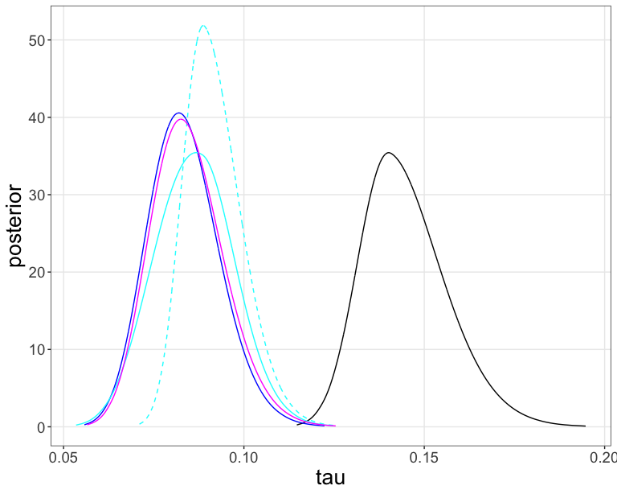
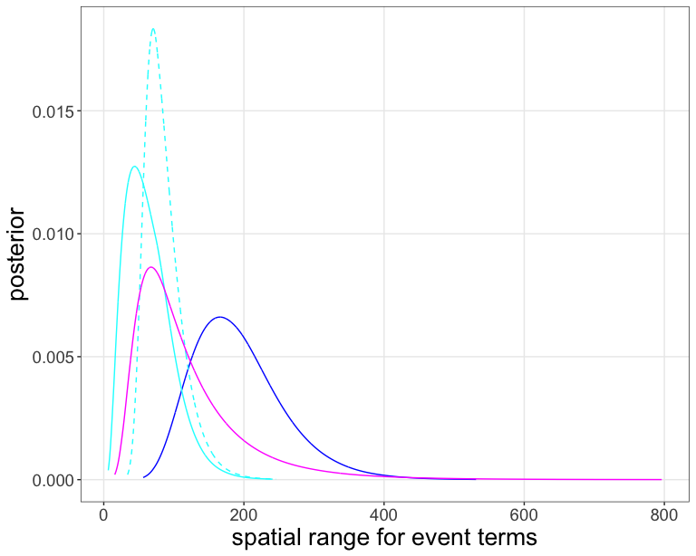
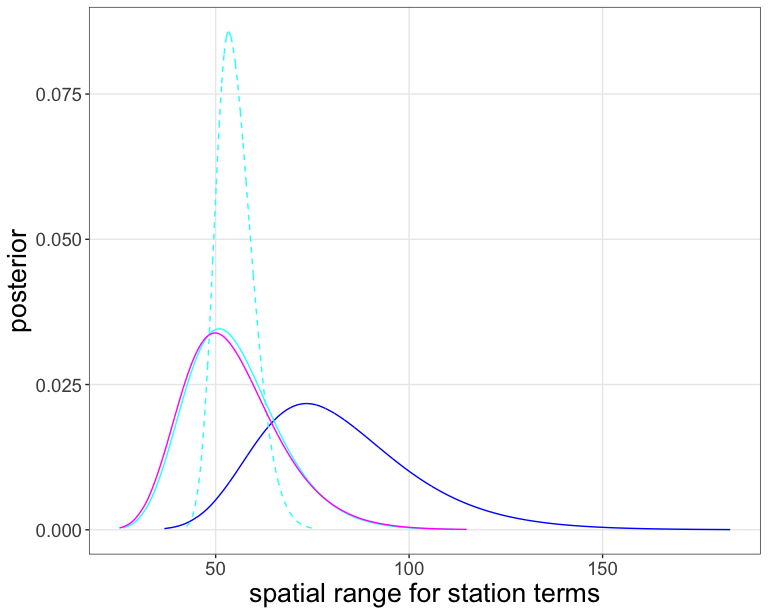
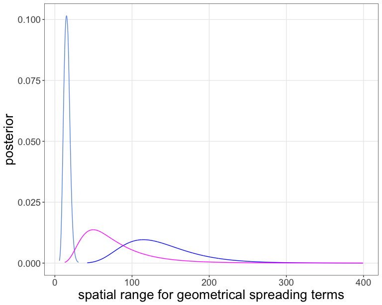
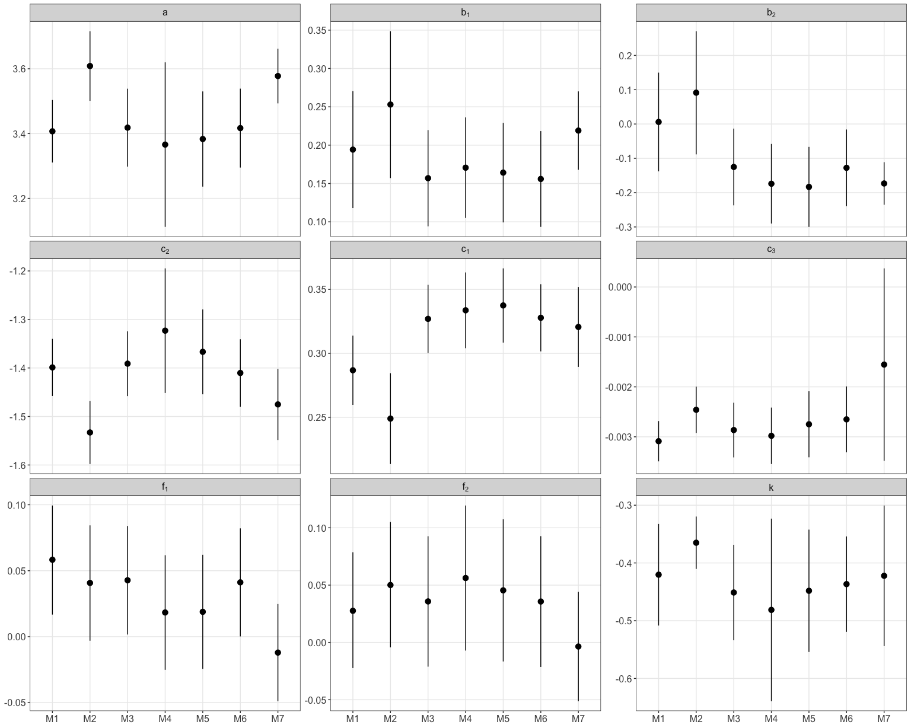
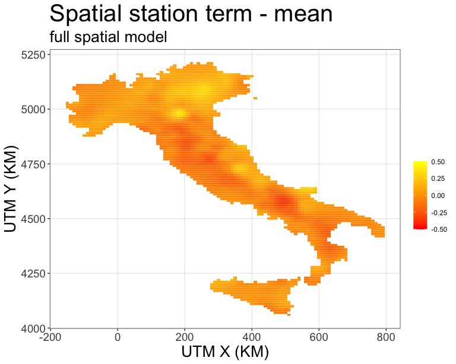
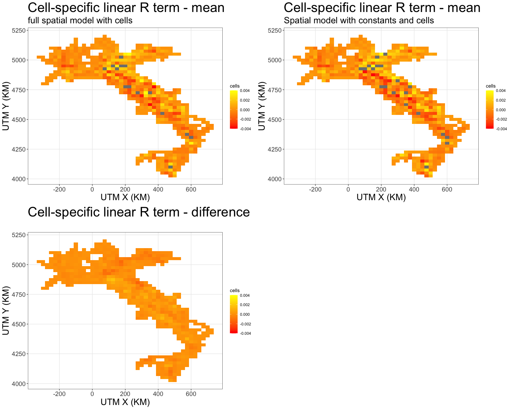
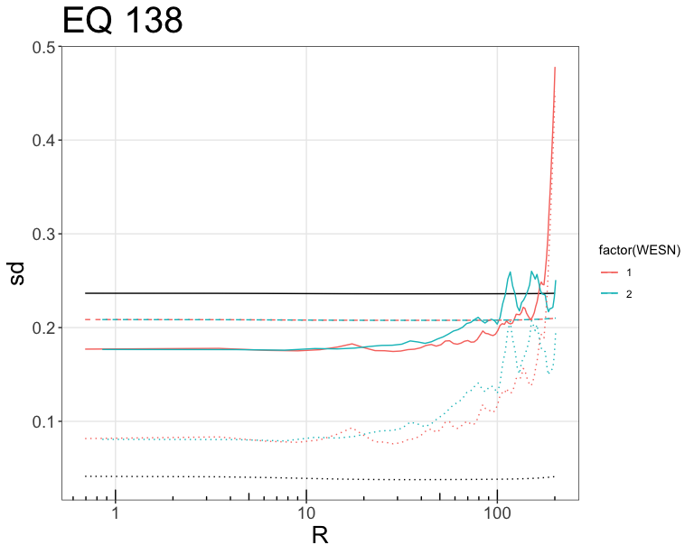
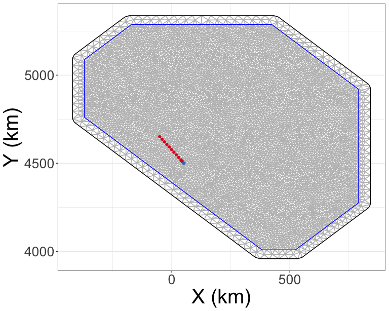
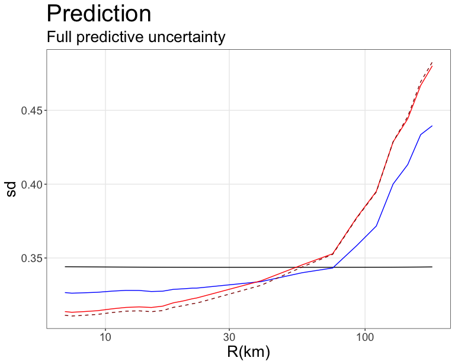

  
  
  

# Introduction

This documet contains code to calculate different nonrgodic ground-motion models (GMMs) using INLA on ground-motion data in Italy.
The data set is the same as the one used by @Caramenti2020, and contains the Italian data of th ITA18 GMM [@Lanzano2019].
The models are compared between themselves, as well as with the MS-GWR model of @Caramento2020.


# Getting Started

First, we load the packages required for the analysis.


```r
# load required packages
library(lme4)
library(sf)
library(raster)
library(rgdal)
library(ggplot2)
library(gridExtra)
library(INLA)
library(inlabru) # for mesh plotting (gg)
set1 <- RColorBrewer::brewer.pal(7, "Set1")

theme_set(theme_bw() + theme(panel.grid.minor = element_blank()))
```

# Model Description

The functional form of the ITA18 model [@Lanzano2019] is
$$
\begin{aligned}
\log_{10} PGA &= a + b_1  (M_W - M_h) \; {1}_{(M_w \leq M_h)} + b_2 (M_W - M_h) \; {1}_{(M_w > M_h)}  \\
&\quad + \left[ c_2 + c_1 (M_W - M_h)\right] \log_{10} \sqrt{R_{JB}^2 + h^2} + c_3 \sqrt{R_{JB}^2 + h^2} \\
&\quad + k \left[ \log_{10} \frac{V_{S30}}{800} \; {1}_{(V_{S30} \leq 1500)} + \frac{1500}{800} \; {1}_{(V_{S30} > 1500)}\right] + f_1 F_{SS} + f_2 F_R \\
&\quad + \delta B + \delta S2S + \delta WS
\end{aligned}
$$
where $1_{(M_w \leq M_h)}$ is an indicator function that evaluates to one if the condition is true, and zero otherwise.
$F_{SS}$ and $F_R$ are indicators for strike-slip and reverse-faulting event, respectively.
We use the same functional form, and fit different models to the PGA data used in @Caramenti2020.
For the spatial models, we make the constant $a$, the geometrical spreading coefficient $c_2$, the anelastic attenuation coefficient $c_3$, and the $V_{S30}$-scaling coefficient $k$ spatially varying.
There are two spatially varying constants, one dependent on the event coordinate $\vec{x}_e$, the other dependent on the station coordinate $\vec{x}_s$.
The spatially varying geometrical spreading coefficient depends on $\vec{x}_e$, the $V_{S30}$-coefficient on $\vec{x}_s$.
Following @Landwehr2016, @Caramenti2020 modeled the anelastic attenuation coefficient as dependent on the source coordinate $\vec{x}_e$.
We do the same here, but additionally test a model where the anelastic attenuation coefficient depends n the midpoint between the event and station coordinate, $\vec{x}_{es}$.
All spatial terms are modeled as adjustment terms to the fixed effects.
Thus, the full spatial model becomes
$$
\begin{aligned}
\log_{10} PGA &= a + \delta a_e(\vec{x}_e) + \delta a_s(\vec{x}_s) + b_1  (M_W - M_h) \; {1}_{(M_w \leq M_h)} + b_2 (M_W - M_h) \; {1}_{(M_w > M_h)}  \\
&\quad + \left[ (c_2 + \delta c_2(\vec{x}_e)) + c_1 (M_W - M_h)\right] \log_{10} \sqrt{R_{JB}^2 + h^2} + (c_3 + \delta c_3(\vec{x}_{e/es})) \sqrt{R_{JB}^2 + h^2} \\
&\quad + (k + \delta k(\vec{x}_s)) \left[ \log_{10} \frac{V_{S30}}{800} \; {1}_{(V_{S30} \leq 1500)} + \frac{1500}{800} \; {1}_{(V_{S30} > 1500)}\right] + f_1 F_{SS} + f_2 F_R \\
&\quad + \delta B_0 + \delta S2S_0 + \delta WS_0
\end{aligned}
$$
where we have added the subscript $_0$ to the event and station term to indicate that they are the terms after the systematic, repeatable nonergodic terms are taken out.
We test different combinations of the spatial terms, to see which term gives the best improvement.
We also model the anelastic attenuation term using the cell-specific attenuation model [@Dawood2013;@Kuehn2019].
Compared to a varying coefficient $c_3$, which only depends on a point coordinate, this has the advantage that it models the anelastic attenuation along a path, which makes more physical sense.
In that model, the anelastic attenuation model becomes
$$
\begin{aligned}
f_{attn}(R) &= c_3 \sqrt{R_{JB}^2 + h^2} + \sum_{i = 1}^{N_C} \delta c_{3,i} \; \Delta R_i \\
& = c_3 \sqrt{R_{JB}^2 + h^2} + \overrightarrow{\Delta R} \cdot \vec{\delta c_3}
\end{aligned}
$$
where $\delta c_{3,i}$ is the cell-specific adjustment coefficient for the $i$th cell, and $\Delta R_i$ is the fraction of path in the $i$th cell.
The distances within each cell are calculated based on epicentral distance, since the closest points on the rupture are not available.

The adjustment coefficients are modeled as a Gaussian process (or a Gaussian random field) with mean zero and Mat\'ern covariance function
$$
\begin{aligned}
  \delta a &= GP(0, \omega_a^2 k(\vec{x}, \vec{x}')) \\
  k(\vec{x}, \vec{x}') &=  \frac{2^{(1 - \nu)}}{\Gamma(\nu)} (\kappa |\vec{x} - \vec{x}'|)^\nu K_\nu (\kappa |\vec{x} - \vec{x}'|)
\end{aligned}
$$
where $\Gamma$ is the gamma function, $K_\nu$ is the modified Bessel function of the second kind, $\kappa$ is a scale parameter and $\nu$ is a smoothness parameter.
The cell-specific attenuation coefficients are modeled as random effects, with a normal distribution with mean zero and standard deviation $\omega_{c3}$ as the prior (following @Kuehn2019)
$$
\delta c_3 \sim N(0, \omega_{c3})
$$

All models are estimated with the R-INLA package (<https://www.r-inla.org/>) [@Rue2017].
INLA provides a computationally efficient way to estimate spatial models based on Gaussian random fields using the _stochastic partial differential equations_ (SPDE) approach [@Lindgren2011;@Lindgren2015;@Bakka2018].
For $\nu = 1$ in the Mat\'ern covariance function, the Gaussian field can be represented as a Gaussian Markov field (GMRF) by representing a solution to the SPDE using finite elements.
This leads to a sparse representation of the precision matrix, which allows for efficient computation.
The Gaussian field is approximated using basis functions, which are evaluated on nodes of a triangular mesh [@Lindgren2011;@Krainski2019].


# Read Data

Below, we read in the data.
The data is taken from the electronic supplement of @Caramenti2020, available at <https://github.com/lucaramenti/ms-gwr/>.
Most of the code is taken from there, reading in the shape file for Italy, and converting coordinates to UTM, as well as preparing the linear covariates.
In total, there are 4784 records from 137 events and 927 stations.


```r
dataset = readRDS(file.path("DATA","italian_data_pga.RData"))
shape_utm = st_read(file.path("DATA",'confini_ut33.shp'))
```

```
## Reading layer `confini_ut33' from data source 
##   `/Users/nico/GROUNDMOTION/PROJECTS/NONERGODIC/ITALY/Git/NonErgGMM_Italy/DATA/confini_ut33.shp' 
##   using driver `ESRI Shapefile'
## Simple feature collection with 1 feature and 2 fields
## Geometry type: MULTIPOLYGON
## Dimension:     XY
## Bounding box:  xmin: -158718.7 ymin: 3930217 xmax: 800075.7 ymax: 5219220
## Projected CRS: WGS 84 / UTM zone 33N
```

```r
# 
shape_utm_no_lamp = shape_utm
shape_utm_no_lamp$geometry[[1]][[12]] = NULL

shape_utm_no_sardinia = shape_utm
shape_utm_no_sardinia$geometry[[1]][[3]] = NULL
for (i in 4:10){
  shape_utm_no_sardinia$geometry[[1]][[4]] = NULL
}
for (i in 12:57){
  shape_utm_no_sardinia$geometry[[1]][[5]] = NULL
}

#Project coordinates of the events to work with UTM33:
latitude_ev = dataset$ev_latitude
longitude_ev = dataset$ev_longitude
long_lat_ev = cbind(longitude_ev, latitude_ev)
utm_ev = project(long_lat_ev, "+proj=utm +zone=33 ellps=WGS84") 
utm_ev = as.data.frame(utm_ev)
long_lat_ev = as.data.frame(long_lat_ev)

#Project coordinates of the stations to work with UTM33:
latitude_st = dataset$st_latitude
longitude_st = dataset$st_longitude
long_lat_st = cbind(longitude_st, latitude_st)
utm_st = project(long_lat_st, "+proj=utm +zone=33 ellps=WGS84") 
utm_st = as.data.frame(utm_st)
long_lat_st = as.data.frame(long_lat_st)

#Build spatial points data frame for UTM33 coordinates:
utm_ev_sp = SpatialPointsDataFrame(utm_ev, dataset[,1:6])
utm_st_sp = SpatialPointsDataFrame(utm_st, dataset[,1:6])

#Transform shapefile into spatial dataframe:
shape_utm_spatial = as_Spatial(shape_utm_no_sardinia)
grid_utm = makegrid(shape_utm_spatial, cellsize = 10000) # cellsize in map units!
grid_utm = SpatialPoints(grid_utm, proj4string = CRS(proj4string(shape_utm_spatial)))
```

```
## Warning in proj4string(shape_utm_spatial): CRS object has comment, which is lost
## in output
```

```r
grid_inside_utm = grid_utm[shape_utm_spatial,]
coords_utm = grid_inside_utm@coords
coords_df_utm = as.data.frame(coords_utm)

# read n data file with event and station ids
# correcte for Vs30 differences between stations of same location
data <- read.csv(file.path('DATA', 'italian_data_pga_id_utm_stat.csv'))
#### Cell-specific distances are computed outside of R
data_dm <- rstan::read_rdump(file.path('DATA', 'dm_25x25.Rdata'))

# Set linear predictors
mh = 5.5
mref = 5.324
h = 6.924
attach(data)
b1 = (mag-mh)*(mag<=mh)
b2 = (mag-mh)*(mag>mh)
c1 = (mag-mref)*log10(sqrt(JB_complete^2+h^2))
c2 = log10(sqrt(JB_complete^2+h^2))
c3 = sqrt(JB_complete^2+h^2)
f1 = as.numeric(fm_type_code == "SS")
f2 = as.numeric(fm_type_code == "TF")
k = log10(vs30/800)*(vs30<=1500)+log10(1500/800)*(vs30>1500)
y = log10(rotD50_pga)
detach(data)

eq <- data$EQID
stat <- data$STATID
n_rec <- length(b1)
n_eq <- max(eq)
n_stat <- max(stat)
n_cell <- data_dm$NCELL

data_reg <- data.frame(Y = y,
                       intercept = 1,
                       M1 = b1,
                       M2 = b2,
                       MlnR = c1,
                       lnR = c2,
                       R = c3,
                       Fss = f1,
                       Frv = f2,
                       lnVS = k,
                       eq = eq,
                       stat = stat
)
data_reg$idx_cell <- 1:nrow(data_reg)
data_reg$idx <- 1:n_rec
```


```r
ggplot() +
  geom_point(dataset, mapping = aes(x = JB_complete, y = mag)) +
  scale_x_continuous(trans='log10') +
  labs(x = "R_JB (km)", y = "M") +
  theme(
    axis.title = element_text(size = 20),
    axis.text = element_text(size = 14),
    plot.title = element_text(size = 30)
  )

ggplot() + 
  geom_sf(data = shape_utm_no_lamp, size = 1.6, color = "black", fill = NA )+
  geom_point(data = utm_st, aes(x=longitude_st, y=latitude_st), fill= 'deeppink3',
             size = 2, shape = 24, stroke = 0.7)+
  geom_point(data = utm_ev, aes(x=longitude_ev, y=latitude_ev), fill= 'azure2',
             size = 2, shape = 21, stroke = 1.0)+
  theme(
    axis.title = element_text(size = 20),
    axis.text = element_text(size = 14),
    plot.title = element_text(size = 30)
  )
```

<div class="figure">

<p class="caption">Scatterplot of Joyner-Boore distance and magnitude, and map of events and stations.</p>
</div>


```r
ggplot() +
  geom_point(dataset, mapping = aes(x = mag, y = rotD50_pga, colour = JB_complete)) +
  scale_y_continuous(trans='log10') +
  labs(x = "M", y = "PGA (cm/s)") +
  theme(
    axis.title = element_text(size = 20),
    axis.text = element_text(size = 14),
    plot.title = element_text(size = 30)
  )
  
ggplot() +
  geom_point(dataset, mapping = aes(x = JB_complete, y = rotD50_pga, colour = mag)) +
  scale_y_continuous(trans='log10') + scale_x_continuous(trans='log10') +
  labs(x = "R_JB (km)", y = "PGA (cm/s)") +
  theme(
    axis.title = element_text(size = 20),
    axis.text = element_text(size = 14),
    plot.title = element_text(size = 30)
  )
```

```
## Warning: Transformation introduced infinite values in continuous x-axis
```

<div class="figure">

<p class="caption">Scatterplot of PGA vs magnitude and Joyner-Boore distance.</p>
</div>

# Non-Spatial INLA Models

First, we fit an ergodic base model as reference.
This model corresponds to the ITA18 model of @Lanzano2019, and is a fit to the base functional form without any spatial terms.
This model includes random effects for events and stations, i.e. event terms $\delta B$ and station terms $\delta S$.
We also fit a model without random effects.
In its current form, MS-GWR does not include random effects, so we also have this model as reference.


```r
# priors for standard deviation parameters
prior_prec_tau_lg    <- list(prec = list(prior = "loggamma", param = c(0.9, 0.007)))
prior_prec_phiS2S_lg <- list(prec = list(prior = "loggamma", param = c(0.9, 0.007)))
prior_prec_phiSS_lg  <- list(prec = list(prior = "loggamma", param = c(0.9, 0.007)))

# priors for fixed effects
prior.fixed <- list(mean.intercept = 0, prec.intercept = 0.04,
                    mean = (list(R=-0.005, Fss = 0.02, Frv = 0.1, default=0)),
                    prec = (list(R=10000, Fss = 1500, Frv = 625, default = 0.04)))

form <- Y ~ M1 + M2 + lnR + MlnR + R + Fss + Frv + lnVS +
  f(eq, model = "iid", hyper = prior_prec_tau_lg) + 
  f(stat, model = "iid",hyper = prior_prec_phiS2S_lg)

fit_inla <- inla(form,
                 data = data_reg,
                 family="gaussian",
                 control.fixed = prior.fixed,
                 control.family = list(hyper = list(prec = prior_prec_phiSS_lg)),
                 control.compute = list(dic = TRUE, cpo = TRUE, waic = TRUE)
                 )

# model with only event random effects
form_eq <- Y ~ M1 + M2 + lnR + MlnR + R + Fss + Frv + lnVS +
  f(eq, model = "iid", hyper = prior_prec_tau_lg)

fit_inla_eq <- inla(form_eq,
                 data = data_reg,
                 family="gaussian",
                 control.fixed = prior.fixed,
                 control.family = list(hyper = list(prec = prior_prec_phiSS_lg)),
                 control.compute = list(dic = TRUE, cpo = TRUE, waic = TRUE)
                 )

# also fit a model without random effects,
# since Caramenti et al (2020) does not include random effects
fit_inla_noranef <- inla(Y ~ M1 + M2 + lnR + MlnR + R + Fss + Frv + lnVS, 
                 data = data_reg,
                 family="gaussian",
                 control.fixed = prior.fixed,
                 control.family = list(hyper = list(prec = prior_prec_phiSS_lg)),
                 control.compute = list(dic = TRUE, cpo = TRUE, waic = TRUE)
)

df_coeff <- data.frame(mean_M1 = fit_inla$summary.fixed$mean, sd_M1 = fit_inla$summary.fixed$sd,
                       mean_M2 = fit_inla_eq$summary.fixed$mean, sd_M2 = fit_inla_eq$summary.fixed$sd,
           mean_M3 = fit_inla_noranef$summary.fixed$mean, sd_M3 = fit_inla_noranef$summary.fixed$sd,
           mean_ITA18 = c(3.4210, 0.1940, -0.0220, -1.4056, 0.2871, -0.0029, 0.0860, 0.0105, -0.3946))

row.names(df_coeff) <- c("a", "b1","b2","c2", "c1", "c3", "f1","f2","k")

knitr::kable(df_coeff, digits = 3, row.names = TRUE)
```


|   | mean_M1| sd_M1| mean_M2| sd_M2| mean_M3| sd_M3| mean_ITA18|
|:--|-------:|-----:|-------:|-----:|-------:|-----:|----------:|
|a  |   3.407| 0.049|   3.609| 0.055|   3.549| 0.047|      3.421|
|b1 |   0.194| 0.039|   0.253| 0.049|   0.294| 0.034|      0.194|
|b2 |   0.006| 0.073|   0.091| 0.091|   0.131| 0.038|     -0.022|
|c2 |  -1.399| 0.030|  -1.533| 0.033|  -1.483| 0.035|     -1.406|
|c1 |   0.287| 0.014|   0.249| 0.018|   0.219| 0.019|      0.287|
|c3 |  -0.003| 0.000|  -0.002| 0.000|  -0.003| 0.000|     -0.003|
|f1 |   0.058| 0.021|   0.041| 0.022|   0.048| 0.013|      0.086|
|f2 |   0.028| 0.026|   0.050| 0.028|  -0.016| 0.011|      0.011|
|k  |  -0.420| 0.045|  -0.365| 0.023|  -0.402| 0.025|     -0.395|

# Spatial INLA Models

For the spatial INLA models, we divide the UTM coordinates by 1000, so that we can wok on a scale of kilometers.
This is just a matter of convenience.
In INLA, the spatial field s represented as basis functions on a triangular mesh, and projected onto the data locations via a projector matrix $\textbf{A}$.
We need to define the mesh and the projector matrices.
We also need to define prior distributions for the spatial hyperparameters.
These are based on penalized complexity (PC) priors [@Simpson2017;@Fuglstad2019;@Franco-Villoria2018].

Conceptually, a spatial random effects model looks as in the Equation below.
The vector of target variables is distributed according to a normal distribution with mean $\vec{\mu}$ and standard deviation $\phi_0$.
The mean is composed of the base model (the fixed effects) and the random effects, which means that the likelihood factorizes, and all observations are independent (on could also marginalize over the random effects, i.e. put them into the covariance matrix).

$$
\begin{aligned}
  \vec{Y} &\sim N(\vec{\mu}, \phi_0) \\
  \vec{\mu} =& \vec{\mu}_{base} + \vec{\delta}_{adj} \\
  \vec{\delta}_{adj} &\sim GP(0, k(\cdot,\cdot))
\end{aligned}
$$
With the SPDE approach on a mesh, the model is as below.
Now, the random effects are defined on the nodes of the mesh, and are distributed according to a multivariate normal distribution with mean zero and precision matrix $\textbf{P}_{mesh}$, which has size $N_{mesh} \times N_{mesh}$, where $N_{mesh}$ is the number of nodes in the mesh.
Since the field is Markov, $\textbf{P}_{mesh}$ is sparse, and inference on the random effects can be done efficiently.
The matrix $\textbf{A}$ is used to project the random effects to the observation locations.

$$
\begin{aligned}
  \vec{Y} &\sim N(\vec{\mu}, \phi_0) \\
  \vec{\mu} =& \vec{\mu}_{base} + \textbf{A} \; \vec{\delta}_{adj,mesh} \\
  \vec{\delta}_{adj,mesh} &\sim GP(0, \textbf{P}^{-1}_{mesh})
\end{aligned}
$$

## Generate Mesh

First we generate the triangular mesh.
We use the same mesh for event-specific and station-specific terms, and thus combine the coordinates for mesh generation.
We use a maximum triangle edge length of 10km, and an outer boundary of 50km.


```r
co_eq <- utm_ev/1000
co_stat <- utm_st/1000

co_eq_stat <- cbind(rowMeans(cbind(co_eq$longitude_ev, co_stat$longitude_st)),
                    rowMeans(cbind(co_eq$latitude_ev, co_stat$latitude_st)))

coords <- unique(rbind(as.matrix(co_eq), as.matrix(co_stat)))
max.edge2    <- 10
bound.outer2 <- 50
mesh = inla.mesh.2d(loc=as.matrix(coords),
                    max.edge = c(1,5)*max.edge2,
                    # - use 5 times max.edge in the outer extension/offset/boundary
                    cutoff = max.edge2,
                    offset = c(5 * max.edge2, bound.outer2))

print(paste0("numbr of mesh nodes: ", mesh$n))
```

```
## [1] "numbr of mesh nodes: 7505"
```

```r
ggplot() + theme_bw() + gg(mesh) +
  geom_point(data = as.data.frame(co_stat), aes(x=longitude_st,y=latitude_st), color = set1[1]) +
  #geom_point(data = as.data.frame(co_eq_stat), aes(x=V1,y=V2), color = set1[1]) +
  geom_point(data = as.data.frame(co_eq), aes(x=longitude_ev,y=latitude_ev), color = set1[2]) +
  labs(x="X (km)", y="Y (km)") +
  theme(axis.title = element_text(size=30), axis.text.y = element_text(size=20),
        axis.text.x = element_text(size=20))
```

<div class="figure">

<p class="caption">Mesh used for spatial INLA models.</p>
</div>

## Make SPDE Priors and Projector Matrices

Now we define the prior distributions for the spatial hyperparameters.
As stated before, they are based on PC priors.
The PC prior for a 2D-Mat\`ern field is set by specifying tail probabilities for the spatial range $\ell$ and the standard deviation of the field $\omega$.
The spatial range is defined as $\ell = \frac{\sqrt{8 \nu}}{\kappa}$, and corresponds to the distance where the correlation takes a value of 0.140.
The PC prior requires one to specify values $\ell_0, p_\ell$ and $\omega_0, p_\omega$ such that
$$
\begin{aligned}
  P(\ell < \ell_0) = p_\ell \\
  P(\omega > \omega_0) = p_\omega
\end{aligned}
$$
i.e. we need to specify our prior belief that the range is smaller than a value $\ell_0$, and the standard deviation is larger than a value $\omega_0$.
We can specify different prior distributions for the different spatial terms.
Since we do not have strong prior information, we use the same prior for the range for all terms, and only adjust the prior for the standard deviation for the anelastic attenuation term, and the prior becomes
$$
\begin{aligned}
  P(\ell < 30) = 0.5 \\
  P(\omega > 0.3) = 0.01 \\
  P(\omega > 0.1) = 0.01
\end{aligned}
$$
which means we assign a prior probability of 50% that the range is smaller than 30km, and a prior probability of 1% that the standard deviation of the systematic spatial terms is smaller than 0.3 (or 0.1 for the anelastic attenuation coefficient).


```r
spde_stat <- inla.spde2.pcmatern(
  # Mesh and smoothness parameter
  mesh = mesh, alpha = 2,
  # P(practic.range < 0.3) = 0.5
  prior.range = c(30, 0.5),
  # P(sigma > .3) = 0.01
  prior.sigma = c(.3, 0.01)) 

spde_eq <- inla.spde2.pcmatern(
  # Mesh and smoothness parameter
  mesh = mesh, alpha = 2,
  # P(practic.range < 30) = 0.5
  prior.range = c(30, 0.5),
  # P(sigma > .3) = 0.01
  prior.sigma = c(.3, 0.01)) 

spde_vs <- inla.spde2.pcmatern(
  # Mesh and smoothness parameter
  mesh = mesh, alpha = 2,
  # P(practic.range < 30) = 0.5
  prior.range = c(30, 0.5),
  # P(sigma > .3) = 0.01
  prior.sigma = c(.3, 0.01)) 

spde_lnR <- inla.spde2.pcmatern(
  # Mesh and smoothness parameter
  mesh = mesh, alpha = 2,
  # P(practic.range < 30) = 0.5
  prior.range = c(30, 0.5),
  # P(sigma > .3) = 0.01
  prior.sigma = c(.3, 0.01)) 

spde_R <- inla.spde2.pcmatern(
  # Mesh and smoothness parameter
  mesh = mesh, alpha = 2,
  # P(practic.range < 30) = 0.5
  prior.range = c(30, 0.5),
  # P(sigma > .1) = 0.01
  prior.sigma = c(.01, 0.01)) 
```

Next, we specify the projector matrices $\textbf{A}$, which connect the mesh nodes with the data locations.
The data coordinates are either the event or station locations (or the midpoint for the anelastic attenuation).
For the spatial coefficients associated with covariates, we need to specify these as well.
We also create the data stack, which combines the information for all data and effects that go into the model.


```r
A_stat   <- inla.spde.make.A(mesh, loc = as.matrix(co_stat))
A_eq   <- inla.spde.make.A(mesh, loc = as.matrix(co_eq))
A_lnr   <- inla.spde.make.A(mesh, loc = as.matrix(co_eq),
                            weights = data_reg$lnR)
# linear R term based on event coordinates
A_r   <- inla.spde.make.A(mesh, loc = as.matrix(co_eq),
                            weights = data_reg$R)
# linear R term based on midpoint between event and station coordinates
A_r_es   <- inla.spde.make.A(mesh, loc = as.matrix(co_eq_stat),
                          weights = data_reg$R)
A_vs   <- inla.spde.make.A(mesh, loc = as.matrix(co_stat),
                          weights = data_reg$lnVS)

idx.stat <- inla.spde.make.index("idx.stat",spde_stat$n.spde)
idx.eq <- inla.spde.make.index("idx.eq",spde_eq$n.spde)
idx.lnr <- inla.spde.make.index("idx.lnr",spde_lnR$n.spde)
idx.r <- inla.spde.make.index("idx.r",spde_R$n.spde)
idx.vs <- inla.spde.make.index("idx.vs",spde_vs$n.spde)

# create the stack
stk_spatial_full <- inla.stack(
  data = list(y = data_reg$Y),
  A = list(A_eq, A_lnr, A_r_es, A_stat, A_vs, 1), 
  effects = list(idx.eq = idx.eq,
                 idx.lnr = idx.lnr,
                 idx.r = idx.r,
                 idx.stat = idx.stat,
                 idx.vs = idx.vs,
                 data_reg
  ),
  tag = 'model_spatial_full')
```

## Spatial Model with only spatially varying constant terms

Here, we fit the reference spatial model, with only spatial constants ($\delta a_e(\vec{x}_e)$ and $\delta a_e(\vec{x}_e)$).
We define the formula of the model, which includes the fixed effects, iid random effects for the non-spatially event and station terms ($\delta B$ and $\delta S2S$), and the spatially varying terms (using the previously defined SPDE models).


```r
form_spatial <- y ~ 0 + intercept + M1 + M2 + lnR + MlnR + R + Fss + Frv + lnVS +
  f(eq, model = "iid", hyper = prior_prec_tau_lg) + 
  f(stat, model = "iid",hyper = prior_prec_phiS2S_lg) +
  f(idx.stat, model = spde_stat) + f(idx.eq, model = spde_eq)

fit_inla_spatial <- inla(form_spatial, 
                         data = inla.stack.data(stk_spatial_full), 
                         control.predictor = list(A = inla.stack.A(stk_spatial_full)),
                         control.compute = list(dic = TRUE, cpo = TRUE, waic = TRUE),
                         family="gaussian",
                         control.fixed = prior.fixed,
                         control.family = list(hyper = list(prec = prior_prec_phiSS_lg)),
                         control.inla = list(int.strategy = "eb", strategy = "gaussian")
)
```

## Spatial Model with only spatially varying event constant terms


```r
form_spatial_eq <- y ~ 0 + intercept + M1 + M2 + lnR + MlnR + R + Fss + Frv + lnVS +
  f(eq, model = "iid", hyper = prior_prec_tau_lg) + 
  f(stat, model = "iid",hyper = prior_prec_phiS2S_lg) +
  f(idx.eq, model = spde_eq)

fit_inla_spatial_eq <- inla(form_spatial_eq, 
                         data = inla.stack.data(stk_spatial_full), 
                         control.predictor = list(A = inla.stack.A(stk_spatial_full)),
                         control.compute = list(dic = TRUE, cpo = TRUE, waic = TRUE),
                         family="gaussian",
                         control.family = list(hyper = list(prec = prior_prec_phiSS_lg)),
                         control.inla = list(int.strategy = "eb", strategy = "gaussian")
)
```

## Spatial Model with only spatially varying station constant term


```r
form_spatial_stat <- y ~ 0 + intercept + M1 + M2 + lnR + MlnR + R + Fss + Frv + lnVS +
  f(eq, model = "iid", hyper = prior_prec_tau_lg) + 
  f(stat, model = "iid",hyper = prior_prec_phiS2S_lg) +
  f(idx.stat, model = spde_stat)

fit_inla_spatial_stat <- inla(form_spatial_stat, 
                         data = inla.stack.data(stk_spatial_full), 
                         control.predictor = list(A = inla.stack.A(stk_spatial_full)),
                         control.compute = list(dic = TRUE, cpo = TRUE, waic = TRUE),
                         family="gaussian",
                         control.fixed = prior.fixed,
                         control.family = list(hyper = list(prec = prior_prec_phiSS_lg)),
                         control.inla = list(int.strategy = "eb", strategy = "gaussian")
)
```

## Spatial Model with spatially varying constant and geometrical spreading terms


```r
form_spatial_gs <- y ~ 0 + intercept + M1 + M2 + lnR + MlnR + R + Fss + Frv + lnVS +
  f(eq, model = "iid", hyper = prior_prec_tau_lg) + 
  f(stat, model = "iid",hyper = prior_prec_phiS2S_lg) +
  f(idx.stat, model = spde_stat) + f(idx.eq, model = spde_eq) +
  f(idx.lnr, model = spde_lnR)

fit_inla_spatial_gs <- inla(form_spatial_gs, 
                         data = inla.stack.data(stk_spatial_full), 
                         control.predictor = list(A = inla.stack.A(stk_spatial_full)),
                         control.compute = list(dic = TRUE, cpo = TRUE, waic = TRUE),
                         family="gaussian",
                         control.fixed = prior.fixed,
                         control.family = list(hyper = list(prec = prior_prec_phiSS_lg)),
                         control.inla = list(int.strategy = "eb", strategy = "gaussian")
)
```

## Spatial Model with spatially varying constant, and anelastic attenuation terms

Here we estimate models with spatially varying event and station constants, and a spatially varying anelastic attenuation coefficient.
Two models are estimated, one where the attenuation depends on the midpoint of event/station coordinates, and one where it depends on event location.
The stack that we defined before, `stk_spatial_full`, includes the projector matrix for the midpoint, so we define a separate stack for the second model.


```r
form_spatial_r <- y ~ 0 + intercept + M1 + M2 + lnR + MlnR + R + Fss + Frv + lnVS +
  f(eq, model = "iid", hyper = prior_prec_tau_lg) + 
  f(stat, model = "iid",hyper = prior_prec_phiS2S_lg) +
  f(idx.stat, model = spde_stat) + f(idx.eq, model = spde_eq) +
  f(idx.r, model = spde_R)

fit_inla_spatial_r <- inla(form_spatial_r, 
                         data = inla.stack.data(stk_spatial_full), 
                         control.predictor = list(A = inla.stack.A(stk_spatial_full)),
                         control.compute = list(dic = TRUE, cpo = TRUE, waic = TRUE),
                         family="gaussian",
                         control.fixed = prior.fixed,
                         control.family = list(hyper = list(prec = prior_prec_phiSS_lg)),
                         control.inla = list(int.strategy = "eb", strategy = "gaussian")
)
```


```r
# create the stack
stk_spatial_r2 <- inla.stack(
  data = list(y = data_reg$Y),
  #A = list(A_eq, A_eq, A_eq, A_stat, A_stat, 1), 
  A = list(A_eq, A_stat, A_r, 1), 
  effects = list(idx.eq = idx.eq,
                 idx.stat = idx.stat,
                 idx.r = idx.r,
                 data_reg
  ),
  tag = 'model_spatial_r2')

fit_inla_spatial_r2 <- inla(form_spatial_r, 
                         data = inla.stack.data(stk_spatial_r2), 
                         control.predictor = list(A = inla.stack.A(stk_spatial_r2)),
                         control.compute = list(dic = TRUE, cpo = TRUE, waic = TRUE),
                         family="gaussian",
                         control.fixed = prior.fixed,
                         control.family = list(hyper = list(prec = prior_prec_phiSS_lg)),
                         control.inla = list(int.strategy = "eb", strategy = "gaussian")
)
```

## Spatial Model with spatially varying constant and $V_{S30}$ terms


```r
form_spatial_vs <- y ~ 0 + intercept + M1 + M2 + lnR + MlnR + R + Fss + Frv + lnVS +
  f(eq, model = "iid", hyper = prior_prec_tau_lg) + 
  f(stat, model = "iid",hyper = prior_prec_phiS2S_lg) +
  f(idx.stat, model = spde_stat) + f(idx.eq, model = spde_eq) +
  f(idx.vs, model = spde_vs)

fit_inla_spatial_vs <- inla(form_spatial_vs, 
                         data = inla.stack.data(stk_spatial_full), 
                         control.predictor = list(A = inla.stack.A(stk_spatial_full)),
                         control.compute = list(dic = TRUE, cpo = TRUE, waic = TRUE),
                         family="gaussian",
                         control.fixed = prior.fixed,
                         control.family = list(hyper = list(prec = prior_prec_phiSS_lg)),
                         control.inla = list(int.strategy = "eb", strategy = "gaussian")
)
```

## Spatial Model with spatially varying constant and all terms


```r
# set starting values based on previous estimated models
theta <- c(fit_inla_spatial$mode$theta["Log precision for the Gaussian observations"],
           fit_inla_spatial$mode$theta["Log precision for eq"],
           fit_inla_spatial$mode$theta["Log precision for stat"],
           fit_inla_spatial$mode$theta["log(Range) for idx.stat"],
           fit_inla_spatial$mode$theta["log(Stdev) for idx.stat"],
           fit_inla_spatial$mode$theta["log(Range) for idx.eq"],
           fit_inla_spatial$mode$theta["log(Stdev) for idx.eq"],
           fit_inla_spatial_gs$mode$theta["log(Range) for idx.lnr"],
           fit_inla_spatial_gs$mode$theta["log(Stdev) for idx.lnr"],
           fit_inla_spatial$mode$theta["log(Range) for idx.r"],
           fit_inla_spatial$mode$theta["log(Stdev) for idx.r"],
           fit_inla_spatial_vs$mode$theta["log(Range) for idx.vs"],
           fit_inla_spatial_vs$mode$theta["log(Stdev) for idx.vs"]
           )

form_spatial_full <- y ~ 0 + intercept + M1 + M2 + lnR + MlnR + R + Fss + Frv + lnVS +
  f(eq, model = "iid", hyper = prior_prec_tau_lg) + 
  f(stat, model = "iid",hyper = prior_prec_phiS2S_lg) +
  f(idx.stat, model = spde_stat) + f(idx.eq, model = spde_eq) +
  f(idx.lnr, model = spde_lnR) + f(idx.r, model = spde_R) +
  f(idx.vs, model = spde_vs)

fit_inla_spatial_full <- inla(form_spatial_full, 
                         data = inla.stack.data(stk_spatial_full), 
                         control.predictor = list(A = inla.stack.A(stk_spatial_full)),
                         control.compute = list(dic = TRUE, cpo = TRUE, waic = TRUE),
                         family="gaussian",
                         control.fixed = prior.fixed,
                         control.family = list(hyper = list(prec = prior_prec_phiSS_lg)),
                         control.inla = list(int.strategy = "eb", strategy = "gaussian"),
                         control.mode=list(theta = theta, restart=TRUE)
)
```

## Spatial Model without random effect, spatially varying constant, wth lnR,R,VS


```r
form_spatial_full_b <- y ~ 0 + intercept + M1 + M2 + lnR + MlnR + R + Fss + Frv + lnVS +
  f(idx.lnr, model = spde_lnR) + f(idx.r, model = spde_R) +
  f(idx.vs, model = spde_vs)

fit_inla_spatial_full_b <- inla(form_spatial_full_b, 
                         data = inla.stack.data(stk_spatial_full), 
                         control.predictor = list(A = inla.stack.A(stk_spatial_full)),
                         control.compute = list(dic = TRUE, cpo = TRUE, waic = TRUE),
                         family="gaussian",
                         control.fixed = prior.fixed,
                         control.family = list(hyper = list(prec = prior_prec_phiSS_lg)),
                         control.inla = list(int.strategy = "eb", strategy = "gaussian")
)
```

## Spatial Model with spatially varying constant and cell-specific attenuation

Now we fit a model with cell-specific attenuation.
This is modeled as a generic `Z` model in the call to `inla`, as the cell-specific attenuation terms for all records can be written as $\textbf{R}_C \; \vec{\delta c}_3$, where $\textbf{R}_C$ is an $N \times N_C$ matrix whose rows correspond to the records, columns correspond to the cells, and where $\textbf{R}_{C,ij}$ is the length of the path in cell $j$ for record $i$.
For the standard deviation $\omega_{c3}$ of the cell-specific attenuation coefficients, we use again a PC prior.
From @Kuehn2019, the standard deviation of the cell-specific attenuation coefficients in California has a value of about $\omega_{c3, calif} \approx 0.0054$, so we set the prior assuming that a value larger than 0.01 is unlikely

$$
P(\omega_{c3} > 0.01) = 0.01
$$


```r
dm_sparse <- as(data_dm$RC,"dgCMatrix")
prior_prec_cell <- list(prec = list(prior = 'pc.prec', param = c(0.01, 0.01))) 

form_spatial_cell <- y ~ 0 + intercept + M1 + M2 + lnR + MlnR + R + Fss + Frv + lnVS +
  f(eq, model = "iid", hyper = prior_prec_tau_lg) + 
  f(stat, model = "iid",hyper = prior_prec_phiS2S_lg) +
  f(idx.stat, model = spde_stat) + f(idx.eq, model = spde_eq) +
  f(idx_cell, model = "z", Z = dm_sparse, hyper = prior_prec_cell)

fit_inla_spatial_cell <- inla(form_spatial_cell, 
                          data = inla.stack.data(stk_spatial_full), 
                          control.predictor = list(A = inla.stack.A(stk_spatial_full)),
                          control.compute = list(dic = TRUE, cpo = TRUE, waic = TRUE),
                          family="gaussian",
                          control.fixed = prior.fixed,
                          control.family = list(hyper = list(prec = prior_prec_phiSS_lg)),
                          control.inla = list(int.strategy = "eb", strategy = "gaussian")
)
```

```
## Warning in inla.model.properties.generic(inla.trim.family(model), mm[names(mm) == : Model 'z' in section 'latent' is marked as 'experimental'; changes may appear at any time.
##   Use this model with extra care!!! Further warnings are disabled.
```

We also estimate this model without the empirical Bayes approximation.


```r
fit_inla_spatial_cell_int <- inla(form_spatial_cell, 
                          data = inla.stack.data(stk_spatial_full), 
                          control.predictor = list(A = inla.stack.A(stk_spatial_full)),
                          control.compute = list(dic = TRUE, cpo = TRUE, waic = TRUE),
                          family="gaussian",
                          control.fixed = prior.fixed,
                          control.family = list(hyper = list(prec = prior_prec_phiSS_lg))
)
```

## Spatial Model with all spatially varying terms and cell-specific attenuation


```r
form_spatial_full_cell <- y ~ 0 + intercept + M1 + M2 + lnR + MlnR + R + Fss + Frv + lnVS +
  f(eq, model = "iid", hyper = prior_prec_tau_lg) + 
  f(stat, model = "iid",hyper = prior_prec_phiS2S_lg) +
  f(idx.stat, model = spde_stat) + f(idx.eq, model = spde_eq) +
  f(idx.lnr, model = spde_lnR) + f(idx.vs, model = spde_vs) +
  f(idx_cell, model = "z", Z = dm_sparse, hyper = prior_prec_cell)

# set starting values based on previous estimated models
theta <- c(fit_inla_spatial_full$mode$theta[c(1,2,3,4,5,6,7,8,9,12,13)],fit_inla_spatial_cell$mode$theta[8])

fit_inla_spatial_full_cell <- inla(form_spatial_full_cell, 
                          data = inla.stack.data(stk_spatial_full), 
                          control.predictor = list(A = inla.stack.A(stk_spatial_full)),
                          control.compute = list(dic = TRUE, cpo = TRUE, waic = TRUE),
                          family="gaussian",
                          control.fixed = prior.fixed,
                          control.family = list(hyper = list(prec = prior_prec_phiSS_lg)),
                          control.inla = list(int.strategy = "eb", strategy = "gaussian"),
                          control.mode=list(theta = theta, restart=TRUE)
)
```

## Spatial Model with spatially varying constants and geometrical spreading term and cell-specific attenuation


```r
form_spatial_gs_cell <- y ~ 0 + intercept + M1 + M2 + lnR + MlnR + R + Fss + Frv + lnVS +
  f(eq, model = "iid", hyper = prior_prec_tau_lg) + 
  f(stat, model = "iid",hyper = prior_prec_phiS2S_lg) +
  f(idx.stat, model = spde_stat) + f(idx.eq, model = spde_eq) +
  f(idx.lnr, model = spde_lnR) + 
  f(idx_cell, model = "z", Z = dm_sparse, hyper = prior_prec_cell)

# set starting values based on previous estimated models
theta <- c(fit_inla_spatial_full$mode$theta[c(1,2,3,4,5,6,7,8,9)],fit_inla_spatial_cell$mode$theta[8])

fit_inla_spatial_gs_cell <- inla(form_spatial_gs_cell, 
                          data = inla.stack.data(stk_spatial_full), 
                          control.predictor = list(A = inla.stack.A(stk_spatial_full)),
                          control.compute = list(dic = TRUE, cpo = TRUE, waic = TRUE),
                          family="gaussian",
                          control.fixed = prior.fixed,
                          control.family = list(hyper = list(prec = prior_prec_phiSS_lg)),
                          control.inla = list(int.strategy = "eb", strategy = "gaussian"),
                          control.mode=list(theta = theta, restart=TRUE)
)
```

## Spatial Model with spatially varying constants and VS30 scaling term and cell-specific attenuation


```r
form_spatial_vs_cell <- y ~ 0 + intercept + M1 + M2 + lnR + MlnR + R + Fss + Frv + lnVS +
  f(eq, model = "iid", hyper = prior_prec_tau_lg) + 
  f(stat, model = "iid",hyper = prior_prec_phiS2S_lg) +
  f(idx.stat, model = spde_stat) + f(idx.eq, model = spde_eq) +
  f(idx.vs, model = spde_vs) + 
  f(idx_cell, model = "z", Z = dm_sparse, hyper = prior_prec_cell)

# set starting values based on previous estimated models
theta <- c(fit_inla_spatial_full$mode$theta[c(1,2,3,4,5,6,7,12,13)],fit_inla_spatial_cell$mode$theta[8])

fit_inla_spatial_vs_cell <- inla(form_spatial_vs_cell, 
                          data = inla.stack.data(stk_spatial_full), 
                          control.predictor = list(A = inla.stack.A(stk_spatial_full)),
                          control.compute = list(dic = TRUE, cpo = TRUE, waic = TRUE),
                          family="gaussian",
                          control.fixed = prior.fixed,
                          control.family = list(hyper = list(prec = prior_prec_phiSS_lg)),
                          control.inla = list(int.strategy = "eb", strategy = "gaussian"),
                          control.mode=list(theta = theta, restart=TRUE)
)
```

# MS-GWR

Now, we fit the MS-GWR model.
This is taken directly from the <https://github.com/lucaramenti/ms-gwr/>.
The calculations are done outside of his document, and read in.


```r
# best bandwidth is set
bwe = 25000
bws = 75000
coords_df_utm = as.data.frame(coords_utm)

sec = SEC_only_calibration(Xc, Xe, Xs, y, "c", bwe, bws, coordinates(utm_ev_sp), coordinates(utm_st_sp))
#Now we can compute all the regression coefficients:
result = SEC_grid_creation(Xc, Xe, Xs, y,"c", bwe, bws, coordinates(utm_ev_sp),
                           coordinates(utm_st_sp), coords_utm, sec)
```


```r
load(file = file.path('RESULTS', 'results_caramenti.Rdata'))
beta_const = result$beta_c

beta_k = t(result$beta_s)
beta_k_coord = cbind(coords_utm, beta_k)
beta_k_coord = as.data.frame(beta_k_coord)

beta_c2 = result$beta_e[1,]
beta_c2_coord = cbind(coords_utm, beta_c2)
beta_c2_coord = as.data.frame(beta_c2_coord)

beta_c3 = result$beta_e[2,]
beta_c3_coord = cbind(coords_utm, beta_c3)
beta_c3_coord = as.data.frame(beta_c3_coord)

time_msgwr <- 14189.787
```


```r
load(file = file.path('RESULTS', 'residuals_caramenti.Rdata'))
data_reg$resid <- data_reg$Y - prediction_msgwr$y0

fit_inla_resid <- inla(resid ~ 1 +
                   f(eq, model = "iid", hyper = prior_prec_tau_lg) + 
                   f(stat, model = "iid",hyper = prior_prec_phiS2S_lg), 
                 data = data_reg,
                 family="gaussian",
                 control.family = list(hyper = list(prec = prior_prec_phiSS_lg)),
                 control.compute = list(dic = TRUE, cpo = TRUE, waic = TRUE)
)
```

# Model Comparison

Now that we have fit many different models, we need to compare them.
We calculated DIC [@Spiegelhalter2002] and WAIC [@Watanabe2013] for the models, which we will use for model comparison.
WAIC and DIC are an approximation of the generalization error, and can be (loosely) thought of as Bayesian extensions of the Akaike Information criterion (AIC) [@Akaike1973].
One should note that WAIC ad DIC wok at the observation level, i.e. they contain information about the random effects.
For application of GMMs, we typically want to evaluate the models on new events.
To do that, we also perform a cross-validation (CV), leaving out all observations from events, training the model on the remaining data, and evaluating the models on the left out events.

## Model Comparison based on Information Criteria

Here we compare all the models fit using INLA via their WAIC and DIC values.
We also compare the CPU time (not important for model comparison, but important for applicability).


```r
df_comp <- data.frame(matrix(c(fit_inla$waic$waic, fit_inla$dic$dic, fit_inla$cpu.used[4],
  fit_inla_eq$waic$waic, fit_inla_eq$dic$dic, fit_inla_eq$cpu.used[4],
  fit_inla_noranef$waic$waic, fit_inla_noranef$dic$dic, fit_inla_noranef$cpu.used[4],
  fit_inla_spatial$waic$waic, fit_inla_spatial$dic$dic, fit_inla_spatial$cpu.used[4],
  fit_inla_spatial_eq$waic$waic, fit_inla_spatial_eq$dic$dic, fit_inla_spatial_eq$cpu.used[4],
  fit_inla_spatial_stat$waic$waic, fit_inla_spatial_stat$dic$dic, fit_inla_spatial_stat$cpu.used[4],
  fit_inla_spatial_gs$waic$waic, fit_inla_spatial_gs$dic$dic, fit_inla_spatial_gs$cpu.used[4],
  fit_inla_spatial_r$waic$waic, fit_inla_spatial_r$dic$dic, fit_inla_spatial_r$cpu.used[4],
  fit_inla_spatial_r2$waic$waic, fit_inla_spatial_r2$dic$dic, fit_inla_spatial_r2$cpu.used[4],
  fit_inla_spatial_vs$waic$waic, fit_inla_spatial_vs$dic$dic, fit_inla_spatial_vs$cpu.used[4],
  fit_inla_spatial_full$waic$waic, fit_inla_spatial_full$dic$dic, fit_inla_spatial_full$cpu.used[4],
  fit_inla_spatial_full_b$waic$waic, fit_inla_spatial_full_b$dic$dic, fit_inla_spatial_full_b$cpu.used[4],
  fit_inla_spatial_cell$waic$waic, fit_inla_spatial_cell$dic$dic, fit_inla_spatial_cell$cpu.used[4],
  fit_inla_spatial_cell_int$waic$waic, fit_inla_spatial_cell_int$dic$dic, fit_inla_spatial_cell_int$cpu.used[4],
  fit_inla_spatial_full_cell$waic$waic, fit_inla_spatial_full_cell$dic$dic, fit_inla_spatial_full_cell$cpu.used[4],
  fit_inla_spatial_gs_cell$waic$waic, fit_inla_spatial_gs_cell$dic$dic, fit_inla_spatial_gs_cell$cpu.used[4],
  fit_inla_spatial_vs_cell$waic$waic, fit_inla_spatial_vs_cell$dic$dic, fit_inla_spatial_vs_cell$cpu.used[4],
  NA, NA, time_msgwr),
  ncol = 3, byrow = TRUE))
names(df_comp) <- c("WAIC", "DIC", "Running Time")
row.names(df_comp) <- c("eq/stat terms",
                        "eq terms",
                        "no random effects",
                        "spatial eq/stat constants",
                        "spatial eq constant",
                        "spatial stat constants",
                        "spatial eq/stat constants + gs",
                        "spatial eq/stat constants + r (midpoint)",
                        "spatial eq/stat constants + r (eq coord)",
                        "spatial eq/stat constants + vs",
                        "full spatial model",
                        "spatial model, no random effects/constants",
                        "spatial eq/stat constants + cells",
                        "spatial eq/stat constants + cells, integration",
                        "spatial eq/stat constants + gs + vs + cells",
                        "spatial eq/stat constants + gs + cells",
                        "spatial eq/stat constants + vs + cells",
                        "MS-GWR")

knitr::kable(df_comp, digits = 2, row.names = TRUE,
             caption = "Information Criteria (WAIC and DIC) for different INLA models
             estimated on the Italian data.")
```


Table: Information Criteria (WAIC and DIC) for different INLA models
             estimated on the Italian data.

|                                               |     WAIC|      DIC| Running Time|
|:----------------------------------------------|--------:|--------:|------------:|
|eq/stat terms                                  |  -777.41|  -798.16|        22.05|
|eq terms                                       |  2398.99|  2392.42|        34.10|
|no random effects                              |  3407.34|  3407.69|        12.51|
|spatial eq/stat constants                      | -1521.88| -1496.97|       477.44|
|spatial eq constant                            | -1502.30| -1473.62|       119.81|
|spatial stat constants                         | -1513.89| -1497.12|       117.17|
|spatial eq/stat constants + gs                 | -1759.80| -1745.41|       582.39|
|spatial eq/stat constants + r (midpoint)       | -1627.29| -1594.47|       409.91|
|spatial eq/stat constants + r (eq coord)       | -1382.83| -1427.39|       269.69|
|spatial eq/stat constants + vs                 | -1530.64| -1514.67|      1110.15|
|full spatial model                             | -1758.34| -1725.85|      1926.42|
|spatial model, no random effects/constants     |  -187.91|   -85.08|      1199.44|
|spatial eq/stat constants + cells              | -1841.30| -1787.50|       907.45|
|spatial eq/stat constants + cells, integration | -1838.58| -1791.33|      1596.59|
|spatial eq/stat constants + gs + vs + cells    | -1953.83| -1900.03|       617.32|
|spatial eq/stat constants + gs + cells         | -1956.41| -1901.44|       484.67|
|spatial eq/stat constants + vs + cells         | -1849.28| -1806.79|      2091.22|
|MS-GWR                                         |       NA|       NA|     14189.79|

All spatial models are an improvement over the simple ergodic model that only includes event and station terms.
The spatial model that only includes spatially varying geometrical spreading, $V_{S30}$-scaling, ad linear R-scaling performs than the ergodic random effects model.
The model using the spatially varying linear R term based on midpoints between events/stations performs better than the one using event coordinates; however, the models with cell-specific linear R coefficients outperform the spatially varying models.

## Posterior distributions


```r
posterior_inla <- as.data.frame(fit_inla$marginals.fixed$R)

posterior_inla_noranef <- as.data.frame(fit_inla_noranef$marginals.fixed$R)

posterior_inla_full <- as.data.frame(fit_inla_spatial_full$marginals.fixed$R)

posterior_inla_full_b <- as.data.frame(fit_inla_spatial_full_b$marginals.fixed$R)

posterior_inla_cell <- as.data.frame(fit_inla_spatial_cell$marginals.fixed$R)

posterior_inla_cell_int <- as.data.frame(fit_inla_spatial_cell_int$marginals.fixed$R)

posterior_inla_full_cell <- as.data.frame(fit_inla_spatial_full_cell$marginals.fixed$R)

ggplot() +
  geom_line(posterior_inla, mapping = aes(x,y)) +
  geom_line(posterior_inla_noranef, mapping = aes(x,y), colour = "red") +
  geom_line(posterior_inla_full, mapping = aes(x,y), colour = "blue") +
  geom_line(posterior_inla_full_b, mapping = aes(x,y), colour = "cornflowerblue") +
  geom_line(posterior_inla_cell, mapping = aes(x,y), colour = "cyan") +
  geom_line(posterior_inla_cell_int, mapping = aes(x,y), colour = "cyan", linetype = 'dashed') +
  geom_line(posterior_inla_full_cell, mapping = aes(x,y), colour = "magenta") +
  labs(x = "phi_SS", y = "posterior") +
  theme(
    axis.title = element_text(size = 20),
    axis.text = element_text(size = 14),
    plot.title = element_text(size = 30)
  )
```

<div class="figure">

<p class="caption">Posterior distribution of linear R coefficient.</p>
</div>


```r
posterior_inla <- as.data.frame(inla.tmarginal(function(x) sqrt(exp(-x)), 
                                         fit_inla$internal.marginals.hyperpar[[1]]))

posterior_inla_noranef <- as.data.frame(inla.tmarginal(function(x) sqrt(exp(-x)), 
                                         fit_inla_noranef$internal.marginals.hyperpar[[1]]))

posterior_inla_full <- as.data.frame(inla.tmarginal(function(x) sqrt(exp(-x)), 
                                         fit_inla_spatial_full$internal.marginals.hyperpar[[1]]))

posterior_inla_full_b <- as.data.frame(inla.tmarginal(function(x) sqrt(exp(-x)), 
                                         fit_inla_spatial_full_b$internal.marginals.hyperpar[[1]]))

posterior_inla_cell <- as.data.frame(inla.tmarginal(function(x) sqrt(exp(-x)), 
                                         fit_inla_spatial_cell$internal.marginals.hyperpar[[1]]))

posterior_inla_cell_int <- as.data.frame(inla.tmarginal(function(x) sqrt(exp(-x)), 
                                         fit_inla_spatial_cell_int$internal.marginals.hyperpar[[1]]))

posterior_inla_full_cell <- as.data.frame(inla.tmarginal(function(x) sqrt(exp(-x)), 
                                         fit_inla_spatial_full_cell$internal.marginals.hyperpar[[1]]))

ggplot() +
  geom_line(posterior_inla, mapping = aes(x,y)) +
  geom_line(posterior_inla_noranef, mapping = aes(x,y), colour = "red") +
  geom_line(posterior_inla_full, mapping = aes(x,y), colour = "blue") +
  geom_line(posterior_inla_full_b, mapping = aes(x,y), colour = "cornflowerblue") +
  geom_line(posterior_inla_cell, mapping = aes(x,y), colour = "cyan") +
  geom_line(posterior_inla_cell_int, mapping = aes(x,y), colour = "cyan", linetype = 'dashed') +
  geom_line(posterior_inla_full_cell, mapping = aes(x,y), colour = "magenta") +
  labs(x = "phi_SS", y = "posterior") +
  theme(
    axis.title = element_text(size = 20),
    axis.text = element_text(size = 14),
    plot.title = element_text(size = 30)
  )
```

<div class="figure">

<p class="caption">Posterior distribution of phi for different models.</p>
</div>


```r
posterior_inla <- as.data.frame(inla.tmarginal(function(x) sqrt(exp(-x)), 
                                         fit_inla$internal.marginals.hyperpar[[2]]))

posterior_inla_full <- as.data.frame(inla.tmarginal(function(x) sqrt(exp(-x)), 
                                         fit_inla_spatial_full$internal.marginals.hyperpar[[2]]))

posterior_inla_cell <- as.data.frame(inla.tmarginal(function(x) sqrt(exp(-x)), 
                                         fit_inla_spatial_cell$internal.marginals.hyperpar[[2]]))

posterior_inla_cell_int <- as.data.frame(inla.tmarginal(function(x) sqrt(exp(-x)), 
                                         fit_inla_spatial_cell_int$internal.marginals.hyperpar[[2]]))

posterior_inla_full_cell <- as.data.frame(inla.tmarginal(function(x) sqrt(exp(-x)), 
                                         fit_inla_spatial_full_cell$internal.marginals.hyperpar[[2]]))

ggplot() +
  geom_line(posterior_inla, mapping = aes(x,y)) +
  geom_line(posterior_inla_full, mapping = aes(x,y), colour = "blue") +
  geom_line(posterior_inla_cell, mapping = aes(x,y), colour = "cyan") +
  geom_line(posterior_inla_cell_int, mapping = aes(x,y), colour = "cyan", linetype = 'dashed') +
  geom_line(posterior_inla_full_cell, mapping = aes(x,y), colour = "magenta") +
  labs(x = "tau", y = "posterior") +
  theme(
    axis.title = element_text(size = 20),
    axis.text = element_text(size = 14),
    plot.title = element_text(size = 30)
  )
```

<div class="figure">

<p class="caption">Posterior distribution of tau for different models.</p>
</div>


```r
posterior_inla <- as.data.frame(inla.tmarginal(function(x) sqrt(exp(-x)), 
                                         fit_inla$internal.marginals.hyperpar[[3]]))

posterior_inla_full <- as.data.frame(inla.tmarginal(function(x) sqrt(exp(-x)), 
                                         fit_inla_spatial_full$internal.marginals.hyperpar[[3]]))

posterior_inla_cell <- as.data.frame(inla.tmarginal(function(x) sqrt(exp(-x)), 
                                         fit_inla_spatial_cell$internal.marginals.hyperpar[[3]]))

posterior_inla_cell_int <- as.data.frame(inla.tmarginal(function(x) sqrt(exp(-x)), 
                                         fit_inla_spatial_cell_int$internal.marginals.hyperpar[[3]]))

posterior_inla_full_cell <- as.data.frame(inla.tmarginal(function(x) sqrt(exp(-x)), 
                                         fit_inla_spatial_full_cell$internal.marginals.hyperpar[[3]]))

ggplot() +
  geom_line(posterior_inla, mapping = aes(x,y)) +
  geom_line(posterior_inla_full, mapping = aes(x,y), colour = "blue") +
  geom_line(posterior_inla_cell, mapping = aes(x,y), colour = "cyan") +
  geom_line(posterior_inla_cell_int, mapping = aes(x,y), colour = "cyan", linetype = 'dashed') +
  geom_line(posterior_inla_full_cell, mapping = aes(x,y), colour = "magenta") +
  labs(x = "phi_S2S", y = "posterior") +
  theme(
    axis.title = element_text(size = 20),
    axis.text = element_text(size = 14),
    plot.title = element_text(size = 30)
  )
```

<div class="figure">

<p class="caption">Posterior distribution of phi_S2S for different models.</p>
</div>


```r
posterior_inla_full <- as.data.frame(inla.tmarginal(function(x) exp(x), 
                                         fit_inla_spatial_full$internal.marginals.hyperpar$`log(Range) for idx.eq`))

posterior_inla_cell <- as.data.frame(inla.tmarginal(function(x) exp(x), 
                                         fit_inla_spatial_cell$internal.marginals.hyperpar$`log(Range) for idx.eq`))

posterior_inla_cell_int <- as.data.frame(inla.tmarginal(function(x) exp(x), 
                                         fit_inla_spatial_cell_int$internal.marginals.hyperpar$`log(Range) for idx.eq`))

posterior_inla_full_cell <- as.data.frame(inla.tmarginal(function(x) exp(x), 
                                         fit_inla_spatial_full_cell$internal.marginals.hyperpar$`log(Range) for idx.eq`))

ggplot() +
  geom_line(posterior_inla_full, mapping = aes(x,y), colour = "blue") +
  geom_line(posterior_inla_cell, mapping = aes(x,y), colour = "cyan") +
  geom_line(posterior_inla_cell_int, mapping = aes(x,y), colour = "cyan", linetype = 'dashed') +
  geom_line(posterior_inla_full_cell, mapping = aes(x,y), colour = "magenta") +
  labs(x = "spatial range for event terms", y = "posterior") +
  theme(
    axis.title = element_text(size = 20),
    axis.text = element_text(size = 14),
    plot.title = element_text(size = 30)
  )
```

<div class="figure">

<p class="caption">Posterior distribution of spatial range of event constant for different models.</p>
</div>


```r
posterior_inla_full <- as.data.frame(inla.tmarginal(function(x) exp(x), 
                                         fit_inla_spatial_full$internal.marginals.hyperpar$`log(Range) for idx.stat`))

posterior_inla_cell <- as.data.frame(inla.tmarginal(function(x) exp(x), 
                                         fit_inla_spatial_cell$internal.marginals.hyperpar$`log(Range) for idx.stat`))

posterior_inla_cell_int <- as.data.frame(inla.tmarginal(function(x) exp(x), 
                                         fit_inla_spatial_cell_int$internal.marginals.hyperpar$`log(Range) for idx.stat`))

posterior_inla_full_cell <- as.data.frame(inla.tmarginal(function(x) exp(x), 
                                         fit_inla_spatial_full_cell$internal.marginals.hyperpar$`log(Range) for idx.stat`))

ggplot() +
  geom_line(posterior_inla_full, mapping = aes(x,y), colour = "blue") +
  geom_line(posterior_inla_cell, mapping = aes(x,y), colour = "cyan") +
  geom_line(posterior_inla_cell_int, mapping = aes(x,y), colour = "cyan", linetype = 'dashed') +
  geom_line(posterior_inla_full_cell, mapping = aes(x,y), colour = "magenta") +
  labs(x = "spatial range for station terms", y = "posterior") +
  theme(
    axis.title = element_text(size = 20),
    axis.text = element_text(size = 14),
    plot.title = element_text(size = 30)
  )
```

<div class="figure">

<p class="caption">Posterior distribution of spatial range of station constant for different models.</p>
</div>


```r
posterior_inla_full <- as.data.frame(inla.tmarginal(function(x) exp(x), 
                                         fit_inla_spatial_full$internal.marginals.hyperpar$`log(Range) for idx.lnr`))

posterior_inla_full_b <- as.data.frame(inla.tmarginal(function(x) exp(x), 
                                         fit_inla_spatial_full_b$internal.marginals.hyperpar$`log(Range) for idx.lnr`))

posterior_inla_full_cell <- as.data.frame(inla.tmarginal(function(x) exp(x), 
                                         fit_inla_spatial_full_cell$internal.marginals.hyperpar$`log(Range) for idx.lnr`))

ggplot() +
  geom_line(posterior_inla_full, mapping = aes(x,y), colour = "blue") +
  geom_line(posterior_inla_full_b, mapping = aes(x,y), colour = "cornflowerblue") +
  geom_line(posterior_inla_full_cell, mapping = aes(x,y), colour = "magenta") +
  labs(x = "spatial range for geometrical spreading terms", y = "posterior") +
  theme(
    axis.title = element_text(size = 20),
    axis.text = element_text(size = 14),
    plot.title = element_text(size = 30)
  )
```

<div class="figure">

<p class="caption">Posterior distribution of spatial range of geometrical spreading terms for different models.</p>
</div>

## Comparison of Fixed Effects


```r
###########
# fixed effects plots
res <- fit_inla$summary.fixed[,c(4,3,5)]
res <- rbind(res, fit_inla_eq$summary.fixed[,c(4,3,5)])
res <- rbind(res, fit_inla_spatial$summary.fixed[,c(4,3,5)])
res <- rbind(res, fit_inla_spatial_full$summary.fixed[,c(4,3,5)])
res <- rbind(res, fit_inla_spatial_full_cell$summary.fixed[,c(4,3,5)])
res <- rbind(res, fit_inla_spatial_cell$summary.fixed[,c(4,3,5)])
res <- rbind(res, fit_inla_spatial_full_b$summary.fixed[,c(4,3,5)])

colnames(res) = c("E", "L", "U")
rownames(res)=NULL

n.covar = nrow(fit_inla$summary.fixed)
model_list <- c("M1", "M2", "M3", "M4", "M5", "M6", "M7")
res$model = factor(rep(model_list, each=n.covar), 
                       levels = model_list)
covar_list <- rownames(fit_inla$summary.fixed)
covar_list <- c("a", "b[1]", "b[2]", "c[2]", "c[1]", "c[3]", "f[1]", "f[2]", "k")
  
res$covar = factor(rep(covar_list, length(model_list)),
                   levels = covar_list)

ggplot(res, aes(x = model, y = E)) +
  facet_wrap(~covar, scales = "free_y", labeller = label_parsed) +
  geom_point(size = 3) +
  geom_pointrange(aes(ymax = U, ymin = L)) +
  xlab(NULL) + ylab(NULL) +
  theme(
    axis.title = element_text(size = 18),
    axis.text = element_text(size = 12),
    plot.title = element_text(size = 30),
    strip.text.x = element_text(size = 12)
  )
```

<div class="figure">

<p class="caption">Comparison of fixed effects.</p>
</div>

## Comparison of Standard Deviations


```r
# calculate expected value of standard deviations from posterior marginals of log precisions
tmp <- matrix(c(inla.emarginal(function(x) sqrt(exp(-x)), 
                               fit_inla$internal.marginals.hyperpar$`Log precision for the Gaussian observations`),
                inla.emarginal(function(x) sqrt(exp(-x)), 
                               fit_inla$internal.marginals.hyperpar$`Log precision for eq`),
                inla.emarginal(function(x) sqrt(exp(-x)), 
                               fit_inla$internal.marginals.hyperpar$`Log precision for stat`),
                
                inla.emarginal(function(x) sqrt(exp(-x)), 
                               fit_inla_noranef$internal.marginals.hyperpar$`Log precision for the Gaussian observations`),
                NA, NA,
                
                inla.emarginal(function(x) sqrt(exp(-x)), 
                               fit_inla_spatial$internal.marginals.hyperpar$`Log precision for the Gaussian observations`),
                inla.emarginal(function(x) sqrt(exp(-x)), 
                               fit_inla_spatial$internal.marginals.hyperpar$`Log precision for eq`),
                inla.emarginal(function(x) sqrt(exp(-x)), 
                               fit_inla_spatial$internal.marginals.hyperpar$`Log precision for stat`),
                
                inla.emarginal(function(x) sqrt(exp(-x)), 
                               fit_inla_spatial_full$internal.marginals.hyperpar$`Log precision for the Gaussian observations`),
                inla.emarginal(function(x) sqrt(exp(-x)), 
                               fit_inla_spatial_full$internal.marginals.hyperpar$`Log precision for eq`),
                inla.emarginal(function(x) sqrt(exp(-x)), 
                               fit_inla_spatial_full$internal.marginals.hyperpar$`Log precision for stat`),
                
                inla.emarginal(function(x) sqrt(exp(-x)), 
                               fit_inla_spatial_full_b$internal.marginals.hyperpar$`Log precision for the Gaussian observations`),
                NA, NA,
                
                inla.emarginal(function(x) sqrt(exp(-x)), 
                               fit_inla_spatial_cell$internal.marginals.hyperpar$`Log precision for the Gaussian observations`),
                inla.emarginal(function(x) sqrt(exp(-x)), 
                               fit_inla_spatial_cell$internal.marginals.hyperpar$`Log precision for eq`),
                inla.emarginal(function(x) sqrt(exp(-x)), 
                               fit_inla_spatial_cell$internal.marginals.hyperpar$`Log precision for stat`),
                
                inla.emarginal(function(x) sqrt(exp(-x)), 
                               fit_inla_spatial_cell_int$internal.marginals.hyperpar$`Log precision for the Gaussian observations`),
                inla.emarginal(function(x) sqrt(exp(-x)), 
                               fit_inla_spatial_cell_int$internal.marginals.hyperpar$`Log precision for eq`),
                inla.emarginal(function(x) sqrt(exp(-x)), 
                               fit_inla_spatial_cell_int$internal.marginals.hyperpar$`Log precision for stat`),
                
                inla.emarginal(function(x) sqrt(exp(-x)), 
                               fit_inla_resid$internal.marginals.hyperpar$`Log precision for the Gaussian observations`),
                inla.emarginal(function(x) sqrt(exp(-x)), 
                               fit_inla_resid$internal.marginals.hyperpar$`Log precision for eq`),
                inla.emarginal(function(x) sqrt(exp(-x)), 
                               fit_inla_resid$internal.marginals.hyperpar$`Log precision for stat`),
                
                0.220582, 0.155988, 0.200099
), ncol = 3, byrow = TRUE)
row.names(tmp) <- c("eq/stat terms",
                    "no random effects",
                    "spatial eq/stat constants",
                    "full spatial model",
                    "spatial model, no random effects/constants",
                    "spatial eq/stat constants + cells",
                    "spatial eq/stat constants + cells, integration",
                    "MS-GWR residuals",
                    "ITA18"
)
knitr::kable(tmp, col.names = c("phi_SS","tau","phi_S2S"), row.names = TRUE,
             caption = "Estimated standard deviations (mean of posterior distribution).")
```


Table: Estimated standard deviations (mean of posterior distribution).

|                                               |    phi_SS|       tau|   phi_S2S|
|:----------------------------------------------|---------:|---------:|---------:|
|eq/stat terms                                  | 0.2042613| 0.1449961| 0.2331139|
|no random effects                              | 0.3450781|        NA|        NA|
|spatial eq/stat constants                      | 0.1823025| 0.0848408| 0.1587514|
|full spatial model                             | 0.1773721| 0.0834966| 0.1581042|
|spatial model, no random effects/constants     | 0.2194172|        NA|        NA|
|spatial eq/stat constants + cells              | 0.1751167| 0.0862315| 0.1573930|
|spatial eq/stat constants + cells, integration | 0.1752461| 0.0918765| 0.1579738|
|MS-GWR residuals                               | 0.2003396| 0.0916589| 0.2066721|
|ITA18                                          | 0.2205820| 0.1559880| 0.2000990|

## Model Comparison based on Cross-Validation

Now we calculate a 5-fold CV for some selected models (5 folds because of time).
The CV for the MS-GWR is calculated outside, since it takes a long time (but is run with the same folds).
We randomize the event indices, and partition them into five sets.
We loop over sets, and for each set, set the value of the response for the test set to `NA`.
`inla` will automatically calculate predictions for data where the response is `NA`.
We then calculate the residuals for the test set, and store the test residuals.
We also calculate RMSE for each fold.

For GMMs,  is important that the variability is well estimated, no just median predictions.
Hence, it is important to not only compare es residuals, bu also the likelihood of the test data given the model.
Here, we calculate the loglikelihood of the test data, and sample from the posterior distributions of the hyperparameters, and average over the samples for each test record.
This part is only done for the INLA models.


```r
library(matrixStats) # for logsumexp

# load cv results of MS-GWR
load(file.path('RESULTS', 'results_cveq_fold_b_ll_mswgr.Rdata'))
tmp <- resid_mod
tmp2 <- cv_results
tmp3 <- loglik_mod

n_eq <- max(data_reg$eq)
set.seed(1701)
idx_rand <- sample(1:n_eq)

n_fold <- 5
batch = floor(n_eq/n_fold)
rest = n_eq - batch * n_fold
rest_const = rest
n_sample <- 1000

n_mod <- 10
cv_results <- matrix(nrow = n_mod, ncol = n_fold)
lpd_results <- matrix(nrow = n_mod, ncol = n_fold)
resid_mod <- matrix(nrow = n_rec, ncol = n_mod)
loglik_mod <- matrix(nrow = n_rec, ncol = n_mod)

# last two models are MS-GWR
resid_mod[,c(n_mod - 1, n_mod)] <- tmp
loglik_mod[,c(n_mod - 1, n_mod)] <- tmp3
cv_results[c(n_mod - 1, n_mod),] <- tmp2

for(b in 1:n_fold) {
  print(paste0('fold ', b))
  if (rest >0){
    batch_t = batch + 1
    beginning = batch_t*(b-1)+1
    end = b*batch_t
    rest = rest - 1
  } else {
    beginning = rest_const + batch*(b-1) + 1 
    end = rest_const + batch*b
  }
  idx_test_eq <- idx_rand[beginning:end]
  idx_test <- which(data_reg$eq %in% idx_test_eq)

  y <- data_reg$Y
  y[idx_test] <- NA

  data_reg_p <- data_reg
  data_reg_p$Y <- y

  ### ergodic model with random effects
  mod_idx <- 1
  print(paste0('working on model ', mod_idx))
  form_p <- Y ~ M1 + M2 + lnR + MlnR + R + lnVS +
    f(eq, model = "iid", hyper = prior_prec_tau_lg) + 
    f(stat, model = "iid",hyper = prior_prec_phiS2S_lg)
  
  fit_inla_p <- inla(form_p,
                     data = data_reg_p,
                     family="gaussian",
                     control.fixed = prior.fixed,
                     control.family = list(hyper = list(prec = prior_prec_phiSS_lg)),
                     control.compute = list(dic = TRUE, cpo = TRUE, waic = TRUE, config = TRUE),
                     control.predictor = list(compute = TRUE)
  )
  pred <- fit_inla_p$summary.fitted.values[idx_test,]$mean
  y_res <- data_reg$Y[idx_test] - pred
  cv_results[mod_idx, b] <- sqrt(mean(y_res^2))
  resid_mod[idx_test, mod_idx] <- y_res

  ## sample
  sample <- inla.posterior.sample(n_sample, fit_inla_p)
  y_sim <- matrix(ncol = length(idx_test), nrow = n_sample)
  tau_sim <- vector(length = n_sample)
  for(i in 1:n_sample) {
    y_sim[i,] <- sample[[i]]$latent[idx_test]
    tau_sim[i] <- sample[[i]]$hyperpar[1]
  }
  residuals <- sweep(y_sim, 2, data_reg$Y[idx_test]) #subtract true values from each row of y_sim
  log_dens <- dnorm(residuals, sd=sqrt(1/tau_sim), log=TRUE) #log likelihood of the residual of each draw
  lpd <- apply(log_dens, 2, function (col) {logSumExp(col) - log(length(col))}) #take mean across draws (rows) for each point, giving pointwise likelihoods; using log_sum_exp in case of underflow
  loglik_mod[idx_test, mod_idx] <- lpd
  lpd_results[mod_idx, b] <- sum(lpd)

  print(paste0('mean = ',mean(y_res), ' sd = ',sd(y_res)))

  rm(fit_inla_p)
  
  ### ergodic model with random effects for events
  mod_idx <- 2
  print(paste0('working on model ', mod_idx))
  form_p <- Y ~ M1 + M2 + lnR + MlnR + R + lnVS +
    f(eq, model = "iid", hyper = prior_prec_tau_lg)
  
  fit_inla_p <- inla(form_p,
                     data = data_reg_p,
                     family="gaussian",
                     control.fixed = prior.fixed,
                     control.family = list(hyper = list(prec = prior_prec_phiSS_lg)),
                     control.compute = list(dic = TRUE, cpo = TRUE, waic = TRUE, config = TRUE),
                     control.predictor = list(compute = TRUE)
  )
  pred <- fit_inla_p$summary.fitted.values[idx_test,]$mean
  y_res <- data_reg$Y[idx_test] - pred
  cv_results[mod_idx, b] <- sqrt(mean(y_res^2))
  resid_mod[idx_test, mod_idx] <- y_res

  ## sample
  sample <- inla.posterior.sample(n_sample, fit_inla_p)
  y_sim <- matrix(ncol = length(idx_test), nrow = n_sample)
  tau_sim <- vector(length = n_sample)
  for(i in 1:n_sample) {
    y_sim[i,] <- sample[[i]]$latent[idx_test]
    tau_sim[i] <- sample[[i]]$hyperpar[1]
  }
  residuals <- sweep(y_sim, 2, data_reg$Y[idx_test]) #subtract true values from each row of y_sim
  log_dens <- dnorm(residuals, sd=sqrt(1/tau_sim), log=TRUE) #log likelihood of the residual of each draw
  lpd <- apply(log_dens, 2, function (col) {logSumExp(col) - log(length(col))}) #take mean across draws (rows) for each point, giving pointwise likelihoods; using log_sum_exp in case of underflow
  loglik_mod[idx_test, mod_idx] <- lpd
  lpd_results[mod_idx, b] <- sum(lpd)

  print(paste0('mean = ',mean(y_res), ' sd = ',sd(y_res)))

  rm(fit_inla_p)

  ### ergodic model without random effects
  mod_idx <- 3
  print(paste0('working on model ', mod_idx))
  fit_inla_p <- inla(Y ~ M1 + M2 + lnR + MlnR + R + lnVS,
                     data = data_reg_p,
                     family="gaussian",
                     control.fixed = prior.fixed,
                     control.family = list(hyper = list(prec = prior_prec_phiSS_lg)),
                     control.compute = list(dic = TRUE, cpo = TRUE, waic = TRUE, config = TRUE),
                     control.predictor = list(compute = TRUE)
  )
  pred <- fit_inla_p$summary.fitted.values[idx_test,]$mean
  y_res <- data_reg$Y[idx_test] - pred
  cv_results[mod_idx, b] <- sqrt(mean(y_res^2))
  resid_mod[idx_test, mod_idx] <- y_res

  ## sample
  sample <- inla.posterior.sample(n_sample, fit_inla_p)
  y_sim <- matrix(ncol = length(idx_test), nrow = n_sample)
  tau_sim <- vector(length = n_sample)
  for(i in 1:n_sample) {
    y_sim[i,] <- sample[[i]]$latent[idx_test]
    tau_sim[i] <- sample[[i]]$hyperpar[1]
  }
  residuals <- sweep(y_sim, 2, data_reg$Y[idx_test]) #subtract true values from each row of y_sim
  log_dens <- dnorm(residuals, sd=sqrt(1/tau_sim), log=TRUE) #log likelihood of the residual of each draw
  lpd <- apply(log_dens, 2, function (col) {logSumExp(col) - log(length(col))}) #take mean across draws (rows) for each point, giving pointwise likelihoods; using log_sum_exp in case of underflow
  loglik_mod[idx_test, mod_idx] <- lpd
  lpd_results[mod_idx, b] <- sum(lpd)

  print(paste0('mean = ',mean(y_res), ' sd = ',sd(y_res)))

  rm(fit_inla_p)

  ### spatial model without random effects
  mod_idx <- 4
  print(paste0('working on model ', mod_idx))
  
  theta <- fit_inla_spatial_full_b$mode$theta
  
  stk_spatial_p <- inla.stack(
    data = list(y = y),
    #A = list(A_eq, A_eq, A_eq, A_stat, A_stat, 1), 
    A = list(A_lnr, A_r, A_vs, 1), 
    effects = list(idx.lnr = idx.lnr,
                   idx.r = idx.r,
                   idx.vs = idx.vs,
                   data_reg_p
    ),
    tag = 'model_spatial_p')
  
  form_p <- y ~ 0 + intercept + M1 + M2 + lnR + MlnR + R + lnVS +
    f(idx.lnr, model = spde_lnR) + f(idx.r, model = spde_R) +
    f(idx.vs, model = spde_vs)

  fit_inla_p <- inla(form_p,
                     data = inla.stack.data(stk_spatial_p),
                     control.predictor = list(A = inla.stack.A(stk_spatial_p),
                                              compute = TRUE),
                     control.compute = list(dic = TRUE, cpo = TRUE, waic = TRUE, config = TRUE),
                     family="gaussian",
                     control.fixed = prior.fixed,
                     control.family = list(hyper = list(prec = prior_prec_phiSS_lg)),
                     control.inla = list(int.strategy = "eb", strategy = "gaussian"),
                     control.mode=list(theta = theta, restart=TRUE)
  )
  pred <- fit_inla_p$summary.fitted.values[idx_test,]$mean
  y_res <- data_reg$Y[idx_test] - pred
  cv_results[mod_idx, b] <- sqrt(mean(y_res^2))
  resid_mod[idx_test, mod_idx] <- y_res

  ## sample
  sample <- inla.posterior.sample(n_sample, fit_inla_p)
  y_sim <- matrix(ncol = length(idx_test), nrow = n_sample)
  tau_sim <- vector(length = n_sample)
  for(i in 1:n_sample) {
    y_sim[i,] <- sample[[i]]$latent[idx_test]
    tau_sim[i] <- sample[[i]]$hyperpar[1]
  }
  residuals <- sweep(y_sim, 2, data_reg$Y[idx_test]) #subtract true values from each row of y_sim
  log_dens <- dnorm(residuals, sd=sqrt(1/tau_sim), log=TRUE) #log likelihood of the residual of each draw
  lpd <- apply(log_dens, 2, function (col) {logSumExp(col) - log(length(col))}) #take mean across draws (rows) for each point, giving pointwise likelihoods; using log_sum_exp in case of underflow
  loglik_mod[idx_test, mod_idx] <- lpd
  lpd_results[mod_idx, b] <- sum(lpd)

  print(paste0('mean = ',mean(y_res), ' sd = ',sd(y_res)))
  rm(fit_inla_p)

  ### spatial model with event/station constants
  mod_idx <- 5
  print(paste0('working on model ', mod_idx))
  
  theta <- fit_inla_spatial$mode$theta
  
  stk_spatial_p <- inla.stack(
    data = list(y = y),
    A = list(A_eq, A_stat, 1), 
    effects = list(idx.eq = idx.eq,
                   idx.stat = idx.stat,
                   data_reg_p
    ),
    tag = 'model_spatial_p')
  
  form_p <- y ~ 0 + intercept + M1 + M2 + lnR + MlnR + R + lnVS +
    f(eq, model = "iid", hyper = prior_prec_tau_lg) + 
    f(stat, model = "iid",hyper = prior_prec_phiS2S_lg) +
    f(idx.stat, model = spde_stat) + f(idx.eq, model = spde_eq)

  fit_inla_p <- inla(form_p,
                     data = inla.stack.data(stk_spatial_p),
                     control.predictor = list(A = inla.stack.A(stk_spatial_p),
                                              compute = TRUE),
                     control.compute = list(dic = TRUE, cpo = TRUE, waic = TRUE, config = TRUE),
                     family="gaussian",
                     control.fixed = prior.fixed,
                     control.family = list(hyper = list(prec = prior_prec_phiSS_lg)),
                     control.inla = list(int.strategy = "eb", strategy = "gaussian"),
                     control.mode=list(theta = theta, restart=TRUE)
  )
  pred <- fit_inla_p$summary.fitted.values[idx_test,]$mean
  y_res <- data_reg$Y[idx_test] - pred
  cv_results[mod_idx, b] <- sqrt(mean(y_res^2))
  resid_mod[idx_test, mod_idx] <- y_res

  ## sample
  sample <- inla.posterior.sample(n_sample, fit_inla_p)
  y_sim <- matrix(ncol = length(idx_test), nrow = n_sample)
  tau_sim <- vector(length = n_sample)
  for(i in 1:n_sample) {
    y_sim[i,] <- sample[[i]]$latent[idx_test]
    tau_sim[i] <- sample[[i]]$hyperpar[1]
  }
  residuals <- sweep(y_sim, 2, data_reg$Y[idx_test]) #subtract true values from each row of y_sim
  log_dens <- dnorm(residuals, sd=sqrt(1/tau_sim), log=TRUE) #log likelihood of the residual of each draw
  lpd <- apply(log_dens, 2, function (col) {logSumExp(col) - log(length(col))}) #take mean across draws (rows) for each point, giving pointwise likelihoods; using log_sum_exp in case of underflow
  loglik_mod[idx_test, mod_idx] <- lpd
  lpd_results[mod_idx, b] <- sum(lpd)

  print(paste0('mean = ',mean(y_res), ' sd = ',sd(y_res)))
  rm(fit_inla_p)
  
  ### full spatial model with cells
  mod_idx <- 6
  print(paste0('working on model ', mod_idx))
  
  theta <- fit_inla_spatial_full_cell$mode$theta
  
  stk_spatial_p <- inla.stack(
    data = list(y = y),
    A = list(A_eq, A_stat, A_lnr, A_vs, 1), 
    effects = list(idx.eq = idx.eq,
                   idx.stat = idx.stat,
                   idx.lnr = idx.lnr,
                   idx.vs = idx.vs,
                   data_reg_p
    ),
    tag = 'model_spatial_p')
  
  form_p <- y ~ 0 + intercept + M1 + M2 + lnR + MlnR + R + lnVS +
    f(eq, model = "iid", hyper = prior_prec_tau_lg) + 
    f(stat, model = "iid",hyper = prior_prec_phiS2S_lg) +
    f(idx.stat, model = spde_stat) + f(idx.eq, model = spde_eq) +
    f(idx.lnr, model = spde_lnR) + f(idx.vs, model = spde_vs) +
    f(idx_cell, model = "z", Z = dm_sparse, hyper = prior_prec_cell)

  fit_inla_p <- inla(form_p,
                     data = inla.stack.data(stk_spatial_p),
                     control.predictor = list(A = inla.stack.A(stk_spatial_p),
                                              compute = TRUE),
                     control.compute = list(dic = TRUE, cpo = TRUE, waic = TRUE, config = TRUE),
                     family="gaussian",
                     control.fixed = prior.fixed,
                     control.family = list(hyper = list(prec = prior_prec_phiSS_lg)),
                     control.inla = list(int.strategy = "eb", strategy = "gaussian"),
                     control.mode=list(theta = theta, restart=TRUE)
  )
  pred <- fit_inla_p$summary.fitted.values[idx_test,]$mean
  y_res <- data_reg$Y[idx_test] - pred
  cv_results[mod_idx, b] <- sqrt(mean(y_res^2))
  resid_mod[idx_test, mod_idx] <- y_res

  ## sample
  sample <- inla.posterior.sample(n_sample, fit_inla_p)
  y_sim <- matrix(ncol = length(idx_test), nrow = n_sample)
  tau_sim <- vector(length = n_sample)
  for(i in 1:n_sample) {
    y_sim[i,] <- sample[[i]]$latent[idx_test]
    tau_sim[i] <- sample[[i]]$hyperpar[1]
  }
  residuals <- sweep(y_sim, 2, data_reg$Y[idx_test]) #subtract true values from each row of y_sim
  log_dens <- dnorm(residuals, sd=sqrt(1/tau_sim), log=TRUE) #log likelihood of the residual of each draw
  lpd <- apply(log_dens, 2, function (col) {logSumExp(col) - log(length(col))}) #take mean across draws (rows) for each point, giving pointwise likelihoods; using log_sum_exp in case of underflow
  loglik_mod[idx_test, mod_idx] <- lpd
  lpd_results[mod_idx, b] <- sum(lpd)

  print(paste0('mean = ',mean(y_res), ' sd = ',sd(y_res)))
  rm(fit_inla_p)
  
  ### spatial model with eq/stat, gs and cells
  mod_idx <- 7
  print(paste0('working on model ', mod_idx))
  
  theta <- fit_inla_spatial_gs_cell$mode$theta
  
  stk_spatial_p <- inla.stack(
    data = list(y = y),
    A = list(A_eq, A_stat, A_lnr, 1), 
    effects = list(idx.eq = idx.eq,
                   idx.stat = idx.stat,
                   idx.lnr = idx.lnr,
                   data_reg_p
    ),
    tag = 'model_spatial_p')
  
  form_p <- y ~ 0 + intercept + M1 + M2 + lnR + MlnR + R + lnVS +
    f(eq, model = "iid", hyper = prior_prec_tau_lg) + 
    f(stat, model = "iid",hyper = prior_prec_phiS2S_lg) +
    f(idx.stat, model = spde_stat) + f(idx.eq, model = spde_eq) +
    f(idx.lnr, model = spde_lnR) + 
    f(idx_cell, model = "z", Z = dm_sparse, hyper = prior_prec_cell)

  fit_inla_p <- inla(form_p,
                     data = inla.stack.data(stk_spatial_p),
                     control.predictor = list(A = inla.stack.A(stk_spatial_p),
                                              compute = TRUE),
                     control.compute = list(dic = TRUE, cpo = TRUE, waic = TRUE, config = TRUE),
                     family="gaussian",
                     control.fixed = prior.fixed,
                     control.family = list(hyper = list(prec = prior_prec_phiSS_lg)),
                     control.inla = list(int.strategy = "eb", strategy = "gaussian"),
                     control.mode=list(theta = theta, restart=TRUE)
  )
  pred <- fit_inla_p$summary.fitted.values[idx_test,]$mean
  y_res <- data_reg$Y[idx_test] - pred
  cv_results[mod_idx, b] <- sqrt(mean(y_res^2))
  resid_mod[idx_test, mod_idx] <- y_res

  ## sample
  sample <- inla.posterior.sample(n_sample, fit_inla_p)
  y_sim <- matrix(ncol = length(idx_test), nrow = n_sample)
  tau_sim <- vector(length = n_sample)
  for(i in 1:n_sample) {
    y_sim[i,] <- sample[[i]]$latent[idx_test]
    tau_sim[i] <- sample[[i]]$hyperpar[1]
  }
  residuals <- sweep(y_sim, 2, data_reg$Y[idx_test]) #subtract true values from each row of y_sim
  log_dens <- dnorm(residuals, sd=sqrt(1/tau_sim), log=TRUE) #log likelihood of the residual of each draw
  lpd <- apply(log_dens, 2, function (col) {logSumExp(col) - log(length(col))}) #take mean across draws (rows) for each point, giving pointwise likelihoods; using log_sum_exp in case of underflow
  loglik_mod[idx_test, mod_idx] <- lpd
  lpd_results[mod_idx, b] <- sum(lpd)

  print(paste0('mean = ',mean(y_res), ' sd = ',sd(y_res)))
  rm(fit_inla_p)

  ### spatial model with constants and cells
  mod_idx <- 8
  print(paste0('working on model ', mod_idx))
  
  theta <- fit_inla_spatial_cell$mode$theta
  
  stk_spatial_p <- inla.stack(
    data = list(y = y),
    A = list(A_eq, A_stat, 1), 
    effects = list(idx.eq = idx.eq,
                   idx.stat = idx.stat,
                   data_reg_p
    ),
    tag = 'model_spatial_p')
  
  form_p <- y ~ 0 + intercept + M1 + M2 + lnR + MlnR + R + lnVS +
    f(eq, model = "iid", hyper = prior_prec_tau_lg) + 
    f(stat, model = "iid",hyper = prior_prec_phiS2S_lg) +
    f(idx.stat, model = spde_stat) + f(idx.eq, model = spde_eq) +
    f(idx_cell, model = "z", Z = dm_sparse, hyper = prior_prec_cell)

  fit_inla_p <- inla(form_p,
                     data = inla.stack.data(stk_spatial_p),
                     control.predictor = list(A = inla.stack.A(stk_spatial_p),
                                              compute = TRUE),
                     control.compute = list(dic = TRUE, cpo = TRUE, waic = TRUE, config = TRUE),
                     family="gaussian",
                     control.fixed = prior.fixed,
                     control.family = list(hyper = list(prec = prior_prec_phiSS_lg)),
                     control.inla = list(int.strategy = "eb", strategy = "gaussian"),
                     control.mode=list(theta = theta, restart=TRUE)
  )
  pred <- fit_inla_p$summary.fitted.values[idx_test,]$mean
  y_res <- data_reg$Y[idx_test] - pred
  cv_results[mod_idx, b] <- sqrt(mean(y_res^2))
  resid_mod[idx_test, mod_idx] <- y_res

  ## sample
  sample <- inla.posterior.sample(n_sample, fit_inla_p)
  y_sim <- matrix(ncol = length(idx_test), nrow = n_sample)
  tau_sim <- vector(length = n_sample)
  for(i in 1:n_sample) {
    y_sim[i,] <- sample[[i]]$latent[idx_test]
    tau_sim[i] <- sample[[i]]$hyperpar[1]
  }
  residuals <- sweep(y_sim, 2, data_reg$Y[idx_test]) #subtract true values from each row of y_sim
  log_dens <- dnorm(residuals, sd=sqrt(1/tau_sim), log=TRUE) #log likelihood of the residual of each draw
  lpd <- apply(log_dens, 2, function (col) {logSumExp(col) - log(length(col))}) #take mean across draws (rows) for each point, giving pointwise likelihoods; using log_sum_exp in case of underflow
  loglik_mod[idx_test, mod_idx] <- lpd
  lpd_results[mod_idx, b] <- sum(lpd)

  print(paste0('mean = ',mean(y_res), ' sd = ',sd(y_res)))
  rm(fit_inla_p)
}
```

```
## [1] "fold 1"
## [1] "working on model 1"
## [1] "mean = 0.00456364312555309 sd = 0.246874031197999"
## [1] "working on model 2"
## [1] "mean = -0.0209448053657166 sd = 0.322897635397506"
## [1] "working on model 3"
## [1] "mean = 0.0120734080940625 sd = 0.325950242557458"
## [1] "working on model 4"
## [1] "mean = -0.00564826737881487 sd = 0.291089948941428"
## [1] "working on model 5"
## [1] "mean = 0.0103075446083969 sd = 0.239731810314872"
## [1] "working on model 6"
## [1] "mean = 0.0248020147124058 sd = 0.245737776460391"
## [1] "working on model 7"
## [1] "mean = 0.0255714979757602 sd = 0.245527877721971"
## [1] "working on model 8"
## [1] "mean = 0.00957222742249976 sd = 0.239130854428604"
## [1] "fold 2"
## [1] "working on model 1"
## [1] "mean = 0.00404755503513967 sd = 0.280325067852517"
## [1] "working on model 2"
## [1] "mean = -0.0117057889599775 sd = 0.358996695995166"
## [1] "working on model 3"
## [1] "mean = 0.002093576117574 sd = 0.359328553662707"
## [1] "working on model 4"
## [1] "mean = 0.045215048650451 sd = 0.278221903339401"
## [1] "working on model 5"
## [1] "mean = 0.0147881594672282 sd = 0.27136577467174"
## [1] "working on model 6"
## [1] "mean = 0.0357135590610041 sd = 0.264435684208377"
## [1] "working on model 7"
## [1] "mean = 0.0354817936697438 sd = 0.264415621449941"
## [1] "working on model 8"
## [1] "mean = 0.0125288551355134 sd = 0.265045458499461"
## [1] "fold 3"
## [1] "working on model 1"
## [1] "mean = 0.0381252043879595 sd = 0.28736787487984"
## [1] "working on model 2"
## [1] "mean = 0.0599004654402984 sd = 0.364538070422647"
## [1] "working on model 3"
## [1] "mean = 0.0898962407617036 sd = 0.367356928092352"
## [1] "working on model 4"
## [1] "mean = -0.0495123297554841 sd = 0.342265866162666"
## [1] "working on model 5"
## [1] "mean = 0.0390270448433387 sd = 0.270281963529062"
## [1] "working on model 6"
## [1] "mean = 0.0311892157756944 sd = 0.262449980084128"
## [1] "working on model 7"
## [1] "mean = 0.0316943429053305 sd = 0.262837325080368"
## [1] "working on model 8"
## [1] "mean = 0.0437635348978191 sd = 0.262095418824066"
## [1] "fold 4"
## [1] "working on model 1"
## [1] "mean = -0.0413461516430655 sd = 0.245148863948091"
## [1] "working on model 2"
## [1] "mean = -0.0795669606053928 sd = 0.322666503070977"
## [1] "working on model 3"
## [1] "mean = -0.0640222756850469 sd = 0.324012332837434"
## [1] "working on model 4"
## [1] "mean = 0.0397881008286041 sd = 0.321884585477414"
## [1] "working on model 5"
## [1] "mean = -0.00809681641288462 sd = 0.245474558210724"
## [1] "working on model 6"
## [1] "mean = 0.0123006289707938 sd = 0.267784216731641"
## [1] "working on model 7"
## [1] "mean = 0.0119597005996983 sd = 0.268083970735819"
## [1] "working on model 8"
## [1] "mean = 0.00548221357835055 sd = 0.244778108446509"
## [1] "fold 5"
## [1] "working on model 1"
## [1] "mean = -0.0775772475564917 sd = 0.28792767502906"
## [1] "working on model 2"
## [1] "mean = -0.0874268122645042 sd = 0.36615359727054"
## [1] "working on model 3"
## [1] "mean = -0.0759052340003993 sd = 0.366376079206747"
## [1] "working on model 4"
## [1] "mean = -0.0244052774491159 sd = 0.269923606263465"
## [1] "working on model 5"
## [1] "mean = -0.0475989517007645 sd = 0.25433084400649"
## [1] "working on model 6"
## [1] "mean = -0.043684722649354 sd = 0.244018315341879"
## [1] "working on model 7"
## [1] "mean = -0.0429766179498643 sd = 0.243857885329127"
## [1] "working on model 8"
## [1] "mean = -0.0475757573761072 sd = 0.251461771724918"
```


```r
row.names(cv_results) <- c("eq/stat random effects", "eq random effects", "no random effects",
                           "spatial without random effects", "spatial eq/stat constants",
                           "full spatial model + cells", "eq/stat constants + gs + cells",
                           "eq/stat constants + cells", "MS-GWR", "MS-GWR stat")
row.names(lpd_results) <- row.names(cv_results)

knitr::kable(cv_results, col.names = c("fold 1", "fold 2", "fold 3", "fold 4", "fold 5"),
             caption = "Root mean square error (RMSE) for individual folds from cross-validation.")
```


Table: Root mean square error (RMSE) for individual folds from cross-validation.

|                               |    fold 1|    fold 2|    fold 3|    fold 4|    fold 5|
|:------------------------------|---------:|---------:|---------:|---------:|---------:|
|eq/stat random effects         | 0.2468171| 0.2801823| 0.2897683| 0.2484781| 0.2979645|
|eq random effects              | 0.3234469| 0.3589673| 0.3692783| 0.3321597| 0.3761505|
|no random effects              | 0.3260430| 0.3591141| 0.3780491| 0.3301020| 0.3738583|
|spatial without random effects | 0.2910279| 0.2817035| 0.3456888| 0.3241586| 0.2708013|
|spatial eq/stat constants      | 0.2398572| 0.2716021| 0.2729747| 0.2454731| 0.2585390|
|full spatial model + cells     | 0.2468881| 0.2666756| 0.2641892| 0.2679194| 0.2476982|
|eq/stat constants + gs + cells | 0.2467579| 0.2666248| 0.2646337| 0.2682033| 0.2474164|
|eq/stat constants + cells      | 0.2392265| 0.2651789| 0.2656174| 0.2447048| 0.2557175|
|MS-GWR                         | 0.3027971| 0.3388769| 0.3423976| 0.3019265| 0.3428962|
|MS-GWR stat                    | 0.2530393| 0.2695278| 0.2763125| 0.2449033| 0.2972949|

```r
knitr::kable(lpd_results, col.names = c("fold 1", "fold 2", "fold 3", "fold 4", "fold 5"),
             caption = "Log-likelihood for individual folds from cross-validation.")
```


Table: Log-likelihood for individual folds from cross-validation.

|                               |       fold 1|     fold 2|    fold 3|      fold 4|      fold 5|
|:------------------------------|------------:|----------:|---------:|-----------:|-----------:|
|eq/stat random effects         |  -48.7523291| -108.10820| -230.0046|  -24.877659| -128.015489|
|eq random effects              | -376.0340575| -322.92402| -519.4316| -299.957234| -270.541324|
|no random effects              | -379.4065022| -323.47998| -557.8507| -285.551930| -267.197242|
|spatial without random effects | -202.7258044| -169.76153| -478.9851| -301.401510|  -83.973701|
|spatial eq/stat constants      |   30.3454353|  -84.25548| -154.0877|    8.102798|  -40.652181|
|full spatial model + cells     |    0.4330756|  -86.77924| -209.6863|  -61.802746|   -7.357769|
|eq/stat constants + gs + cells |    0.5815905|  -89.48688| -193.9346|  -67.217376|   -8.455137|
|eq/stat constants + cells      |   41.5102253|  -56.64614| -134.7271|   16.954818|  -33.549343|
|MS-GWR                         |           NA|         NA|        NA|          NA|          NA|
|MS-GWR stat                    |           NA|         NA|        NA|          NA|          NA|

```r
res <- t(rbind(sqrt(colMeans(resid_mod[,]^2)),
                     colSums(loglik_mod)))
row.names(res) <- row.names(cv_results)
knitr::kable(res, col.names = c("RMSE", "LL"),
             caption = "RMSE and total loglikelihood on test set from cross-validation.")
```


Table: RMSE and total loglikelihood on test set from cross-validation.

|                               |      RMSE|         LL|
|:------------------------------|---------:|----------:|
|eq/stat random effects         | 0.2709532|  -539.7582|
|eq random effects              | 0.3500225| -1788.8882|
|no random effects              | 0.3523609| -1813.4864|
|spatial without random effects | 0.3082976| -1236.8477|
|spatial eq/stat constants      | 0.2574679|  -240.5471|
|full spatial model + cells     | 0.2589068|  -365.1930|
|eq/stat constants + gs + cells | 0.2590025|  -358.5124|
|eq/stat constants + cells      | 0.2537038|  -166.4575|
|MS-GWR                         | 0.3244398| -1420.5269|
|MS-GWR stat                    | 0.2662948|         NA|


# Comparisons of Spatial Coefficients


```r
### grid from mwgr
co_df_utm <- coords_df_utm/1000
proj <- inla.mesh.projector(mesh, loc = as.matrix(co_df_utm))
```

## Plot of Spatially Varying Event Terms


```r
field.proj <- inla.mesh.project(proj, fit_inla_spatial_cell$summary.random$idx.eq$mean)
df_plot <- as.data.frame(cbind(co_df_utm, field.proj))
p_mean_c <- ggplot() + 
  geom_tile(df_plot, mapping = aes(x=x1, y=x2, fill=field.proj))+
  scale_fill_gradient(low = 'red', high = 'yellow', name = ""
                       ,limits = c(-0.2,0.2), breaks = c(-0.2, -0.1,0, 0.1, 0.2)
  ) +
  labs(title = "Spatial event term - mean",
       subtitle = "spatial eq/stat + cell model",
       x = "UTM X (km)", y = "UTM Y (KM)") +
  theme(
    axis.title = element_text(size = 20),
    axis.text = element_text(size = 14),
    plot.title = element_text(size = 30),
    plot.subtitle = element_text(size = 20)
  )

field.proj <- inla.mesh.project(proj, fit_inla_spatial_cell$summary.random$idx.eq$sd)
df_plot <- as.data.frame(cbind(co_df_utm, field.proj))
p_sd_c <- ggplot() + 
  geom_tile(df_plot, mapping = aes(x=x1, y=x2, fill=field.proj))+
  scale_fill_gradient(low = 'red', high = 'yellow', name = ""
                       ,limits = c(0,0.25), breaks = c(0, 0.1, 0.2)
  ) +
  labs(title = "Spatial event term - sd",
       subtitle = "full spatial model",
       x = "UTM X (KM)", y = "UTM Y (KM)") +
  theme(
    axis.title = element_text(size = 20),
    axis.text = element_text(size = 14),
    plot.title = element_text(size = 30),
    plot.subtitle = element_text(size = 20)
  )

field.proj <- inla.mesh.project(proj, fit_inla_spatial_full$summary.random$idx.eq$mean)
df_plot <- as.data.frame(cbind(co_df_utm, field.proj))
p_mean_f <- ggplot() + 
  geom_tile(df_plot, mapping = aes(x=x1, y=x2, fill=field.proj))+
  scale_fill_gradient(low = 'red', high = 'yellow', name = ""
                       ,limits = c(-0.2,0.2), breaks = c(-0.2, -0.1,0, 0.1, 0.2)
  ) +
  labs(title = "Spatial event term - mean",
       subtitle = "full spatial model",
       x = "UTM X (KM)", y = "UTM Y (KM)") +
  theme(
    axis.title = element_text(size = 20),
    axis.text = element_text(size = 14),
    plot.title = element_text(size = 30),
    plot.subtitle = element_text(size = 20)
  )

field.proj <- inla.mesh.project(proj, fit_inla_spatial_full$summary.random$idx.eq$sd)
df_plot <- as.data.frame(cbind(co_df_utm, field.proj))
p_sd_f <- ggplot() + 
  geom_tile(df_plot, mapping = aes(x=x1, y=x2, fill=field.proj))+
  scale_fill_gradient(low = 'red', high = 'yellow', name = ""
                       ,limits = c(0,0.25), breaks = c(0, 0.1, 0.2)
  ) +
  labs(title = "Spatial event term - sd",
       subtitle = "full spatial model",
       x = "UTM X (KM)", y = "UTM Y (KM)") +
  theme(
    axis.title = element_text(size = 20),
    axis.text = element_text(size = 14),
    plot.title = element_text(size = 30),
    plot.subtitle = element_text(size = 20)
  )

grid.arrange(p_mean_c, p_sd_c, p_mean_f, p_sd_f, nrow = 2)
```


## Plot of Spatially Varying Station Terms


```r
field.proj <- inla.mesh.project(proj, fit_inla_spatial_full$summary.random$idx.stat$mean)
df_plot <- as.data.frame(cbind(co_df_utm, field.proj))
ggplot() + 
  geom_tile(df_plot, mapping = aes(x=x1, y=x2, fill=field.proj))+
  scale_fill_gradient(low = 'red', high = 'yellow', name = ""
                       ,limits = c(-0.5,0.5), breaks = c(-0.5, -0.25,0, 0.25, 0.5)
  ) +
  labs(title = "Spatial station term - mean",
       subtitle = "full spatial model",
       x = "UTM X (KM)", y = "UTM Y (KM)") +
  theme(
    axis.title = element_text(size = 20),
    axis.text = element_text(size = 14),
    plot.title = element_text(size = 30),
    plot.subtitle = element_text(size = 20)
  )

field.proj <- inla.mesh.project(proj, fit_inla_spatial_full$summary.random$idx.stat$sd)
df_plot <- as.data.frame(cbind(co_df_utm, field.proj))
ggplot() + 
  geom_tile(df_plot, mapping = aes(x=x1, y=x2, fill=field.proj))+
  scale_fill_gradient(low = 'red', high = 'yellow', name = ""
                       ,limits = c(0,0.25), breaks = c(0, 0.1, 0.2)
  ) +
  labs(title = "Spatial station term - sd",
       subtitle = "full spatial model",
       x = "UTM X (KM)", y = "UTM Y (KM)") +
  theme(
    axis.title = element_text(size = 20),
    axis.text = element_text(size = 14),
    plot.title = element_text(size = 30),
    plot.subtitle = element_text(size = 20)
  )
```



## Plot of Spatially Varying Geometrical Spreading


```r
field.proj <- inla.mesh.project(proj, fit_inla_spatial_full$summary.random$idx.lnr$mean)
df_plot <- as.data.frame(cbind(co_df_utm, field.proj))
p_mean_f <- ggplot() + 
  geom_tile(df_plot, mapping = aes(x=x1, y=x2, fill=field.proj))+
  scale_fill_gradient(low = 'red', high = 'yellow', name = ""
                       ,limits = c(-0.2,0.2), breaks = c(-0.2, -0.1,0, 0.1, 0.2)
  ) +
  labs(title = "Spatial GS term - mean",
       subtitle = "full spatial model",
       x = "UTM X (KM)", y = "UTM Y (KM)") +
  theme(
    axis.title = element_text(size = 20),
    axis.text = element_text(size = 14),
    plot.title = element_text(size = 30),
    plot.subtitle = element_text(size = 20)
  )

field.proj <- inla.mesh.project(proj, fit_inla_spatial_full$summary.random$idx.lnr$sd)
df_plot <- as.data.frame(cbind(co_df_utm, field.proj))
p_sd_f <- ggplot() + 
  geom_tile(df_plot, mapping = aes(x=x1, y=x2, fill=field.proj))+
  scale_fill_gradient(low = 'red', high = 'yellow', name = ""
                       ,limits = c(0,0.2), breaks = c(0, 0.1, 0.2)
  ) +
  labs(title = "Spatial GS term - sd",
       subtitle = "full spatial model",
       x = "UTM X (KM)", y = "UTM Y (KM)") +
  theme(
    axis.title = element_text(size = 20),
    axis.text = element_text(size = 14),
    plot.title = element_text(size = 30),
    plot.subtitle = element_text(size = 20)
  )

# spatial without random effects and constants
field.proj <- inla.mesh.project(proj, fit_inla_spatial_full_b$summary.random$idx.lnr$mean)
df_plot <- as.data.frame(cbind(co_df_utm, field.proj))
p_mean_fb <- ggplot() + 
  geom_tile(df_plot, mapping = aes(x=x1, y=x2, fill=field.proj))+
  scale_fill_gradient(low = 'red', high = 'yellow', name = ""
                       ,limits = c(-0.2,0.2), breaks = c(-0.2, -0.1,0, 0.1, 0.2)
  ) +
  labs(title = "Spatial delta GS term - mean",
       subtitle = "full spatial model without random effects",
       x = "UTM X (KM)", y = "UTM Y (KM)") +
  theme(
    axis.title = element_text(size = 20),
    axis.text = element_text(size = 14),
    plot.title = element_text(size = 30),
    plot.subtitle = element_text(size = 20)
  )

field.proj <- inla.mesh.project(proj, fit_inla_spatial_full_b$summary.random$idx.lnr$sd)
df_plot <- as.data.frame(cbind(co_df_utm, field.proj))
p_sd_fb <- ggplot() + 
  geom_tile(df_plot, mapping = aes(x=x1, y=x2, fill=field.proj))+
  scale_fill_gradient(low = 'red', high = 'yellow', name = ""
                       ,limits = c(0,0.2), breaks = c(0, 0.1, 0.2)
  ) +
  labs(title = "Spatial delta GS term - sd",
       subtitle = "full spatial model without random effects",
       x = "UTM X (KM)", y = "UTM Y (KM)") +
  theme(
    axis.title = element_text(size = 20),
    axis.text = element_text(size = 14),
    plot.title = element_text(size = 30),
    plot.subtitle = element_text(size = 20)
  )

grid.arrange(p_mean_f, p_sd_f, p_mean_fb, p_sd_fb, nrow = 2)
```


```r
field.proj <- inla.mesh.project(proj, fit_inla_spatial_full$summary.random$idx.lnr$mean +
                                  fit_inla_spatial_full$summary.fixed$mean[4])
df_plot <- as.data.frame(cbind(co_df_utm, field.proj))
p_mean_f <- ggplot() + 
  geom_tile(df_plot, mapping = aes(x=x1, y=x2, fill=field.proj))+
  scale_fill_gradient(low = 'red', high = 'yellow', name = ""
                      ,limits = c(-1.8,-1.), breaks = c(-1.8, -1.4, -1)
  ) +
  labs(title = "Spatial GS term - mean",
       subtitle = "full spatial model",
       x = "UTM X (KM)", y = "UTM Y (KM)") +
  theme(
    axis.title = element_text(size = 20),
    axis.text = element_text(size = 14),
    plot.title = element_text(size = 30),
    plot.subtitle = element_text(size = 20)
  )


# spatial model without random effects and constants
field.proj <- inla.mesh.project(proj, fit_inla_spatial_full_b$summary.random$idx.lnr$mean +
                                  fit_inla_spatial_full_b$summary.fixed$mean[4])
df_plot <- as.data.frame(cbind(co_df_utm, field.proj))
p_mean_fb <- ggplot() + 
  geom_tile(df_plot, mapping = aes(x=x1, y=x2, fill=field.proj))+
  scale_fill_gradient(low = 'red', high = 'yellow', name = ""
                       ,limits = c(-1.8,-1.), breaks = c(-1.8, -1.4, -1)
  ) +
  labs(title = "Spatial GS term - mean",
       subtitle = "full spatial model without random effects",
       x = "UTM X (KM)", y = "UTM Y (KM)") +
  theme(
    axis.title = element_text(size = 20),
    axis.text = element_text(size = 14),
    plot.title = element_text(size = 30),
    plot.subtitle = element_text(size = 20)
  )

# full spatial model with cells
field.proj <- inla.mesh.project(proj, fit_inla_spatial_full_cell$summary.random$idx.lnr$mean +
                                  fit_inla_spatial_full_cell$summary.fixed$mean[4])
df_plot <- as.data.frame(cbind(co_df_utm, field.proj))
p_mean_fc <- ggplot() + 
  geom_tile(df_plot, mapping = aes(x=x1, y=x2, fill=field.proj))+
  scale_fill_gradient(low = 'red', high = 'yellow', name = ""
                       ,limits = c(-1.8,-1.), breaks = c(-1.8, -1.4, -1)
  ) +
  labs(title = "Spatial GS term - mean",
       subtitle = "full spatial model with cells",
       x = "UTM X (KM)", y = "UTM Y (KM)") +
  theme(
    axis.title = element_text(size = 20),
    axis.text = element_text(size = 14),
    plot.title = element_text(size = 30),
    plot.subtitle = element_text(size = 20)
  )

# MS-WGR model
df_plot <- as.data.frame(cbind(co_df_utm, beta_c2))
p_mean_wgr <- ggplot() + 
  geom_tile(df_plot, mapping = aes(x=x1, y=x2, fill=beta_c2))+
  scale_fill_gradient(low = 'red', high = 'yellow', name = ""
                       ,limits = c(-1.8,-1.), breaks = c(-1.8, -1.4, -1)
  ) +
  labs(title = "Spatial GS term",
       subtitle = "MS-WGR model",
       x = "UTM X (KM)", y = "UTM Y (KM)") +
  theme(
    axis.title = element_text(size = 20),
    axis.text = element_text(size = 14),
    plot.title = element_text(size = 30),
    plot.subtitle = element_text(size = 20)
  )


grid.arrange(p_mean_f, p_mean_fb, p_mean_fc, p_mean_wgr, nrow = 2)
```


## Plot of Spatially Varying Anelastic Attenuation


```r
field.proj <- inla.mesh.project(proj, fit_inla_spatial_full$summary.random$idx.r$mean)
df_plot <- as.data.frame(cbind(co_df_utm, field.proj))
p_mean_f <- ggplot() + 
  geom_tile(df_plot, mapping = aes(x=x1, y=x2, fill=field.proj))+
  scale_fill_gradient(low = 'red', high = 'yellow', name = ""
                       ,limits = c(-0.004,0.004), breaks = c(-0.004, -0.002,0, 0.002, 0.004)
  ) +
  labs(title = "Spatial delta linear R term - mean",
       subtitle = "full spatial model",
       x = "UTM X (KM)", y = "UTM Y (KM)") +
  theme(
    axis.title = element_text(size = 20),
    axis.text = element_text(size = 14),
    plot.title = element_text(size = 30),
    plot.subtitle = element_text(size = 20)
  )

field.proj <- inla.mesh.project(proj, fit_inla_spatial_full$summary.random$idx.r$sd)
df_plot <- as.data.frame(cbind(co_df_utm, field.proj))
p_sd_f <- ggplot() + 
  geom_tile(df_plot, mapping = aes(x=x1, y=x2, fill=field.proj))+
  scale_fill_gradient(low = 'red', high = 'yellow', name = ""
                       ,limits = c(0,0.003), breaks = c(0, 0.0015, 0.003)
  ) +
  labs(title = "Spatial delta linear R term - sd",
       subtitle = "full spatial model",
       x = "UTM X (KM)", y = "UTM Y (KM)") +
  theme(
    axis.title = element_text(size = 20),
    axis.text = element_text(size = 14),
    plot.title = element_text(size = 30),
    plot.subtitle = element_text(size = 20)
  )

# spatial without random effects and constants
field.proj <- inla.mesh.project(proj, fit_inla_spatial_full_b$summary.random$idx.r$mean)
df_plot <- as.data.frame(cbind(co_df_utm, field.proj))
p_mean_fb <- ggplot() + 
  geom_tile(df_plot, mapping = aes(x=x1, y=x2, fill=field.proj))+
  scale_fill_gradient(low = 'red', high = 'yellow', name = ""
                       ,limits = c(-0.004,0.004), breaks = c(-0.004, -0.002,0, 0.002, 0.004)
  ) +
  labs(title = "Spatial delta linear R term - mean",
       subtitle = "full spatial model without random effects",
       x = "UTM X (KM)", y = "UTM Y (KM)") +
  theme(
    axis.title = element_text(size = 20),
    axis.text = element_text(size = 14),
    plot.title = element_text(size = 30),
    plot.subtitle = element_text(size = 20)
  )

field.proj <- inla.mesh.project(proj, fit_inla_spatial_full_b$summary.random$idx.r$sd)
df_plot <- as.data.frame(cbind(co_df_utm, field.proj))
p_sd_fb <- ggplot() + 
  geom_tile(df_plot, mapping = aes(x=x1, y=x2, fill=field.proj))+
  scale_fill_gradient(low = 'red', high = 'yellow', name = ""
                       ,limits = c(0,0.003), breaks = c(0, 0.0015, 0.003)
  ) +
  labs(title = "Spatial delta linear R term - sd",
       subtitle = "full spatial model without random effects",
       x = "UTM X (KM)", y = "UTM Y (KM)") +
  theme(
    axis.title = element_text(size = 20),
    axis.text = element_text(size = 14),
    plot.title = element_text(size = 30),
    plot.subtitle = element_text(size = 20)
  )

# cell-specific attenuation
cells <- read.csv(file.path('DATA', 'cells_dim25.csv'))
cell_idx <- data_dm$cell_idx

cells2 <- cells[cell_idx,]
ca <- fit_inla_spatial_full_cell$summary.random$idx_cell$mean[(n_rec + 1):(n_rec + n_cell)]
ca_sd <- fit_inla_spatial_full_cell$summary.random$idx_cell$sd[(n_rec + 1):(n_rec + n_cell)]

df_plot <- data.frame(x = cells2$X0, y = cells2$X1,
                      z = ca, z_sd = ca_sd)
p_mean_c <- ggplot() + 
  geom_raster(df_plot, mapping = aes(x=x, y=y, fill=z))+
  scale_fill_gradient(low = 'red', high = 'yellow', name = "cells"
                       ,limits = c(-0.004,0.004), breaks = c(-0.004, -0.002,0, 0.002, 0.004)
  ) +
  labs(title = "Cell-specific linear R term - mean",
       subtitle = "full spatial model with cells",
       x = "UTM X (KM)", y = "UTM Y (KM)") +
  theme(
    axis.title = element_text(size = 20),
    axis.text = element_text(size = 14),
    plot.title = element_text(size = 30),
    plot.subtitle = element_text(size = 20)
  )

p_sd_c <- ggplot() + 
  geom_raster(df_plot, mapping = aes(x=x, y=y, fill=z_sd))+
  scale_fill_gradient(low = 'red', high = 'yellow', name = "cells"
                       ,limits = c(0,0.003), breaks = c(0, 0.0015, 0.003)
  ) +
  labs(title = "Cell-specific linear R term - sd",
       subtitle = "full spatial model with cells",
       x = "UTM X (KM)", y = "UTM Y (KM)") +
  theme(
    axis.title = element_text(size = 20),
    axis.text = element_text(size = 14),
    plot.title = element_text(size = 30),
    plot.subtitle = element_text(size = 20)
  )

grid.arrange(p_mean_f, p_sd_f, p_mean_fb, p_sd_fb, p_mean_c, p_sd_c, nrow = 3)
```


```r
field.proj <- inla.mesh.project(proj, fit_inla_spatial_full$summary.random$idx.r$mean +
                                  fit_inla_spatial_full$summary.fixed$mean[6])
df_plot <- as.data.frame(cbind(co_df_utm, field.proj))
p_mean_f <- ggplot() + 
  geom_tile(df_plot, mapping = aes(x=x1, y=x2, fill=field.proj))+
  scale_fill_gradient(low = 'red', high = 'yellow', name = ""
                      ,limits = c(-0.009,0.003), breaks = c(-0.009, -0.004, 0.003)
  ) +
  labs(title = "Spatial linear term - mean",
       subtitle = "full spatial model",
       x = "UTM X (KM)", y = "UTM Y (KM)") +
  theme(
    axis.title = element_text(size = 20),
    axis.text = element_text(size = 14),
    plot.title = element_text(size = 30),
    plot.subtitle = element_text(size = 20)
  )


# spatial model without random effects and constants
field.proj <- inla.mesh.project(proj, fit_inla_spatial_full_b$summary.random$idx.r$mean +
                                  fit_inla_spatial_full_b$summary.fixed$mean[6])
df_plot <- as.data.frame(cbind(co_df_utm, field.proj))
p_mean_fb <- ggplot() + 
  geom_tile(df_plot, mapping = aes(x=x1, y=x2, fill=field.proj))+
  scale_fill_gradient(low = 'red', high = 'yellow', name = ""
                       ,limits = c(-0.009,0.003), breaks = c(-0.009, -0.004, 0.003)
  ) +
  labs(title = "Spatial linear term - mean",
       subtitle = "full spatial model without random effects",
       x = "UTM X (KM)", y = "UTM Y (KM)") +
  theme(
    axis.title = element_text(size = 20),
    axis.text = element_text(size = 14),
    plot.title = element_text(size = 30),
    plot.subtitle = element_text(size = 20)
  )

# MS-WGR model
df_plot <- as.data.frame(cbind(co_df_utm, beta_c3))
p_mean_wgr <- ggplot() + 
  geom_tile(df_plot, mapping = aes(x=x1, y=x2, fill=beta_c3))+
  scale_fill_gradient(low = 'red', high = 'yellow', name = ""
                       ,limits = c(-0.009,0.003), breaks = c(-0.009, -0.004, 0.003)
  ) +
  labs(title = "Spatial linear term",
       subtitle = "MS-WGR model",
       x = "UTM X (KM)", y = "UTM Y (KM)") +
  theme(
    axis.title = element_text(size = 20),
    axis.text = element_text(size = 14),
    plot.title = element_text(size = 30),
    plot.subtitle = element_text(size = 20)
  )

# cell-specific model
df_plot <- data.frame(x = cells2$X0, y = cells2$X1,
                      z = ca + fit_inla_spatial_full_cell$summary.fixed$mean[6])
p_mean_c <- ggplot() + 
  geom_raster(df_plot, mapping = aes(x=x, y=y, fill=z))+
  scale_fill_gradient(low = 'red', high = 'yellow', name = "cells"
                       ,limits = c(-0.009,0.003), breaks = c(-0.009, -0.004, 0.003)
  ) +
  labs(title = "Cell-specific linear R term ",
       subtitle = "full spatial model with cells",
       x = "UTM X (KM)", y = "UTM Y (KM)") +
  theme(
    axis.title = element_text(size = 20),
    axis.text = element_text(size = 14),
    plot.title = element_text(size = 30),
    plot.subtitle = element_text(size = 20)
  )


grid.arrange(p_mean_f, p_mean_fb, p_mean_wgr, p_mean_c, nrow = 2)
```


## Plot of Spatially Varying VS30 Scaling Term


```r
field.proj <- inla.mesh.project(proj, fit_inla_spatial_full$summary.random$idx.vs$mean)
df_plot <- as.data.frame(cbind(co_df_utm, field.proj))
p_mean_f <- ggplot() + 
  geom_tile(df_plot, mapping = aes(x=x1, y=x2, fill=field.proj))+
  scale_fill_gradient(low = 'red', high = 'yellow', name = ""
                       ,limits = c(-0.6,0.6), breaks = c(-0.6, -0.3,0, 0.3, 0.6)
  ) +
  labs(title = "Spatial delta VS - mean",
       subtitle = "full spatial model",
       x = "UTM X (KM)", y = "UTM Y (KM)") +
  theme(
    axis.title = element_text(size = 20),
    axis.text = element_text(size = 14),
    plot.title = element_text(size = 30),
    plot.subtitle = element_text(size = 20)
  )

field.proj <- inla.mesh.project(proj, fit_inla_spatial_full$summary.random$idx.vs$sd)
df_plot <- as.data.frame(cbind(co_df_utm, field.proj))
p_sd_f <- ggplot() + 
  geom_tile(df_plot, mapping = aes(x=x1, y=x2, fill=field.proj))+
  scale_fill_gradient(low = 'red', high = 'yellow', name = ""
                       ,limits = c(0,0.6), breaks = c(0, 0.3, 0.6)
  ) +
  labs(title = "Spatial delta VS term - sd",
       subtitle = "full spatial model",
       x = "UTM X (KM)", y = "UTM Y (KM)") +
  theme(
    axis.title = element_text(size = 20),
    axis.text = element_text(size = 14),
    plot.title = element_text(size = 30),
    plot.subtitle = element_text(size = 20)
  )

# spatial without random effects and constants
field.proj <- inla.mesh.project(proj, fit_inla_spatial_full_b$summary.random$idx.vs$mean)
df_plot <- as.data.frame(cbind(co_df_utm, field.proj))
p_mean_fb <- ggplot() + 
  geom_tile(df_plot, mapping = aes(x=x1, y=x2, fill=field.proj))+
  scale_fill_gradient(low = 'red', high = 'yellow', name = ""
                       ,limits = c(-0.6,0.6), breaks = c(-0.6, -0.3,0, 0.3, 0.6)
  ) +
  labs(title = "Spatial delta VS term - mean",
       subtitle = "full spatial model without random effects",
       x = "UTM X (KM)", y = "UTM Y (KM)") +
  theme(
    axis.title = element_text(size = 20),
    axis.text = element_text(size = 14),
    plot.title = element_text(size = 30),
    plot.subtitle = element_text(size = 20)
  )

field.proj <- inla.mesh.project(proj, fit_inla_spatial_full_b$summary.random$idx.vs$sd)
df_plot <- as.data.frame(cbind(co_df_utm, field.proj))
p_sd_fb <- ggplot() + 
  geom_tile(df_plot, mapping = aes(x=x1, y=x2, fill=field.proj))+
  scale_fill_gradient(low = 'red', high = 'yellow', name = ""
                       ,limits = c(0,0.6), breaks = c(0, 0.3, 0.6)
  ) +
  labs(title = "Spatial delta VS term - sd",
       subtitle = "full spatial model without random effects",
       x = "UTM X (KM)", y = "UTM Y (KM)") +
  theme(
    axis.title = element_text(size = 20),
    axis.text = element_text(size = 14),
    plot.title = element_text(size = 30),
    plot.subtitle = element_text(size = 20)
  )

grid.arrange(p_mean_f, p_sd_f, p_mean_fb, p_sd_fb, nrow = 2)
```


```r
field.proj <- inla.mesh.project(proj, fit_inla_spatial_full$summary.random$idx.vs$mean +
                                  fit_inla_spatial_full$summary.fixed$mean[9])
df_plot <- as.data.frame(cbind(co_df_utm, field.proj))
p_mean_f <- ggplot() + 
  geom_tile(df_plot, mapping = aes(x=x1, y=x2, fill=field.proj))+
  scale_fill_gradient(low = 'red', high = 'yellow', name = ""
                      ,limits = c(-1.,0.00), breaks = c(-1., -0.5, 0.)
  ) +
  labs(title = "Spatial VS term - mean",
       subtitle = "full spatial model",
       x = "UTM X (KM)", y = "UTM Y (KM)") +
  theme(
    axis.title = element_text(size = 20),
    axis.text = element_text(size = 14),
    plot.title = element_text(size = 30),
    plot.subtitle = element_text(size = 20)
  )


# spatial model without random effects and constants
field.proj <- inla.mesh.project(proj, fit_inla_spatial_full_b$summary.random$idx.vs$mean +
                                  fit_inla_spatial_full_b$summary.fixed$mean[9])
df_plot <- as.data.frame(cbind(co_df_utm, field.proj))
p_mean_fb <- ggplot() + 
  geom_tile(df_plot, mapping = aes(x=x1, y=x2, fill=field.proj))+
  scale_fill_gradient(low = 'red', high = 'yellow', name = ""
                       ,limits = c(-1.,0.00), breaks = c(-1., -0.5, 0.)
  ) +
  labs(title = "Spatial VS term - mean",
       subtitle = "full spatial model without random effects",
       x = "UTM X (KM)", y = "UTM Y (KM)") +
  theme(
    axis.title = element_text(size = 20),
    axis.text = element_text(size = 14),
    plot.title = element_text(size = 30),
    plot.subtitle = element_text(size = 20)
  )

# MS-WGR model
df_plot <- as.data.frame(cbind(co_df_utm, beta_k))
p_mean_wgr <- ggplot() + 
  geom_tile(df_plot, mapping = aes(x=x1, y=x2, fill=beta_k))+
  scale_fill_gradient(low = 'red', high = 'yellow', name = ""
                       ,limits = c(-1.,0.00), breaks = c(-1., -0.5, 0.)
  ) +
  labs(title = "Spatial VS term",
       subtitle = "MS-WGR model",
       x = "UTM X (KM)", y = "UTM Y (KM)") +
  theme(
    axis.title = element_text(size = 20),
    axis.text = element_text(size = 14),
    plot.title = element_text(size = 30),
    plot.subtitle = element_text(size = 20)
  )


grid.arrange(p_mean_f, p_mean_fb, p_mean_wgr, nrow = 2)
```


## Comparison of Cell-Specific Attenuation models


```r
ca <- fit_inla_spatial_full_cell$summary.random$idx_cell$mean[(n_rec + 1):(n_rec + n_cell)]
ca_sd <- fit_inla_spatial_full_cell$summary.random$idx_cell$sd[(n_rec + 1):(n_rec + n_cell)]

ca2 <- fit_inla_spatial_cell$summary.random$idx_cell$mean[(n_rec + 1):(n_rec + n_cell)]
ca2_sd <- fit_inla_spatial_cell$summary.random$idx_cell$sd[(n_rec + 1):(n_rec + n_cell)]

df_plot <- data.frame(x = cells2$X0, y = cells2$X1,
                      z = ca, z_sd = ca_sd,
                      z2 = ca2, z2_sd = ca2_sd,
                      z_diff = ca - ca2)
p_mean_c <- ggplot() + 
  geom_raster(df_plot, mapping = aes(x=x, y=y, fill=z))+
  scale_fill_gradient(low = 'red', high = 'yellow', name = "cells"
                       ,limits = c(-0.004,0.004), breaks = c(-0.004, -0.002,0, 0.002, 0.004)
  ) +
  labs(title = "Cell-specific linear R term - mean",
       subtitle = "full spatial model with cells",
       x = "UTM X (KM)", y = "UTM Y (KM)") +
  theme(
    axis.title = element_text(size = 20),
    axis.text = element_text(size = 14),
    plot.title = element_text(size = 30),
    plot.subtitle = element_text(size = 20)
  )

p_mean_c2 <- ggplot() + 
  geom_raster(df_plot, mapping = aes(x=x, y=y, fill=z2))+
  scale_fill_gradient(low = 'red', high = 'yellow', name = "cells"
                       ,limits = c(-0.004,0.004), breaks = c(-0.004, -0.002,0, 0.002, 0.004)
  ) +
  labs(title = "Cell-specific linear R term - mean",
       subtitle = "Spatial model with constants and cells",
       x = "UTM X (KM)", y = "UTM Y (KM)") +
  theme(
    axis.title = element_text(size = 20),
    axis.text = element_text(size = 14),
    plot.title = element_text(size = 30),
    plot.subtitle = element_text(size = 20)
  )

p_mean_diff <- ggplot() + 
  geom_raster(df_plot, mapping = aes(x=x, y=y, fill=z_diff))+
  scale_fill_gradient(low = 'red', high = 'yellow', name = "cells"
                       ,limits = c(-0.004,0.004), breaks = c(-0.004, -0.002,0, 0.002, 0.004)
  ) +
  labs(title = "Cell-specific linear R term - difference",
       subtitle = "",
       x = "UTM X (KM)", y = "UTM Y (KM)") +
  theme(
    axis.title = element_text(size = 20),
    axis.text = element_text(size = 14),
    plot.title = element_text(size = 30),
    plot.subtitle = element_text(size = 20)
  )

grid.arrange(p_mean_c, p_mean_c2, p_mean_diff, nrow = 2)
```



# Prediction

Here, we calculate predictions for some example scenarios, and compare different models.
We can make predictions by refitting different models and adding the scenarios for which we want to predict, with the target variable $y$ set to NA.
In that case (and if we add `control.predictor = list(compute = TRUE)` to the INLA options), the posterior distribution of $y$ is calculated.

Below, we load some data for which want to make predictions.
There are three different events (North, Middle, South), with stations from 1km to 200km in different directions for each (East, North, West, South).
The scenarios $M_W = 6$, $V_{S30} = 400$, $F_{SS} = 1$.
We set he event index to NA for the new data, which means that we do not include this term in the prediction.
This means that $\tau$ is no included in the predictive uncertainty.


```r
data_pred <- read.csv(file.path("DATA", "data_prediction.csv"))
data_dm_comb <- rstan::read_rdump(file.path('DATA', 'dm_combined_25x25.Rdata'))
dm_sparse_c <- as(data_dm_comb$RC,"dgCMatrix")

load(file.path('RESULTS', 'results_pred_mswgr.Rdata'))

attach(data_pred)
b1p = (mag-mh)*(mag<=mh)
b2p = (mag-mh)*(mag>mh)
c1p = (mag-mref)*log10(sqrt(JB_complete^2+h^2))
c2p = log10(sqrt(JB_complete^2+h^2))
c3p = sqrt(JB_complete^2+h^2)
f1p = as.numeric(fm_type_code == "SS")
f2p = as.numeric(fm_type_code == "TF")
kp = log10(vs30/800)*(vs30<=1500)+log10(1500/800)*(vs30>1500)
yp = log10(rotD50_pga)
detach(data_pred)

data_pred_reg <- data.frame(Y = yp,
                         M1 = b1p,
                         M2 = b2p,
                         MlnR = c1p,
                         lnR = c2p,
                         R = c3p,
                         Fss = f1p,
                         Frv = f2p,
                         lnVS = kp,
                         #eq = data_pred$EQID,
                         eq = NA,
                         stat = data_pred$STATID,
                         intercept = 1,
                         resid = NA
)
data_pred_reg$idx_cell <- (n_rec + 1):(n_rec + length(data_pred_reg$Y))
data_pred_reg$idx <- (n_rec + 1):(n_rec + length(data_pred_reg$Y))

co_eq_pred <- data_pred[,c(13,14)]
co_stat_pred <- data_pred[,c(15,16)]

co_eq_stat_pred <- cbind(rowMeans(cbind(co_eq_pred$X_ev, co_stat_pred$X_stat)),
                    rowMeans(cbind(co_eq_pred$Y_ev, co_stat_pred$Y_stat)))

ggplot() + theme_bw() + gg(mesh) +
  geom_point(data = as.data.frame(co_stat_pred), aes(x=X_stat,y=Y_stat), color = set1[1]) +
  geom_point(data = as.data.frame(co_eq_pred), aes(x=X_ev,y=Y_ev), color = set1[2]) +
  labs(x="X (km)", y="Y (km)") +
  theme(axis.title = element_text(size=30), axis.text.y = element_text(size=20),
        axis.text.x = element_text(size=20))
```


We alse calculate the $A$ matrices which porject the spaial field from the mesh nodes to the prediction locations.
Then we define the stack for the new locations, and combine the data and prediction stack.


```r
A_stat_pred   <- inla.spde.make.A(mesh, loc = as.matrix(co_stat_pred))
A_eq_pred  <- inla.spde.make.A(mesh, loc = as.matrix(co_eq_pred))

idx.stat_pred <- inla.spde.make.index("idx.stat",spde_stat$n.spde)
idx.eq_pred <- inla.spde.make.index("idx.eq",spde_eq$n.spde)

A_lnr_pred   <- inla.spde.make.A(mesh, loc = as.matrix(co_eq_pred),
                            weights = data_pred_reg$lnR)
A_r_es_pred   <- inla.spde.make.A(mesh, loc = as.matrix(co_eq_stat_pred),
                          weights = data_pred_reg$R)
idx.lnr_pred <- inla.spde.make.index("idx.lnr",spde_lnR$n.spde)
idx.r_pred <- inla.spde.make.index("idx.r",spde_R$n.spde)

A_vs_pred   <- inla.spde.make.A(mesh, loc = as.matrix(co_stat_pred),
                           weights = data_pred_reg$lnVS)
idx.vs_pred <- inla.spde.make.index("idx.vs",spde_vs$n.spde)


# create the stack
stk_spatial_full_pred <- inla.stack(
  data = list(y = NA),
  #A = list(A_eq, A_eq, A_eq, A_stat, A_stat, 1), 
  A = list(A_eq_pred, A_lnr_pred, A_r_es_pred, A_stat_pred, A_vs_pred, 1), 
  effects = list(idx.eq = idx.eq_pred,
                 idx.lnr = idx.lnr_pred,
                 idx.r = idx.r_pred,
                 idx.stat = idx.stat_pred,
                 idx.vs = idx.vs_pred,
                 data_pred_reg
  ),
  tag = 'model_spatial_full_pred')

stk_spatial_full_comb <- inla.stack(stk_spatial_full, stk_spatial_full_pred)
```

Now we fit the ergodic model.


```r
data_comb <- rbind(data_reg, data_pred_reg)
fit_inla_pred <- inla(form,
                      data = data_comb,
                      family="gaussian",
                      control.fixed = prior.fixed,
                      control.family = list(hyper = list(prec = prior_prec_phiSS_lg)),
                      control.predictor = list(compute = TRUE)
)

idx_pred <- inla.stack.index(stk_spatial_full_comb, 'model_spatial_full_pred')$data
pred <- fit_inla_pred$summary.fitted.values[idx_pred,]
```

We fit the full spatial model, which includes all spatially varying coefficients (constants, geometrical spreading, linear R scaling, linear site scaling).


```r
fit_inla_spatial_full_pred <- inla(form_spatial_full, 
                          data = inla.stack.data(stk_spatial_full_comb), 
                          control.predictor = list(A = inla.stack.A(stk_spatial_full_comb),
                                                   compute = TRUE),
                          family="gaussian",
                          control.fixed = prior.fixed,
                          control.family = list(hyper = list(prec = prior_prec_phiSS_lg)),
                          control.inla = list(int.strategy = "eb", strategy = "gaussian")
)

idx_pred <- inla.stack.index(stk_spatial_full_comb, 'model_spatial_full_pred')$data
pred_spatial_full <- fit_inla_spatial_full_pred$summary.fitted.values[idx_pred,]
```

Now we fit the spatial model with cell-specific attenuation.
This model only includes event and station constants.


```r
form_spatial_cell_c <- y ~ 0 + intercept + M1 + M2 + lnR + MlnR + R + Fss + Frv + lnVS +
  f(eq, model = "iid", hyper = prior_prec_tau_lg) + 
  f(stat, model = "iid",hyper = prior_prec_phiS2S_lg) +
  f(idx.stat, model = spde_stat) + f(idx.eq, model = spde_eq) +
  f(idx_cell, model = "z", Z = dm_sparse_c, hyper = prior_prec_cell)

fit_inla_spatial_cell_pred <- inla(form_spatial_cell_c, 
                          data = inla.stack.data(stk_spatial_full_comb), 
                          control.predictor = list(A = inla.stack.A(stk_spatial_full_comb),
                                                   compute = TRUE),
                          family="gaussian",
                          control.fixed = prior.fixed,
                          control.family = list(hyper = list(prec = prior_prec_phiSS_lg)),
                          control.inla = list(int.strategy = "eb", strategy = "gaussian")
)
```

```
## Warning in inla.model.properties.generic(inla.trim.family(model), mm[names(mm) == : Model 'z' in section 'latent' is marked as 'experimental'; changes may appear at any time.
##   Use this model with extra care!!! Further warnings are disabled.
```

```r
idx_pred <- inla.stack.index(stk_spatial_full_comb, 'model_spatial_full_pred')$data
pred_spatial_cell <- fit_inla_spatial_cell_pred$summary.fitted.values[idx_pred,]
```

We fit the model again with predictions, but now we turn of he spatially varying station term, by setting the index to NA.


```r
idx.stat_pred2 <- idx.stat_pred
idx.stat_pred2$idx.stat <- rep(NA, length(idx.stat_pred$idx.stat))

# create the stack
stk_spatial_full_pred2 <- inla.stack(
  data = list(y = NA),
  #A = list(A_eq, A_eq, A_eq, A_stat, A_stat, 1), 
  A = list(A_eq_pred, A_lnr_pred, A_r_es_pred, A_stat_pred, A_vs_pred, 1), 
  effects = list(idx.eq = idx.eq_pred,
                 idx.lnr = idx.lnr_pred,
                 idx.r = idx.r_pred,
                 idx.stat = idx.stat_pred2,
                 idx.vs = idx.vs_pred,
                 data_pred_reg
  ),
  tag = 'model_spatial_full_pred2')
stk_spatial_full_comb2 <- inla.stack(stk_spatial_full, stk_spatial_full_pred2)

fit_inla_spatial_cell_pred2 <- inla(form_spatial_cell_c, 
                          data = inla.stack.data(stk_spatial_full_comb2), 
                          control.predictor = list(A = inla.stack.A(stk_spatial_full_comb2),
                                                   compute = TRUE),
                          family="gaussian",
                          control.fixed = prior.fixed,
                          control.family = list(hyper = list(prec = prior_prec_phiSS_lg)),
                          control.inla = list(int.strategy = "eb", strategy = "gaussian")
)

pred_spatial_cell2 <- fit_inla_spatial_cell_pred2$summary.fitted.values[idx_pred,]
```

Now we plot the predictions.
We plot the predictions for each event spearately, with different colors in for predictions in different directions.


```r
df_plot <- as.data.frame(cbind(data_pred$EQID, data_pred$WESN, data_pred$JB_complete,
                               prediction$y0, pred))
names(df_plot)[c(1,2,3,4)] <- c('EQID', 'WESN', 'R', 'Y_gwr')

df_plot_c <- as.data.frame(cbind(data_pred$EQID, data_pred$WESN, data_pred$JB_complete,
                               prediction$y0, pred_spatial_cell))
names(df_plot_c)[c(1,2,3,4)] <- c('EQID', 'WESN', 'R', 'Y_gwr')

df_plot_f <- as.data.frame(cbind(data_pred$EQID, data_pred$WESN, data_pred$JB_complete,
                               prediction$y0, pred_spatial_full))
names(df_plot_f)[c(1,2,3,4)] <- c('EQID', 'WESN', 'R', 'Y_gwr')


# # EQ 138
ref_id <- 138
df_plot2 <- df_plot[df_plot$EQID == ref_id
                     & df_plot$WESN == 1,]
 
df_plot_c2 <- df_plot_c[df_plot_c$EQID == ref_id
                    & df_plot_c$WESN != 0,]

df_plot_f2 <- df_plot_f[df_plot_f$EQID == ref_id
                    & df_plot_f$WESN != 0,]


p138 <- ggplot()+
  geom_line(df_plot2, mapping = aes(x = R, y = mean)) +
  geom_line(df_plot_c2, mapping = aes(x = R, y = mean, group = factor(WESN),
                                    color = factor(WESN))) +
  geom_line(df_plot_c2, mapping = aes(x = R, y = Y_gwr, group = factor(WESN),
                                    color = factor(WESN)), linetype = 'dashed') +
  geom_line(df_plot_f2, mapping = aes(x = R, y = mean, group = factor(WESN),
                                    color = factor(WESN)), linetype = 'twodash') +
  scale_x_continuous(trans='log10') +
  ylim(-0.75, 3) +
  labs(title = paste0("EQ ",ref_id)) +
  theme(
    axis.title = element_text(size = 20),
    axis.text = element_text(size = 14),
    plot.title = element_text(size = 30)
  )

# EQ 139
ref_id <- 139
df_plot2 <- df_plot[df_plot$EQID == ref_id
                    & df_plot$WESN == 1,]

df_plot_c2 <- df_plot_c[df_plot_c$EQID == ref_id
                    & df_plot_c$WESN != 0,]

df_plot_f2 <- df_plot_f[df_plot_f$EQID == ref_id
                    & df_plot_f$WESN != 0,]

p139 <- ggplot()+
  geom_line(df_plot2, mapping = aes(x = R, y = mean)) +
  geom_line(df_plot_c2, mapping = aes(x = R, y = mean, group = factor(WESN),
                                    color = factor(WESN))) +
  geom_line(df_plot_c2, mapping = aes(x = R, y = Y_gwr, group = factor(WESN),
                                    color = factor(WESN)), linetype = 'dashed') +
  geom_line(df_plot_f2, mapping = aes(x = R, y = mean, group = factor(WESN),
                                    color = factor(WESN)), linetype = 'twodash') +
  scale_x_continuous(trans='log10') +
  ylim(-0.75, 3) +
  labs(title = paste0("EQ ",ref_id)) +
  theme(
    axis.title = element_text(size = 20),
    axis.text = element_text(size = 14),
    plot.title = element_text(size = 30)
  )

# EQ 140
ref_id <- 140
df_plot2 <- df_plot[df_plot$EQID == ref_id
                    & df_plot$WESN == 1,]

df_plot_c2 <- df_plot_c[df_plot_c$EQID == ref_id
                    & df_plot_c$WESN != 0,]

df_plot_f2 <- df_plot_f[df_plot_f$EQID == ref_id
                    & df_plot_f$WESN != 0,]

p140 <- ggplot()+
  geom_line(df_plot2, mapping = aes(x = R, y = mean)) +
  geom_line(df_plot_c2, mapping = aes(x = R, y = mean, group = factor(WESN),
                                    color = factor(WESN))) +
  geom_line(df_plot_c2, mapping = aes(x = R, y = Y_gwr, group = factor(WESN),
                                    color = factor(WESN)), linetype = 'dashed') +
  geom_line(df_plot_f2, mapping = aes(x = R, y = mean, group = factor(WESN),
                                    color = factor(WESN)), linetype = 'twodash') +
  scale_x_continuous(trans='log10') +
  ylim(-0.75, 3) +
  labs(title = paste0("EQ ",ref_id)) +
  theme(
    axis.title = element_text(size = 20),
    axis.text = element_text(size = 14),
    plot.title = element_text(size = 30)
  )

grid.arrange(p138, p139, p140, nrow = 2)
```


Now we plot the cell-specific model with and without the spatially varying station terms.
This allows us to check which difference is due to the cell-specific attenuation, and what is due to station terms.


```r
df_plot_c <- as.data.frame(cbind(data_pred$EQID, data_pred$WESN, data_pred$JB_complete,
                                 pred_spatial_cell))
names(df_plot_c)[c(1,2,3)] <- c('EQID', 'WESN', 'R')

df_plot_c2 <- as.data.frame(cbind(data_pred$EQID, data_pred$WESN, data_pred$JB_complete,
                                 pred_spatial_cell2))
names(df_plot_c2)[c(1,2,3)] <- c('EQID', 'WESN', 'R')


# # EQ 138
ref_id <- 138

df_plot_cb <- df_plot_c[df_plot_c$EQID == ref_id
                        & df_plot_c$WESN != 0,]
df_plot_cb2 <- df_plot_c2[df_plot_c2$EQID == ref_id
                        & df_plot_c2$WESN != 0,]


ggplot()+
  geom_line(df_plot_cb, mapping = aes(x = R, y = mean, group = factor(WESN),
                                      color = factor(WESN))) +
  geom_line(df_plot_cb2, mapping = aes(x = R, y = mean, group = factor(WESN),
                                      color = factor(WESN)), linetype = 'dashed') +
  scale_x_continuous(trans='log10') +
  ylim(-0.75, 3) +
  labs(title = paste0("EQ ",ref_id)) +
  theme(
    axis.title = element_text(size = 20),
    axis.text = element_text(size = 14),
    plot.title = element_text(size = 30)
  )
```


Here we plot the standard deviations associated with the predictions, which is a measure of predictive epistemic uncertainty.


```r
# # EQ 138
ref_id <- 138
df_plot2 <- df_plot[df_plot$EQID == ref_id
                     & df_plot$WESN == 1,]
 
df_plot_c2 <- df_plot_c[df_plot_c$EQID == ref_id
                    & df_plot_c$WESN != 0,]

df_plot_f2 <- df_plot_f[df_plot_f$EQID == ref_id
                    & df_plot_f$WESN != 0,]


p138 <- ggplot()+
  geom_line(df_plot2, mapping = aes(x = R, y = sd)) +
  geom_line(df_plot_c2, mapping = aes(x = R, y = sd, group = factor(WESN),
                                    color = factor(WESN))) +
  geom_line(df_plot_f2, mapping = aes(x = R, y = sd, group = factor(WESN),
                                    color = factor(WESN)), linetype = 'twodash') +
  scale_x_continuous(trans='log10') +
  labs(title = paste0("EQ ",ref_id)) +
  theme(
    axis.title = element_text(size = 20),
    axis.text = element_text(size = 14),
    plot.title = element_text(size = 30)
  )

# EQ 139
ref_id <- 139
df_plot2 <- df_plot[df_plot$EQID == ref_id
                    & df_plot$WESN == 1,]

df_plot_c2 <- df_plot_c[df_plot_c$EQID == ref_id
                    & df_plot_c$WESN != 0,]

df_plot_f2 <- df_plot_f[df_plot_f$EQID == ref_id
                    & df_plot_f$WESN != 0,]

p139 <- ggplot()+
  geom_line(df_plot2, mapping = aes(x = R, y = sd)) +
  geom_line(df_plot_c2, mapping = aes(x = R, y = sd, group = factor(WESN),
                                    color = factor(WESN))) +
  geom_line(df_plot_f2, mapping = aes(x = R, y = sd, group = factor(WESN),
                                    color = factor(WESN)), linetype = 'twodash') +
  scale_x_continuous(trans='log10') +
  labs(title = paste0("EQ ",ref_id)) +
  theme(
    axis.title = element_text(size = 20),
    axis.text = element_text(size = 14),
    plot.title = element_text(size = 30)
  )

# EQ 140
ref_id <- 140
df_plot2 <- df_plot[df_plot$EQID == ref_id
                    & df_plot$WESN == 1,]

df_plot_c2 <- df_plot_c[df_plot_c$EQID == ref_id
                    & df_plot_c$WESN != 0,]

df_plot_f2 <- df_plot_f[df_plot_f$EQID == ref_id
                    & df_plot_f$WESN != 0,]

p140 <- ggplot()+
  geom_line(df_plot2, mapping = aes(x = R, y = sd)) +
  geom_line(df_plot_c2, mapping = aes(x = R, y = sd, group = factor(WESN),
                                    color = factor(WESN))) +
  geom_line(df_plot_f2, mapping = aes(x = R, y = sd, group = factor(WESN),
                                    color = factor(WESN)), linetype = 'twodash') +
  scale_x_continuous(trans='log10') +
  labs(title = paste0("EQ ",ref_id)) +
  theme(
    axis.title = element_text(size = 20),
    axis.text = element_text(size = 14),
    plot.title = element_text(size = 30)
  )

grid.arrange(p138, p139, p140, nrow = 2)
```


```r
## plots for paper
wid <- 8
asp <- 0.8

df_plot <- as.data.frame(cbind(data_pred$EQID, data_pred$WESN, data_pred$JB_complete,
                               prediction$y0, pred))
names(df_plot)[c(1,2,3,4)] <- c('EQID', 'WESN', 'R', 'Y_gwr')

df_plot_c <- as.data.frame(cbind(data_pred$EQID, data_pred$WESN, data_pred$JB_complete,
                                 prediction$y0, pred_spatial_cell))
names(df_plot_c)[c(1,2,3,4)] <- c('EQID', 'WESN', 'R', 'Y_gwr')


# # EQ 138
ref_id <- 138
df_plot2 <- df_plot[df_plot$EQID == ref_id
                    & df_plot$WESN == 1,]

df_plot_c2 <- df_plot_c[df_plot_c$EQID == ref_id
                        & df_plot_c$WESN != 0,]


p <- ggplot()+
  geom_line(df_plot2, mapping = aes(x = R, y = mean)) +
  geom_line(df_plot_c2, mapping = aes(x = R, y = mean, group = factor(WESN),
                                      color = factor(WESN))) +
  geom_line(df_plot_c2, mapping = aes(x = R, y = Y_gwr, group = factor(WESN),
                                      color = factor(WESN)), linetype = 'dashed') +
  scale_x_continuous(trans='log10') +
  annotation_logticks(sides = "b") +
  scale_color_manual(values=c("red", "blue", "magenta", "cyan"),
                     labels=c("West", "East", "South", "North")
  ) +
  guides(color=guide_legend(title="Direction")) +
  xlab(expression(atop(paste(R[JB]," (km)")))) + ylab(expression(atop(paste(log[10]," PGA"))))  +
  ylim(-0.75, 3) +
  annotate(geom="label", x = 100, y = 3, label = "EQ 1", size = 10, fill = "white") +
  theme(
    axis.title = element_text(size = 20),
    axis.text = element_text(size = 14),
    plot.title = element_text(size = 30),
    legend.text = element_text(size = 20),
    legend.position = c(0.1, 0.2),
    legend.title = element_text(size = 20)
  )
ggsave(file.path('RESULTS','PLOTS','plot_pred_eq1.pdf'), p,
       width = wid, height = asp * wid)

# # EQ 139
ref_id <- 139
df_plot2 <- df_plot[df_plot$EQID == ref_id
                    & df_plot$WESN == 1,]

df_plot_c2 <- df_plot_c[df_plot_c$EQID == ref_id
                        & df_plot_c$WESN != 0,]


p <- ggplot()+
  geom_line(df_plot2, mapping = aes(x = R, y = mean)) +
  geom_line(df_plot_c2, mapping = aes(x = R, y = mean, group = factor(WESN),
                                      color = factor(WESN))) +
  geom_line(df_plot_c2, mapping = aes(x = R, y = Y_gwr, group = factor(WESN),
                                      color = factor(WESN)), linetype = 'dashed') +
  scale_x_continuous(trans='log10') +
  annotation_logticks(sides = "b") +
  scale_color_manual(values=c("red", "blue", "magenta", "cyan"),
                     labels=c("West", "East", "South", "North")
  ) +
  guides(color=guide_legend(title="Direction")) +
  xlab(expression(atop(paste(R[JB]," (km)")))) + ylab(expression(atop(paste(log[10]," PGA"))))  +
  ylim(-0.75, 3) +
  annotate(geom="label", x = 100, y = 3, label = "EQ 2", size = 10, fill = "white") +
  theme(
    axis.title = element_text(size = 20),
    axis.text = element_text(size = 14),
    plot.title = element_text(size = 30),
    legend.text = element_text(size = 20),
    legend.position = c(0.1, 0.2),
    legend.title = element_text(size = 20)
  )
ggsave(file.path('RESULTS','PLOTS','plot_pred_eq2.pdf'), p,
       width = wid, height = asp * wid)

# # EQ 140
ref_id <- 140
df_plot2 <- df_plot[df_plot$EQID == ref_id
                    & df_plot$WESN == 1,]

df_plot_c2 <- df_plot_c[df_plot_c$EQID == ref_id
                        & df_plot_c$WESN != 0,]


p <- ggplot()+
  geom_line(df_plot2, mapping = aes(x = R, y = mean)) +
  geom_line(df_plot_c2, mapping = aes(x = R, y = mean, group = factor(WESN),
                                      color = factor(WESN))) +
  geom_line(df_plot_c2, mapping = aes(x = R, y = Y_gwr, group = factor(WESN),
                                      color = factor(WESN)), linetype = 'dashed') +
  scale_x_continuous(trans='log10') +
  annotation_logticks(sides = "b") +
  scale_color_manual(values=c("red", "blue", "magenta", "cyan"),
                     labels=c("West", "East", "South", "North")
  ) +
  guides(color=guide_legend(title="Direction")) +
  xlab(expression(atop(paste(R[JB]," (km)")))) + ylab(expression(atop(paste(log[10]," PGA"))))  +
  ylim(-0.75, 3) +
  annotate(geom="label", x = 100, y = 3, label = "EQ 3", size = 10, fill = "white") +
  theme(
    axis.title = element_text(size = 20),
    axis.text = element_text(size = 14),
    plot.title = element_text(size = 30),
    legend.text = element_text(size = 20),
    legend.position = c(0.1, 0.2),
    legend.title = element_text(size = 20)
  )
ggsave(file.path('RESULTS','PLOTS','plot_pred_eq3.pdf'), p,
       width = wid, height = asp * wid)

tmp <- unique(co_eq_pred)
p <- ggplot() + theme_bw() + gg(mesh) +
  geom_point(data = as.data.frame(co_stat), aes(x=longitude_st, y=latitude_st), fill= 'deeppink3',
             size = 2, shape = 24, stroke = 0.7)+
  geom_point(data = as.data.frame(co_eq), aes(x=longitude_ev, y=latitude_ev), fill= 'azure2',
             size = 2, shape = 21, stroke = 1.0)+
  geom_point(data = as.data.frame(co_stat_pred), aes(x=X_stat,y=Y_stat), color = "cyan", size = 1) +
  geom_point(data = as.data.frame(tmp), aes(x=X_ev,y=Y_ev), color = "red", size = 1) +
  labs(x="X (km)", y="Y (km)") +
  theme(axis.title = element_text(size=30), axis.text.y = element_text(size=20),
        axis.text.x = element_text(size=20)) +
  annotate(geom="label", x = tmp$X_ev[1] + 70, y = tmp$Y_ev[1] + 50, label = "EQ 1", size = 4, fill = "white") +
  annotate(geom="label", x = tmp$X_ev[2] + 70, y = tmp$Y_ev[2] + 50, label = "EQ 2", size = 4, fill = "white") +
  annotate(geom="label", x = tmp$X_ev[3] + 70, y = tmp$Y_ev[3] + 50, label = "EQ 3", size = 4, fill = "white")

ggsave(file.path('RESULTS','PLOTS','plot_mesh_pred.pdf'), p,
       width = wid, height = asp * wid)
```

## Predictions 2


```r
data_pred <- read.csv(file.path("DATA", "data_prediction_line.csv"))
data_dm_comb <- rstan::read_rdump(file.path('DATA', 'dm_combined_line_25x25.Rdata'))
dm_sparse_c <- as(data_dm_comb$RC,"dgCMatrix")

load(file.path('RESULTS', 'results_pred_mswgr_line.Rdata'))

attach(data_pred)
b1p = (mag-mh)*(mag<=mh)
b2p = (mag-mh)*(mag>mh)
c1p = (mag-mref)*log10(sqrt(JB_complete^2+h^2))
c2p = log10(sqrt(JB_complete^2+h^2))
c3p = sqrt(JB_complete^2+h^2)
f1p = as.numeric(fm_type_code == "SS")
f2p = as.numeric(fm_type_code == "TF")
kp = log10(vs30/800)*(vs30<=1500)+log10(1500/800)*(vs30>1500)
yp = log10(rotD50_pga)
detach(data_pred)

data_pred_reg <- data.frame(Y = yp,
                         M1 = b1p,
                         M2 = b2p,
                         MlnR = c1p,
                         lnR = c2p,
                         R = c3p,
                         Fss = f1p,
                         Frv = f2p,
                         lnVS = kp,
                         #eq = data_pred$EQID,
                         eq = NA,
                         stat = data_pred$STATID,
                         intercept = 1,
                         resid = NA
)
data_pred_reg$idx_cell <- (n_rec + 1):(n_rec + length(data_pred_reg$Y))
data_pred_reg$idx <- (n_rec + 1):(n_rec + length(data_pred_reg$Y))

co_eq_pred <- data_pred[,c(13,14)]
co_stat_pred <- data_pred[,c(15,16)]

co_eq_stat_pred <- cbind(rowMeans(cbind(co_eq_pred$X_ev, co_stat_pred$X_stat)),
                    rowMeans(cbind(co_eq_pred$Y_ev, co_stat_pred$Y_stat)))


### st station index to NA, to avid using it in calculating uncertainty
data_pred_reg_ns <- data.frame(Y = yp,
                         M1 = b1p,
                         M2 = b2p,
                         MlnR = c1p,
                         lnR = c2p,
                         R = c3p,
                         Fss = f1p,
                         Frv = f2p,
                         lnVS = kp,
                         #eq = data_pred$EQID,
                         eq = NA,
                         #stat = data_pred$STATID,
                         stat = NA,
                         intercept = 1,
                         resid = NA
)
data_pred_reg_ns$idx_cell <- (n_rec + 1):(n_rec + length(data_pred_reg$Y))
data_pred_reg_ns$idx <- (n_rec + 1):(n_rec + length(data_pred_reg$Y))
```


```r
A_stat_pred   <- inla.spde.make.A(mesh, loc = as.matrix(co_stat_pred))
A_eq_pred  <- inla.spde.make.A(mesh, loc = as.matrix(co_eq_pred))

idx.stat_pred <- inla.spde.make.index("idx.stat",spde_stat$n.spde)
idx.eq_pred <- inla.spde.make.index("idx.eq",spde_eq$n.spde)

A_lnr_pred   <- inla.spde.make.A(mesh, loc = as.matrix(co_eq_pred),
                            weights = data_pred_reg$lnR)
A_r_es_pred   <- inla.spde.make.A(mesh, loc = as.matrix(co_eq_stat_pred),
                          weights = data_pred_reg$R)
idx.lnr_pred <- inla.spde.make.index("idx.lnr",spde_lnR$n.spde)
idx.r_pred <- inla.spde.make.index("idx.r",spde_R$n.spde)

A_vs_pred   <- inla.spde.make.A(mesh, loc = as.matrix(co_stat_pred),
                           weights = data_pred_reg$lnVS)
idx.vs_pred <- inla.spde.make.index("idx.vs",spde_vs$n.spde)


# create the stack
stk_spatial_full_pred <- inla.stack(
  data = list(y = NA),
  #A = list(A_eq, A_eq, A_eq, A_stat, A_stat, 1), 
  A = list(A_eq_pred, A_lnr_pred, A_r_es_pred, A_stat_pred, A_vs_pred, 1), 
  effects = list(idx.eq = idx.eq_pred,
                 idx.lnr = idx.lnr_pred,
                 idx.r = idx.r_pred,
                 idx.stat = idx.stat_pred,
                 idx.vs = idx.vs_pred,
                 data_pred_reg
  ),
  tag = 'model_spatial_full_pred')

stk_spatial_full_comb <- inla.stack(stk_spatial_full, stk_spatial_full_pred)

# create the stack
stk_spatial_full_pred_ns <- inla.stack(
  data = list(y = NA),
  #A = list(A_eq, A_eq, A_eq, A_stat, A_stat, 1), 
  A = list(A_eq_pred, A_lnr_pred, A_r_es_pred, A_stat_pred, A_vs_pred, 1), 
  effects = list(idx.eq = idx.eq_pred,
                 idx.lnr = idx.lnr_pred,
                 idx.r = idx.r_pred,
                 idx.stat = idx.stat_pred,
                 idx.vs = idx.vs_pred,
                 data_pred_reg_ns
  ),
  tag = 'model_spatial_full_pred_ns')

stk_spatial_full_comb_ns <- inla.stack(stk_spatial_full, stk_spatial_full_pred_ns)
```


```r
data_comb <- rbind(data_reg, data_pred_reg)
fit_inla_pred <- inla(form,
                      data = data_comb,
                      family="gaussian",
                      control.fixed = prior.fixed,
                      control.family = list(hyper = list(prec = prior_prec_phiSS_lg)),
                      control.predictor = list(compute = TRUE)
)

idx_pred <- inla.stack.index(stk_spatial_full_comb, 'model_spatial_full_pred')$data
pred <- fit_inla_pred$summary.fitted.values[idx_pred,]

data_comb <- rbind(data_reg, data_pred_reg_ns)
fit_inla_pred <- inla(form,
                      data = data_comb,
                      family="gaussian",
                      control.fixed = prior.fixed,
                      control.family = list(hyper = list(prec = prior_prec_phiSS_lg)),
                      control.predictor = list(compute = TRUE)
)

pred_ns <- fit_inla_pred$summary.fitted.values[idx_pred,]
rm(fit_inla_pred)
```


```r
form_spatial_cell_c <- y ~ 0 + intercept + M1 + M2 + lnR + MlnR + R + Fss + Frv + lnVS +
  f(eq, model = "iid", hyper = prior_prec_tau_lg) + 
  f(stat, model = "iid",hyper = prior_prec_phiS2S_lg) +
  f(idx.stat, model = spde_stat) + f(idx.eq, model = spde_eq) +
  f(idx_cell, model = "z", Z = dm_sparse_c, hyper = prior_prec_cell)

fit_inla_spatial_cell_pred <- inla(form_spatial_cell_c, 
                          data = inla.stack.data(stk_spatial_full_comb), 
                          control.predictor = list(A = inla.stack.A(stk_spatial_full_comb),
                                                   compute = TRUE),
                          family="gaussian",
                          control.fixed = prior.fixed,
                          control.family = list(hyper = list(prec = prior_prec_phiSS_lg)),
                          control.inla = list(int.strategy = "eb", strategy = "gaussian")
)
```

```
## Warning in inla.model.properties.generic(inla.trim.family(model), mm[names(mm) == : Model 'z' in section 'latent' is marked as 'experimental'; changes may appear at any time.
##   Use this model with extra care!!! Further warnings are disabled.
```

```r
idx_pred <- inla.stack.index(stk_spatial_full_comb, 'model_spatial_full_pred')$data
pred_spatial_cell <- fit_inla_spatial_cell_pred$summary.fitted.values[idx_pred,]

### no stat
fit_inla_spatial_cell_pred <- inla(form_spatial_cell_c, 
                          data = inla.stack.data(stk_spatial_full_comb_ns), 
                          control.predictor = list(A = inla.stack.A(stk_spatial_full_comb_ns),
                                                   compute = TRUE),
                          family="gaussian",
                          control.fixed = prior.fixed,
                          control.family = list(hyper = list(prec = prior_prec_phiSS_lg)),
                          control.inla = list(int.strategy = "eb", strategy = "gaussian")
)

pred_spatial_cell_ns <- fit_inla_spatial_cell_pred$summary.fitted.values[idx_pred,]
rm(fit_inla_spatial_cell_pred)
```


```r
df_plot <- as.data.frame(cbind(data_pred$EQID, data_pred$WESN, data_pred$JB_complete,
                               pred))
names(df_plot)[c(1,2,3)] <- c('EQID', 'WESN', 'R')

df_plot_ns <- as.data.frame(cbind(data_pred$EQID, data_pred$WESN, data_pred$JB_complete,
                               pred_ns))
names(df_plot_ns)[c(1,2,3)] <- c('EQID', 'WESN', 'R')

df_plot_c <- as.data.frame(cbind(data_pred$EQID, data_pred$WESN, data_pred$JB_complete,
                               prediction$y0, sqrt(prediction$s0 + 1/fit_inla_resid$summary.hyperpar$mean[3]),
                               pred_spatial_cell))
names(df_plot_c)[c(1,2,3,4,5)] <- c('EQID', 'WESN', 'R', 'Y_gwr', 'SD_gwr')

df_plot_c_ns <- as.data.frame(cbind(data_pred$EQID, data_pred$WESN, data_pred$JB_complete,
                               prediction$y0, sqrt(prediction$s0), 
                               pred_spatial_cell_ns))
names(df_plot_c_ns)[c(1,2,3,4,5)] <- c('EQID', 'WESN', 'R', 'Y_gwr', 'SD_gwr')


# # EQ 138
ref_id <- 138
df_plot2 <- df_plot[df_plot$EQID == ref_id
                     & df_plot$WESN == 1,]

df_plot2_ns <- df_plot_ns[df_plot_ns$EQID == ref_id
                     & df_plot_ns$WESN == 1,]
 
df_plot_c2 <- df_plot_c[df_plot_c$EQID == ref_id
                    & df_plot_c$WESN != 0,]

df_plot_c_ns2 <- df_plot_c_ns[df_plot_c_ns$EQID == ref_id
                    & df_plot_c_ns$WESN != 0,]


ggplot()+
  geom_line(df_plot2, mapping = aes(x = R, y = mean)) +
  geom_line(df_plot_c2, mapping = aes(x = R, y = mean, group = factor(WESN),
                                    color = factor(WESN))) +
  geom_line(df_plot_c2, mapping = aes(x = R, y = Y_gwr, group = factor(WESN),
                                    color = factor(WESN)), linetype = 'dashed') +
  scale_x_continuous(trans='log10') +
  annotation_logticks(sides = "b") +
  ylim(-0.75, 3) +
  labs(title = paste0("EQ ",ref_id)) +
  theme(
    axis.title = element_text(size = 20),
    axis.text = element_text(size = 14),
    plot.title = element_text(size = 30)
  )

ggplot()+
  geom_line(df_plot2, mapping = aes(x = R, y = sd)) +
  geom_line(df_plot2_ns, mapping = aes(x = R, y = sd), linetype = 'dotted') +
  geom_line(df_plot_c2, mapping = aes(x = R, y = sd, group = factor(WESN),
                                    color = factor(WESN))) +
  geom_line(df_plot_c_ns2, mapping = aes(x = R, y = sd, group = factor(WESN),
                                    color = factor(WESN)), linetype = 'dotted') +
  geom_line(df_plot_c2, mapping = aes(x = R, y = SD_gwr, group = factor(WESN),
                                    color = factor(WESN)), linetype = 'dashed') +
  scale_x_continuous(trans='log10') +
  annotation_logticks(sides = "b") +
  labs(title = paste0("EQ ",ref_id)) +
  theme(
    axis.title = element_text(size = 20),
    axis.text = element_text(size = 14),
    plot.title = element_text(size = 30)
  )
```




```r
tmp <- unique(co_eq_pred)
p <- ggplot() + theme_bw() + gg(mesh) +
  geom_point(data = as.data.frame(co_stat), aes(x=longitude_st, y=latitude_st), fill= 'deeppink3',
             size = 2, shape = 24, stroke = 0.7)+
  geom_point(data = as.data.frame(co_eq), aes(x=longitude_ev, y=latitude_ev), fill= 'azure2',
             size = 2, shape = 21, stroke = 0.7)+
  geom_line(data = as.data.frame(data_pred[data_pred$WESN == 1,c(15,16)]), aes(x=X_stat,y=Y_stat), color = "blue", size = 1.5) +
  geom_line(data = as.data.frame(data_pred[data_pred$WESN == 2,c(15,16)]), aes(x=X_stat,y=Y_stat), color = "red", size = 1.5) +
  geom_point(data = as.data.frame(tmp), aes(x=X_ev,y=Y_ev), fill= 'red',
             size = 2, shape = 21, stroke = 1.0) +
  labs(x="X (km)", y="Y (km)") +
  theme(axis.title = element_text(size=30), axis.text.y = element_text(size=20),
        axis.text.x = element_text(size=20))
ggsave(file.path('RESULTS','PLOTS','plot_mesh_pred_line.pdf'), p,
       width = wid, height = asp * wid)

p <- ggplot()+
  geom_line(df_plot2, mapping = aes(x = R, y = mean)) +
  geom_line(df_plot_c2, mapping = aes(x = R, y = mean, group = factor(WESN),
                                    color = factor(WESN))) +
  geom_line(df_plot_c2, mapping = aes(x = R, y = Y_gwr, group = factor(WESN),
                                    color = factor(WESN)), linetype = 'dashed') +
  scale_x_continuous(trans='log10') +
  annotation_logticks(sides = "b") +
  scale_color_manual(values=c("blue", "red"),
                     labels=c("North", "South")
  ) +
  guides(color=guide_legend(title="Direction")) +
  xlab(expression(atop(paste(R[JB]," (km)")))) + ylab(expression(atop(paste(log[10]," PGA"))))  +
  ylim(0., 3) +
  theme(
    axis.title = element_text(size = 20),
    axis.text = element_text(size = 14),
    plot.title = element_text(size = 30),
    legend.text = element_text(size = 20),
    legend.position = c(0.1, 0.2),
    legend.title = element_text(size = 20)
  )
ggsave(file.path('RESULTS','PLOTS','plot_pred_line.pdf'), p,
       width = wid, height = asp * wid)
```

```
## Warning: Removed 11 row(s) containing missing values (geom_path).
```

```r
p <- ggplot()+
  geom_line(df_plot2, mapping = aes(x = R, y = sd)) +
  geom_line(df_plot_c2, mapping = aes(x = R, y = sd, group = factor(WESN),
                                    color = factor(WESN))) +
  geom_line(df_plot_c2, mapping = aes(x = R, y = SD_gwr, group = factor(WESN),
                                    color = factor(WESN)), linetype = 'dashed') +
  scale_x_continuous(trans='log10') +
  annotation_logticks(sides = "b") +
  scale_color_manual(values=c("blue", "red"),
                     labels=c("North", "South")
  ) +
  guides(color=guide_legend(title="Direction")) +
  xlab(expression(atop(paste(R[JB]," (km)")))) + ylab(expression(atop(paste(psi[mu]))))  +
  ylim(0., 0.5) +
  annotate(geom="text", x = 80, y = 0.45, label = expression(atop(paste("with ",phi[S2S]))),
           size = 8) +
  theme(
    axis.title = element_text(size = 20),
    axis.text = element_text(size = 14),
    plot.title = element_text(size = 30),
    legend.text = element_text(size = 20),
    legend.position = c(0.1, 0.8),
    legend.title = element_text(size = 20)
  )
ggsave(file.path('RESULTS','PLOTS','plot_pred_line_sd.pdf'), p,
       width = wid, height = asp * wid)
```

```
## Warning in is.na(x): is.na() applied to non-(list or vector) of type
## 'expression'
```

```r
p <- ggplot()+
  geom_line(df_plot2, mapping = aes(x = R, y = sd)) +
  geom_line(df_plot2_ns, mapping = aes(x = R, y = sd), linetype = 'dotted') +
  geom_line(df_plot_c2, mapping = aes(x = R, y = sd, group = factor(WESN),
                                    color = factor(WESN))) +
  geom_line(df_plot_c_ns2, mapping = aes(x = R, y = sd, group = factor(WESN),
                                    color = factor(WESN)), linetype = 'dotted') +
  geom_line(df_plot_c2, mapping = aes(x = R, y = SD_gwr, group = factor(WESN),
                                    color = factor(WESN)), linetype = 'dashed') +
  scale_x_continuous(trans='log10') +
  annotation_logticks(sides = "b") +
  scale_color_manual(values=c("blue", "red"),
                     labels=c("North", "South")
  ) +
  guides(color=guide_legend(title="Direction")) +
  xlab(expression(atop(paste(R[JB]," (km)")))) + ylab(expression(atop(paste(psi[mu]))))  +
  ylim(0., 0.5) +
  theme(
    axis.title = element_text(size = 20),
    axis.text = element_text(size = 14),
    plot.title = element_text(size = 30),
    legend.text = element_text(size = 20),
    legend.position = c(0.1, 0.8),
    legend.title = element_text(size = 20)
  )
ggsave(file.path('RESULTS','PLOTS','plot_pred_line_sd_ns.pdf'), p,
       width = wid, height = asp * wid)

p <- ggplot()+
  geom_line(df_plot2_ns, mapping = aes(x = R, y = sd)) +
  geom_line(df_plot_c_ns2, mapping = aes(x = R, y = sd, group = factor(WESN),
                                    color = factor(WESN))) +
  geom_line(df_plot_c_ns2, mapping = aes(x = R, y = SD_gwr, group = factor(WESN),
                                    color = factor(WESN)), linetype = 'dashed') +
  scale_x_continuous(trans='log10') +
  annotation_logticks(sides = "b") +
  scale_color_manual(values=c("blue", "red"),
                     labels=c("North", "South")
  ) +
  guides(color=guide_legend(title="Direction")) +
  xlab(expression(atop(paste(R[JB]," (km)")))) + ylab(expression(atop(paste(psi[mu]))))  +
  ylim(0., 0.5) +
  annotate(geom="text", x = 80, y = 0.45, label = expression(atop(paste("without ",phi[S2S]))),
           size = 8) +
  theme(
    axis.title = element_text(size = 20),
    axis.text = element_text(size = 14),
    plot.title = element_text(size = 30),
    legend.text = element_text(size = 20),
    legend.position = c(0.1, 0.8),
    legend.title = element_text(size = 20)
  )
ggsave(file.path('RESULTS','PLOTS','plot_pred_line_sd_ns2.pdf'), p,
       width = wid, height = asp * wid)
```

```
## Warning in is.na(x): is.na() applied to non-(list or vector) of type
## 'expression'
```

## Predictive Uncertainty

In the previous section, we had plotted the uncertainty associated with prediction.
This prediction did not include $\tau$, but all other terms (i.e. uncertainty due to fixed effects, site terms $\delta S2S$, and spatial effects).
Here we look at the full predictive uncertainty, which includes all terms.
This is generally not something we need for PSHA, since the full predictive uncerainty is decomposed into aleatory vaiabiliy and epistemic uncertainty; the former is integrated out, the latter generally is not (and is used to assess a distribution of hazard curves; simply put, it is put on a logic tree).
Looking a the full predictive distribution gives a good measure how an ergodic model compares with the nonergodic models.

In INLA, the posterior distribution associated with predictions is calculated when the value of the target variable is `NA`.
This distribution represents the uncertainty associated with the mean prediction, and does not include the ``noise'' term.
One way to include this is to sample from the posterior distribution of the model, and then calculate summary statistics (like intervals, or standard deviations).
This was done in the cross-validation section.
Here, we use a trick taken from <https://julianfaraway.github.io/brinla/examples/chicago.html> [@Wang2018a].
We fix the observation precision to a high value, and add a random effect corresponding to each observation.
Since the observation standard deviation is now very small, the new random effect will absorb the noise term.
Because it is a random effect, it is included in the prediction.

We predict for a new set of coordinates.
These are not necessarily realistic event or station locations, but are chosen so that they are far away from observed data.


```r
data_pred <- read.csv(file.path("DATA", "data_prediction_pt.csv"))
data_dm_comb <- rstan::read_rdump(file.path('DATA', '/dm_combined_pt_25x25.Rdata'))
dm_sparse_c <- as(data_dm_comb$RC,"dgCMatrix")

attach(data_pred)
b1p = (mag-mh)*(mag<=mh)
b2p = (mag-mh)*(mag>mh)
c1p = (mag-mref)*log10(sqrt(JB_complete^2+h^2))
c2p = log10(sqrt(JB_complete^2+h^2))
c3p = sqrt(JB_complete^2+h^2)
f1p = as.numeric(fm_type_code == "SS")
f2p = as.numeric(fm_type_code == "TF")
kp = log10(vs30/800)*(vs30<=1500)+log10(1500/800)*(vs30>1500)
yp = log10(rotD50_pga)
detach(data_pred)

data_pred_reg <- data.frame(Y = yp,
                         M1 = b1p,
                         M2 = b2p,
                         MlnR = c1p,
                         lnR = c2p,
                         R = c3p,
                         Fss = f1p,
                         Frv = f2p,
                         lnVS = kp,
                         eq = data_pred$EQID,
                         stat = data_pred$STATID,
                         intercept = 1
)
data_pred_reg$idx_cell <- (n_rec + 1):(n_rec + length(data_pred_reg$Y))
data_pred_reg$resid <- NA
# add index corresponding to noise term for each data and prediction point
data_pred_reg$idx <- (n_rec + 1):(n_rec + length(data_pred_reg$Y))

co_eq_pred <- data_pred[,c(13,14)]
co_stat_pred <- data_pred[,c(15,16)]

co_eq_stat_pred <- cbind(rowMeans(cbind(co_eq_pred$X_ev, co_stat_pred$X_stat)),
                    rowMeans(cbind(co_eq_pred$Y_ev, co_stat_pred$Y_stat)))

ggplot() + theme_bw() + gg(mesh) +
  geom_point(data = as.data.frame(co_stat_pred), aes(x=X_stat,y=Y_stat), color = set1[1]) +
  geom_point(data = as.data.frame(co_eq_pred), aes(x=X_ev,y=Y_ev), color = set1[2]) +
  labs(x="X (km)", y="Y (km)") +
  theme(axis.title = element_text(size=30), axis.text.y = element_text(size=20),
        axis.text.x = element_text(size=20))
```



Calculate projection matrices, and prediction stack.


```r
A_stat_pred   <- inla.spde.make.A(mesh, loc = as.matrix(co_stat_pred))
A_eq_pred  <- inla.spde.make.A(mesh, loc = as.matrix(co_eq_pred))

idx.stat_pred <- inla.spde.make.index("idx.stat",spde_stat$n.spde)
idx.eq_pred <- inla.spde.make.index("idx.eq",spde_eq$n.spde)

A_lnr_pred   <- inla.spde.make.A(mesh, loc = as.matrix(co_eq_pred),
                                 weights = data_pred_reg$lnR)
A_r_es_pred   <- inla.spde.make.A(mesh, loc = as.matrix(co_eq_stat_pred),
                                  weights = data_pred_reg$R)
idx.lnr_pred <- inla.spde.make.index("idx.lnr",spde_lnR$n.spde)
idx.r_pred <- inla.spde.make.index("idx.r",spde_R$n.spde)

A_vs_pred   <- inla.spde.make.A(mesh, loc = as.matrix(co_stat_pred),
                                weights = data_pred_reg$lnVS)
idx.vs_pred <- inla.spde.make.index("idx.vs",spde_vs$n.spde)


# create the stack
stk_spatial_full_pred <- inla.stack(
  data = list(y = NA),
  #A = list(A_eq, A_eq, A_eq, A_stat, A_stat, 1), 
  A = list(A_eq_pred, A_lnr_pred, A_r_es_pred, A_stat_pred, A_vs_pred, 1), 
  effects = list(idx.eq = idx.eq_pred,
                 idx.lnr = idx.lnr_pred,
                 idx.r = idx.r_pred,
                 idx.stat = idx.stat_pred,
                 idx.vs = idx.vs_pred,
                 data_pred_reg
  ),
  tag = 'model_spatial_full_pred')

stk_spatial_full_comb <- inla.stack(stk_spatial_full, stk_spatial_full_pred)
idx_pred <- inla.stack.index(stk_spatial_full_comb, 'model_spatial_full_pred')$data
data_comb <- rbind(data_reg, data_pred_reg)

# create stack with
```

Below, we refit the models with the fixed likelihood and the new random effect to get the full predictive uncertainty distribution.
We also fit a model where the cells are correlated.
This model is based on an autoregressive model [@VerHoef2018], where the correlation is determined based on neighborhood structure.
For a fixed value of the correlation coefficient $\rho$, under a _conditional autoregressive_ (CAR) model the precision matrix becomes

$$
\Sigma^{-1} = \textbf{I} - \rho \textbf{W}
$$
where $\textbf{I}$ is the identity matrix, and $\textbf{W}$ is the adjacency matrix describing the neighborhood structure.
In this case, if two cells share a border, the entry in the adjacency matix is 1, otherwise it is zero (rook adjacency).


```r
# ergodic base model
form2 <- Y ~ M1 + M2 + lnR + MlnR + R + Fss + Frv + lnVS +
  f(eq, model = "iid", hyper = prior_prec_tau_lg) + 
  f(stat, model = "iid",hyper = prior_prec_phiS2S_lg) + 
  f(idx, model = "iid",hyper = prior_prec_phiSS_lg)
  
fit_inla_pred2 <- inla(form2,
                      data = data_comb,
                      family="gaussian",
                      control.fixed = prior.fixed,
                      control.family=list(initial=12,fixed=TRUE),
                      control.predictor = list(compute = TRUE)
)
pred2 <- fit_inla_pred2$summary.fitted.values[idx_pred,]

# spatial model with event and station constants and cells
form_spatial_cell_c2 <- y ~ 0 + intercept + M1 + M2 + lnR + MlnR + R + Fss + Frv + lnVS +
  f(eq, model = "iid", hyper = prior_prec_tau_lg) + 
  f(stat, model = "iid",hyper = prior_prec_phiS2S_lg) +
  f(idx.stat, model = spde_stat) + f(idx.eq, model = spde_eq) +
  f(idx_cell, model = "z", Z = dm_sparse_c, hyper = prior_prec_cell) +
  f(idx, model = "iid", hyper = prior_prec_phiSS_lg)

fit_inla_spatial_cell_pred2 <- inla(form_spatial_cell_c2, 
                                   data = inla.stack.data(stk_spatial_full_comb), 
                                   control.predictor = list(A = inla.stack.A(stk_spatial_full_comb),
                                                            compute = TRUE),
                                   family="gaussian",
                                   control.fixed = prior.fixed,
                                   control.family=list(initial=12,fixed=TRUE),
                                   control.inla = list(int.strategy = "eb", strategy = "gaussian")
)
```

```
## Warning in inla.model.properties.generic(inla.trim.family(model), mm[names(mm) == : Model 'z' in section 'latent' is marked as 'experimental'; changes may appear at any time.
##   Use this model with extra care!!! Further warnings are disabled.
```

```r
pred_spatial_cell2 <- fit_inla_spatial_cell_pred2$summary.fitted.values[idx_pred,]

# spatial model with event and station constants
form_spatial2 <- y ~ 0 + intercept + M1 + M2 + lnR + MlnR + R + Fss + Frv + lnVS +
  f(eq, model = "iid", hyper = prior_prec_tau_lg) + 
  f(stat, model = "iid",hyper = prior_prec_phiS2S_lg) +
  f(idx.stat, model = spde_stat) + f(idx.eq, model = spde_eq) +
  f(idx, model = "iid",hyper = prior_prec_phiSS_lg)

fit_inla_spatial_pred2 <- inla(form_spatial2, 
                         data = inla.stack.data(stk_spatial_full_comb), 
                         control.predictor = list(A = inla.stack.A(stk_spatial_full_comb),
                                                  compute = TRUE),
                         family="gaussian",
                         control.fixed = prior.fixed,
                         control.family=list(initial=12,fixed=TRUE),
                         control.inla = list(int.strategy = "eb", strategy = "gaussian")
)
pred_spatial2 <- fit_inla_spatial_pred2$summary.fitted.values[idx_pred,]

##### correlation of cells
adj <- read.csv(file.path("DATA", "cells_adj.csv"))
cell_idx <- data_dm_comb$cell_idx

rho <- 0.2
tmp <- diag(length(adj[,1])) - rho * adj
cmat <- as(as.matrix(tmp[cell_idx, cell_idx]),"dgCMatrix")

form_spatial_cell_corr_c2 <- y ~ 0 + intercept + M1 + M2 + lnR + MlnR + R + Fss + Frv + lnVS +
  f(eq, model = "iid", hyper = prior_prec_tau_lg) + 
  f(stat, model = "iid",hyper = prior_prec_phiS2S_lg) +
  f(idx.stat, model = spde_stat) + f(idx.eq, model = spde_eq) +
  f(idx_cell, model = "z", Z = dm_sparse_c, hyper = prior_prec_cell, Cmatrix = cmat) +
  f(idx, model = "iid", hyper = prior_prec_phiSS_lg)

fit_inla_spatial_cell_corr_pred2 <- inla(form_spatial_cell_corr_c2, 
                                    data = inla.stack.data(stk_spatial_full_comb), 
                                    control.predictor = list(A = inla.stack.A(stk_spatial_full_comb),
                                                             compute = TRUE),
                                    family="gaussian",
                                    control.fixed = prior.fixed,
                                    control.family=list(initial=12,fixed=TRUE),
                                    control.inla = list(int.strategy = "eb", strategy = "gaussian")
)
pred_spatial_cell_corr2 <- fit_inla_spatial_cell_corr_pred2$summary.fitted.values[idx_pred,]
```


```r
df_plot <- data_pred_reg

df_plot$mean_inla2 <- pred2$mean
df_plot$mean_spatial_cell2 <- pred_spatial_cell2$mean
df_plot$mean_spatial_cell_corr2 <- pred_spatial_cell_corr2$mean
df_plot$mean_spatial2 <- pred_spatial2$mean

df_plot$sd_inla2 <- pred2$sd
df_plot$sd_spatial_cell2 <- pred_spatial_cell2$sd
df_plot$sd_spatial_cell_corr2 <- pred_spatial_cell_corr2$sd
df_plot$sd_spatial2 <- pred_spatial2$sd

ggplot(df_plot) +
  geom_line(aes(x = R, y = mean_inla2)) +
  geom_line(aes(x = R, y = mean_spatial2), color = 'blue') +
  geom_line(aes(x = R, y = mean_spatial_cell2), color = 'red') +
  geom_line(aes(x = R, y = mean_spatial_cell_corr2), color = 'darkred', linetype = 'dashed') +
  scale_x_continuous(trans='log10') +
  labs(title = "Prediction",
       subtitle = "",
       x = "R(km)", y = "mean") +
  theme(
    axis.title = element_text(size = 20),
    axis.text = element_text(size = 14),
    plot.title = element_text(size = 30),
    plot.subtitle = element_text(size = 20)
  )

ggplot(df_plot) +
  geom_line(aes(x = R, y = sd_inla2)) +
  geom_line(aes(x = R, y = sd_spatial2), color = 'blue') +
  geom_line(aes(x = R, y = sd_spatial_cell2), color = 'red') +
  geom_line(aes(x = R, y = sd_spatial_cell_corr2), color = 'darkred', linetype = 'dashed') +
  scale_x_continuous(trans='log10') +
  labs(title = "Prediction",
       subtitle = "Full predictive uncertainty",
       x = "R(km)", y = "sd") +
  theme(
    axis.title = element_text(size = 20),
    axis.text = element_text(size = 14),
    plot.title = element_text(size = 30),
    plot.subtitle = element_text(size = 20)
  )
```



# Some Remarks

According to @Caramenti2020 and @Lanzano2021, MS-GWR has some advantages

* It is easier to understand
  - maybe true; a local weighted model is easy to understand, but a GP (basically a large multi-normal is not hard)
* it is non-parametric (meaning no distribution for the response is assumed)
  - that is true, but kind of irrelevant, since for a GMM one must make some distributional assumption (a GMM provides the gistribution of GM, not just a median prediction)
 
Based on this investigation, GP based VCMs fit with INLA fit the data better (have lower generalization error and higher loglikelihood based on 5fold CV).
Another bgh advantage is time; CV for MS-GWR takes mre time than for the 6 INLA models (four of which are spatial models).

# Some additional plots 


```r
wid <- 8
asp <- 0.8
### phi SS
res <- rbind(1/sqrt(fit_inla_noranef$summary.hyperpar[,c(4,5,3)]),
             1/sqrt(fit_inla$summary.hyperpar[1,c(4,5,3)]),
             1/sqrt(fit_inla_spatial$summary.hyperpar[1,c(4,5,3)]),
             1/sqrt(fit_inla_spatial_full$summary.hyperpar[1,c(4,5,3)]),
             1/sqrt(fit_inla_spatial_cell$summary.hyperpar[1,c(4,5,3)]),
             1/sqrt(fit_inla_spatial_full_b$summary.hyperpar[1,c(4,5,3)]),
             1/sqrt(fit_inla_resid$summary.hyperpar[1,c(4,5,3)])
      )
colnames(res) = c("E", "L", "U")
res$model <- c("M1", "M3", "M4", "M7", "M9", "M10", "MS-WGR B")
res$model <- factor(res$model, levels = res$model)
p <- ggplot(res, aes(x = model, y = E)) +
  geom_point(size = 3) +
  geom_pointrange(aes(ymax = U, ymin = L)) +
  ylim(0,0.4) +
  xlab(NULL) + ylab(expression(atop(paste(phi[SS])))) +
  theme(
    axis.title = element_text(size = 20),
    axis.text = element_text(size = 14),
    plot.title = element_text(size = 30)
  )
ggsave(file.path('RESULTS','PLOTS','plot_phiss.pdf'), p,
       width = wid, height = asp * wid)


### tau
res <- rbind(c(NA, NA, NA),
             1/sqrt(fit_inla$summary.hyperpar[2,c(4,5,3)]),
             1/sqrt(fit_inla_spatial$summary.hyperpar[2,c(4,5,3)]),
             1/sqrt(fit_inla_spatial_full$summary.hyperpar[2,c(4,5,3)]),
             1/sqrt(fit_inla_spatial_cell$summary.hyperpar[2,c(4,5,3)]),
             c(NA, NA, NA),
             1/sqrt(fit_inla_resid$summary.hyperpar[2,c(4,5,3)])
      )
colnames(res) = c("E", "L", "U")
res$model <- c("M1", "M3", "M4", "M7", "M9", "M10", "MS-WGR B")
res$model <- factor(res$model, levels = res$model)
p <- ggplot(res, aes(x = model, y = E)) +
  geom_point(size = 3) +
  geom_pointrange(aes(ymax = U, ymin = L)) +
  xlab(NULL) + ylab(expression(atop(paste(tau)))) +
  ylim(0,0.25) +
  theme(
    axis.title = element_text(size = 20),
    axis.text = element_text(size = 14),
    plot.title = element_text(size = 30)
  )
ggsave(file.path('RESULTS','PLOTS','plot_tau.pdf'), p,
       width = wid, height = asp * wid)
```

```
## Warning: Removed 2 rows containing missing values (geom_point).
```

```
## Warning: Removed 2 rows containing missing values (geom_pointrange).
```

```r
### phi s2s
res <- rbind(c(NA, NA, NA),
             1/sqrt(fit_inla$summary.hyperpar[3,c(4,5,3)]),
             1/sqrt(fit_inla_spatial$summary.hyperpar[3,c(4,5,3)]),
             1/sqrt(fit_inla_spatial_full$summary.hyperpar[3,c(4,5,3)]),
             1/sqrt(fit_inla_spatial_cell$summary.hyperpar[3,c(4,5,3)]),
             c(NA, NA, NA),
             1/sqrt(fit_inla_resid$summary.hyperpar[3,c(4,5,3)])
      )
colnames(res) = c("E", "L", "U")
res$model <- c("M1", "M3", "M4", "M7", "M9", "M10", "MS-WGR B")
res$model <- factor(res$model, levels = res$model)
p <- ggplot(res, aes(x = model, y = E)) +
  geom_point(size = 3) +
  geom_pointrange(aes(ymax = U, ymin = L)) +
  xlab(NULL) + ylab(expression(atop(paste(phi[S2S])))) +
  ylim(0,0.25) +
  theme(
    axis.title = element_text(size = 20),
    axis.text = element_text(size = 14),
    plot.title = element_text(size = 30)
  )
ggsave(file.path('RESULTS','PLOTS','plot_phis2s.pdf'), p,
       width = wid, height = asp * wid)
```

```
## Warning: Removed 2 rows containing missing values (geom_point).

## Warning: Removed 2 rows containing missing values (geom_pointrange).
```

```r
# # all standard deviations
sd_list <- c("sigma", "phi_ss", "tau", "phi_s2s")

res <- rbind(1/sqrt(fit_inla_noranef$summary.hyperpar[,c(4,5,3)]),c(NA,NA,NA),c(NA,NA,NA),c(NA,NA,NA))
res <- rbind(res, c(NA,NA,NA), 1/sqrt(fit_inla$summary.hyperpar[,c(4,5,3)]))
res <- rbind(res, c(NA,NA,NA), 1/sqrt(fit_inla_spatial$summary.hyperpar[c(1,2,3),c(4,5,3)]))
res <- rbind(res, c(NA,NA,NA), 1/sqrt(fit_inla_spatial_full$summary.hyperpar[c(1,2,3),c(4,5,3)]))
res <- rbind(res, c(NA,NA,NA), 1/sqrt(fit_inla_spatial_cell$summary.hyperpar[c(1,2,3),c(4,5,3)]))
res <- rbind(res, 1/sqrt(fit_inla_spatial_full_b$summary.hyperpar[1,c(4,5,3)]),c(NA,NA,NA),c(NA,NA,NA),c(NA,NA,NA))
res <- rbind(res, c(0.3008844, NA, NA), c(NA,NA,NA),c(NA,NA,NA),c(NA,NA,NA))
res <- rbind(res, c(NA,NA,NA),1/sqrt(fit_inla_resid$summary.hyperpar[c(1,2,3),c(4,5,3)]))

colnames(res) = c("E", "L", "U")
n.sd <- length(sd_list)
model_list <- c("Model 1", "Model 3", "Model 4", "Model 7", "Model 9", "Model 10",
                "MS-GWR", "MS-GWR B")
res$model = factor(rep(model_list, each=n.sd),
                       levels = model_list)

res$sd = factor(rep(sd_list, length(model_list)), levels = sd_list)

p <- ggplot(res, aes(x = model, y = E, color = sd)) +
  geom_point(size = 3) +
  geom_pointrange(aes(ymax = U, ymin = L)) +
  xlab(NULL) + ylab("posterior")  +
  scale_color_manual(values=c("black", "red", "blue", "magenta"),
                     labels=c(expression(atop(paste(sigma))),
                                expression(atop(paste(phi[SS]))),
                                expression(atop(paste(tau))),
                                expression(atop(paste(phi[S2S]))))
                     ) +
  ylim(0,0.4) +
  theme(
    axis.title = element_text(size = 20),
    axis.text = element_text(size = 14),
    plot.title = element_text(size = 30),
    legend.text = element_text(size = 20),
    legend.position = c(0.5, 0.8),
    legend.box.background = element_rect(colour = "black"),
    axis.text.x = element_text(angle = 45, hjust=1)
  ) +
  guides(color = guide_legend(nrow = 2, byrow = TRUE,title=NULL))

ggsave(file.path('RESULTS','PLOTS','plot_sd_all.pdf'), p,
       width = wid, height = asp * wid)
```

```
## Warning: Removed 14 rows containing missing values (geom_point).
```

```
## Warning: Removed 14 rows containing missing values (geom_pointrange).
```

```
## Warning: Removed 1 rows containing missing values (geom_segment).
```

```r
###########
# fixed effects plots
res <- fit_inla$summary.fixed[,c(4,3,5)]
res <- rbind(res, fit_inla_spatial$summary.fixed[,c(4,3,5)])
res <- rbind(res, fit_inla_spatial_full$summary.fixed[,c(4,3,5)])
res <- rbind(res, fit_inla_spatial_cell$summary.fixed[,c(4,3,5)])

colnames(res) = c("E", "L", "U")
rownames(res)=NULL

n.covar = nrow(fit_inla$summary.fixed)
model_list <- c("M3", "M4", "M7", "M9")
res$model = factor(rep(model_list, each=n.covar), 
                       levels = model_list)
covar_list <- rownames(fit_inla$summary.fixed)
covar_list <- c("a", "b[1]", "b[2]", "c[2]", "c[1]", "c[3]", "f[1]", "f[2]", "k")
  
res$covar = factor(rep(covar_list, length(model_list)),
                   levels = covar_list)

p <- ggplot(res, aes(x = model, y = E)) +
  facet_wrap(~covar, scales = "free_y", labeller = label_parsed) +
  geom_point(size = 3) +
  geom_pointrange(aes(ymax = U, ymin = L)) +
  xlab(NULL) + ylab(NULL) +
  theme(
    axis.title = element_text(size = 18),
    axis.text = element_text(size = 12),
    plot.title = element_text(size = 30),
    strip.text.x = element_text(size = 12)
  )
ggsave(file.path('RESULTS','PLOTS','plot_fixed_effects.pdf'), p,
       width = wid, height = asp * wid)
```


```r
#### full spatal model
field.proj <- inla.mesh.project(proj, fit_inla_spatial_full$summary.random$idx.lnr$mean +
                                  fit_inla_spatial_full$summary.fixed$mean[4])
df_plot <- as.data.frame(cbind(co_df_utm, field.proj))
p <- ggplot() + 
  geom_tile(df_plot, mapping = aes(x=x1, y=x2, fill=field.proj))+
  scale_fill_gradient(low = 'red', high = 'yellow', name = expression(atop(paste(c[2])))
                      ,limits = c(-1.8,-1.), breaks = c(-1.8, -1.4, -1)
  ) +
  labs(x = "UTM X (KM)", y = "UTM Y (KM)") +
  theme(
    axis.title = element_text(size = 20),
    axis.text = element_text(size = 14),
    plot.title = element_text(size = 30),
    plot.subtitle = element_text(size = 20),
    legend.text = element_text(size = 20),
    legend.title = element_text(size = 20),
    legend.position = c(0.1, 0.2)
  ) +
  annotate(geom="label", x = 600, y = 5200, label = "Model 7", size = 10, fill = "white")
ggsave(file.path('RESULTS','PLOTS','plot_spatial_gs_full.pdf'), p,
       width = wid, height = asp * wid)

#### full spatial model no random effects
field.proj <- inla.mesh.project(proj, fit_inla_spatial_full_b$summary.random$idx.lnr$mean +
                                  fit_inla_spatial_full_b$summary.fixed$mean[4])
df_plot <- as.data.frame(cbind(co_df_utm, field.proj))
p <- ggplot() + 
  geom_tile(df_plot, mapping = aes(x=x1, y=x2, fill=field.proj))+
  scale_fill_gradient(low = 'red', high = 'yellow', name = expression(atop(paste(c[2])))
                      ,limits = c(-1.8,-1.), breaks = c(-1.8, -1.4, -1)
  ) +
  labs(x = "UTM X (KM)", y = "UTM Y (KM)") +
  theme(
    axis.title = element_text(size = 20),
    axis.text = element_text(size = 14),
    plot.title = element_text(size = 30),
    plot.subtitle = element_text(size = 20),
    legend.text = element_text(size = 20),
    legend.title = element_text(size = 20),
    legend.position = "none"
  ) +
  annotate(geom="label", x = 600, y = 5200, label = "Model 10", size = 10, fill = "white")
ggsave(file.path('RESULTS','PLOTS','plot_spatial_gs_full_b.pdf'), p,
       width = wid, height = asp * wid)

#### full spatial model no random effects
field.proj <- inla.mesh.project(proj, fit_inla_spatial_full_cell$summary.random$idx.lnr$mean +
                                  fit_inla_spatial_full_cell$summary.fixed$mean[4])
df_plot <- as.data.frame(cbind(co_df_utm, field.proj))
p <- ggplot() + 
  geom_tile(df_plot, mapping = aes(x=x1, y=x2, fill=field.proj))+
  scale_fill_gradient(low = 'red', high = 'yellow', name = expression(atop(paste(c[2])))
                      ,limits = c(-1.8,-1.), breaks = c(-1.8, -1.4, -1)
  ) +
  labs(x = "UTM X (KM)", y = "UTM Y (KM)") +
  theme(
    axis.title = element_text(size = 20),
    axis.text = element_text(size = 14),
    plot.title = element_text(size = 30),
    plot.subtitle = element_text(size = 20),
    legend.text = element_text(size = 20),
    legend.title = element_text(size = 20),
    legend.position = "none"
  ) +
  annotate(geom="label", x = 600, y = 5200, label = "Model 8", size = 10, fill = "white")
ggsave(file.path('RESULTS','PLOTS','plot_spatial_gs_full_cell.pdf'), p,
       width = wid, height = asp * wid)

#### ms-wgr
df_plot <- as.data.frame(cbind(co_df_utm, beta_c2))
p <- ggplot() + 
  geom_tile(df_plot, mapping = aes(x=x1, y=x2, fill=beta_c2))+
  scale_fill_gradient(low = 'red', high = 'yellow', name = expression(atop(paste(c[2])))
                      ,limits = c(-1.8,-1.), breaks = c(-1.8, -1.4, -1)
  ) +
  labs(x = "UTM X (KM)", y = "UTM Y (KM)") +
  theme(
    axis.title = element_text(size = 20),
    axis.text = element_text(size = 14),
    plot.title = element_text(size = 30),
    plot.subtitle = element_text(size = 20),
    legend.text = element_text(size = 20),
    legend.title = element_text(size = 20),
    legend.position = "none"
  ) +
  annotate(geom="label", x = 600, y = 5200, label = "MS-GWR", size = 10, fill = "white")
ggsave(file.path('RESULTS','PLOTS','plot_spatial_gs_msgwr.pdf'), p,
       width = wid, height = asp * wid)
```


```r
#### full spatal model
field.proj <- inla.mesh.project(proj, fit_inla_spatial_full$summary.random$idx.vs$mean +
                                  fit_inla_spatial_full$summary.fixed$mean[9])
df_plot <- as.data.frame(cbind(co_df_utm, field.proj))
p <- ggplot() + 
  geom_tile(df_plot, mapping = aes(x=x1, y=x2, fill=field.proj))+
  scale_fill_gradient(low = 'red', high = 'yellow', name = "k"
                      ,limits = c(-1.,0.00), breaks = c(-1., -0.5, 0.)
  ) +
  labs(x = "UTM X (KM)", y = "UTM Y (KM)") +
  theme(
    axis.title = element_text(size = 20),
    axis.text = element_text(size = 14),
    plot.title = element_text(size = 30),
    plot.subtitle = element_text(size = 20),
    legend.text = element_text(size = 20),
    legend.title = element_text(size = 20),
    legend.position = c(0.1, 0.2)
  ) +
  annotate(geom="label", x = 600, y = 5200, label = "Model 7", size = 10, fill = "white")
ggsave(file.path('RESULTS','PLOTS','plot_spatial_vs_full.pdf'), p,
       width = wid, height = asp * wid)

#### full spatial model no random effects
field.proj <- inla.mesh.project(proj, fit_inla_spatial_full_b$summary.random$idx.vs$mean +
                                  fit_inla_spatial_full_b$summary.fixed$mean[9])
field.proj[field.proj < -1] <- -1
field.proj[field.proj > 0] <- 0
df_plot <- as.data.frame(cbind(co_df_utm, field.proj))
p <- ggplot() + 
  geom_tile(df_plot, mapping = aes(x=x1, y=x2, fill=field.proj))+
  scale_fill_gradient(low = 'red', high = 'yellow', name = "k"
                      ,limits = c(-1.,0.00), breaks = c(-1., -0.5, 0.)
  ) +
  labs(x = "UTM X (KM)", y = "UTM Y (KM)") +
  theme(
    axis.title = element_text(size = 20),
    axis.text = element_text(size = 14),
    plot.title = element_text(size = 30),
    plot.subtitle = element_text(size = 20),
    legend.text = element_text(size = 20),
    legend.title = element_text(size = 20),
    legend.position = "none"
  ) +
  annotate(geom="label", x = 600, y = 5200, label = "Model 10", size = 10, fill = "white")
ggsave(file.path('RESULTS','PLOTS','plot_spatial_vs_full_b.pdf'), p,
       width = wid, height = asp * wid)

#### full spatial model no random effects
field.proj <- inla.mesh.project(proj, fit_inla_spatial_full_cell$summary.random$idx.vs$mean +
                                  fit_inla_spatial_full_cell$summary.fixed$mean[9])
df_plot <- as.data.frame(cbind(co_df_utm, field.proj))
p <- ggplot() + 
  geom_tile(df_plot, mapping = aes(x=x1, y=x2, fill=field.proj))+
  scale_fill_gradient(low = 'red', high = 'yellow', name = "k"
                     ,limits = c(-1.,0.00), breaks = c(-1., -0.5, 0.)
  ) +
  labs(x = "UTM X (KM)", y = "UTM Y (KM)") +
  theme(
    axis.title = element_text(size = 20),
    axis.text = element_text(size = 14),
    plot.title = element_text(size = 30),
    plot.subtitle = element_text(size = 20),
    legend.text = element_text(size = 20),
    legend.title = element_text(size = 20),
    legend.position = "none"
  ) +
  annotate(geom="label", x = 600, y = 5200, label = "Model 8", size = 10, fill = "white")
ggsave(file.path('RESULTS','PLOTS','plot_spatial_vs_full_cell.pdf'), p,
       width = wid, height = asp * wid)

#### ms-gwr
df_plot <- as.data.frame(cbind(co_df_utm, beta_k))
p <- ggplot() + 
  geom_tile(df_plot, mapping = aes(x=x1, y=x2, fill=beta_k))+
  scale_fill_gradient(low = 'red', high = 'yellow', name = "k"
                      ,limits = c(-1., 0.00), breaks = c(-1., -0.5, 0.)
  ) +
  labs(x = "UTM X (KM)", y = "UTM Y (KM)") +
  theme(
    axis.title = element_text(size = 20),
    axis.text = element_text(size = 14),
    plot.title = element_text(size = 30),
    plot.subtitle = element_text(size = 20),
    legend.text = element_text(size = 20),
    legend.title = element_text(size = 20),
    legend.position = "none"
  ) +
  annotate(geom="label", x = 600, y = 5200, label = "MS-GWR", size = 10, fill = "white")
ggsave(file.path('RESULTS','PLOTS','plot_spatial_vs_msgwr.pdf'), p,
       width = wid, height = asp * wid)
```


```r
#### full spatial model
field.proj <- inla.mesh.project(proj, fit_inla_spatial_full$summary.random$idx.r$mean +
                                  fit_inla_spatial_full$summary.fixed$mean[6])
df_plot <- as.data.frame(cbind(co_df_utm, field.proj))
field.proj[field.proj < -0.01] <- -0.01
field.proj[field.proj > 0.002] <- 0.002

p <- ggplot() + 
  geom_tile(df_plot, mapping = aes(x=x1, y=x2, fill=field.proj))+
  scale_fill_gradient(low = 'red', high = 'yellow', name = expression(atop(paste(c[3])))
                      ,limits = c(-0.01,0.002), breaks = c(-0.01, -0.004, 0.002)
  ) +
  labs(x = "UTM X (KM)", y = "UTM Y (KM)") +
  theme(
    axis.title = element_text(size = 20),
    axis.text = element_text(size = 14),
    plot.title = element_text(size = 30),
    plot.subtitle = element_text(size = 20),
    legend.text = element_text(size = 20),
    legend.title = element_text(size = 20),
    legend.position = c(0.13, 0.23)
  ) +
  annotate(geom="label", x = 600, y = 5200, label = "Model 7", size = 10, fill = "white")
ggsave(file.path('RESULTS','PLOTS','plot_spatial_linr_full.pdf'), p,
       width = wid, height = asp * wid)

#### full spatial model no random effects
field.proj <- inla.mesh.project(proj, fit_inla_spatial_full_b$summary.random$idx.r$mean +
                                  fit_inla_spatial_full_b$summary.fixed$mean[6])
field.proj[field.proj < -0.01] <- -0.01
field.proj[field.proj > 0.002] <- 0.002
df_plot <- as.data.frame(cbind(co_df_utm, field.proj))

p <- ggplot() + 
  geom_tile(df_plot, mapping = aes(x=x1, y=x2, fill=field.proj))+
  scale_fill_gradient(low = 'red', high = 'yellow', name = expression(atop(paste(c[3])))
                      ,limits = c(-0.01,0.002), breaks = c(-0.01, -0.004, 0.002)
  ) +
  labs(x = "UTM X (KM)", y = "UTM Y (KM)") +
  theme(
    axis.title = element_text(size = 20),
    axis.text = element_text(size = 14),
    plot.title = element_text(size = 30),
    plot.subtitle = element_text(size = 20),
    legend.text = element_text(size = 20),
    legend.title = element_text(size = 20),
    legend.position = "none"
  ) +
  annotate(geom="label", x = 600, y = 5200, label = "Model 10", size = 10, fill = "white")
ggsave(file.path('RESULTS','PLOTS','plot_spatial_linr_full_b.pdf'), p,
       width = wid, height = asp * wid)

#### full spatial model cells
ca <- fit_inla_spatial_full_cell$summary.random$idx_cell$mean[(n_rec + 1):(n_rec + n_cell)]
field.proj <- ca + fit_inla_spatial_full_cell$summary.fixed$mean[6]
field.proj[field.proj < -0.01] <- -0.01
field.proj[field.proj > 0.002] <- 0.002
df_plot <- data.frame(x = cells2$X0, y = cells2$X1,
                      z = field.proj)

p <- ggplot() + 
  geom_tile(df_plot, mapping = aes(x=x, y=y, fill=z))+
  scale_fill_gradient(low = 'red', high = 'yellow', name = expression(atop(paste(c[3])))
                     ,limits = c(-0.01,0.002), breaks = c(-0.01, -0.004, 0.002)
  ) +
  labs(x = "UTM X (KM)", y = "UTM Y (KM)") +
  theme(
    axis.title = element_text(size = 20),
    axis.text = element_text(size = 14),
    plot.title = element_text(size = 30),
    plot.subtitle = element_text(size = 20),
    legend.text = element_text(size = 20),
    legend.title = element_text(size = 20),
    legend.position = "none"
  ) +
  annotate(geom="label", x = 600, y = 5200, label = "Model 8", size = 10, fill = "white")
ggsave(file.path('RESULTS','PLOTS','plot_spatial_linr_full_cell.pdf'), p,
       width = wid, height = asp * wid)

#### ms-gwr
field.proj <- beta_c3
field.proj[field.proj < -0.01] <- -0.01
field.proj[field.proj > 0.002] <- 0.002
df_plot <- as.data.frame(cbind(co_df_utm, field.proj))

p <- ggplot() + 
  geom_tile(df_plot, mapping = aes(x=x1, y=x2, fill=field.proj))+
  scale_fill_gradient(low = 'red', high = 'yellow', name = expression(atop(paste(c[3])))
                      ,limits = c(-0.01,0.002), breaks = c(-0.01, -0.004, 0.002)
  ) +
  labs(x = "UTM X (KM)", y = "UTM Y (KM)") +
  theme(
    axis.title = element_text(size = 20),
    axis.text = element_text(size = 14),
    plot.title = element_text(size = 30),
    plot.subtitle = element_text(size = 20),
    legend.text = element_text(size = 20),
    legend.title = element_text(size = 20),
    legend.position = "none"
  ) +
  annotate(geom="label", x = 600, y = 5200, label = "MS-GWR", size = 10, fill = "white")
ggsave(file.path('RESULTS','PLOTS','plot_spatial_linr_msgwr.pdf'), p,
       width = wid, height = asp * wid)
```


```r
p <- ggplot() + theme_bw() + gg(mesh) +
  geom_point(data = as.data.frame(co_stat), aes(x=longitude_st, y=latitude_st), fill= 'deeppink3',
             size = 2, shape = 24, stroke = 0.7)+
  geom_point(data = as.data.frame(co_eq), aes(x=longitude_ev, y=latitude_ev), fill= 'azure2',
             size = 2, shape = 21, stroke = 1.)+
  labs(x="X (km)", y="Y (km)") +
  theme(axis.title = element_text(size=30), axis.text.y = element_text(size=20),
        axis.text.x = element_text(size=20))
ggsave(file.path('RESULTS','PLOTS','plot_mesh.pdf'), p,
       width = wid, height = asp * wid)
```


```r
ca <- fit_inla_spatial_full_cell$summary.random$idx_cell$mean[(n_rec + 1):(n_rec + n_cell)]
field.proj <- ca + fit_inla_spatial_full_cell$summary.fixed$mean[6]
hist(field.proj)

sum(field.proj > 0)
```

```
## [1] 15
```

```r
dim(data_dm)
```

```
## NULL
```


# Acknowledgments

This tutorial was written using the package **markdown** [@Allaire2019] and rendered with **knitr** [@Xie2014;@Xie2015;@Xie2021].
The [R Markdown Cookbook](https://bookdown.org/yihui/rmarkdown-cookbook/) [@Xie2020] was a helpful resource for R-Markdown.
The package **inlabru** [@Bachl2019] was used to make the mesh plot.

# References
